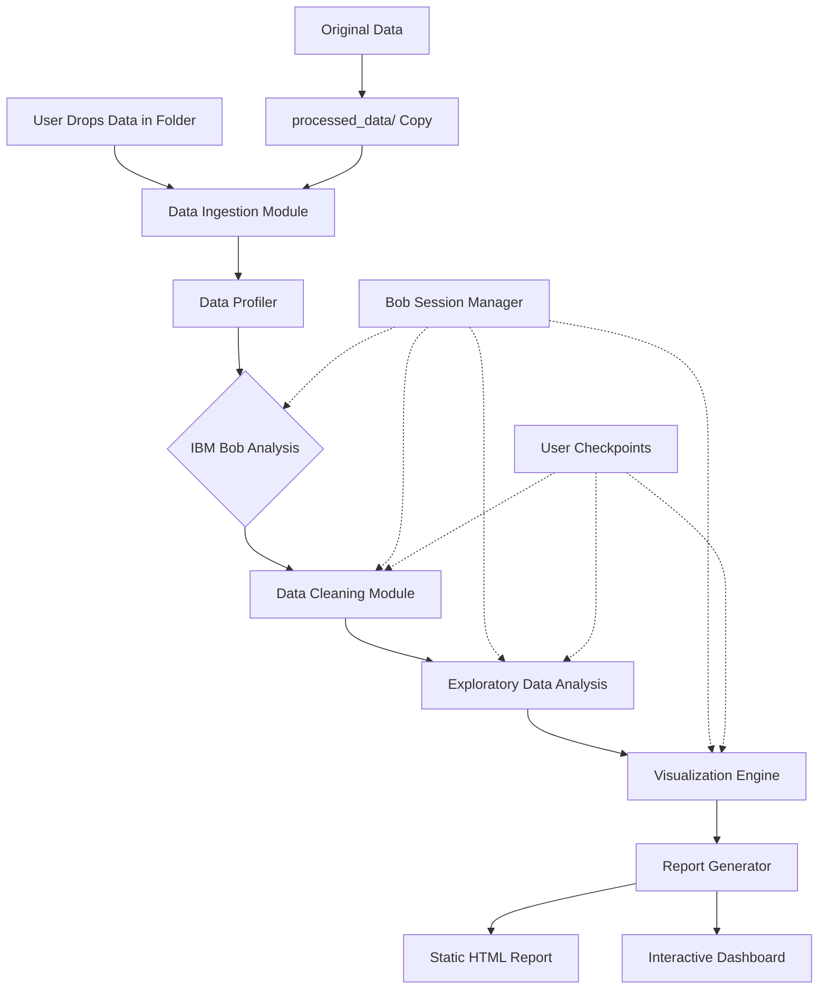

# FastReports - Automated Data Analysis Pipeline Architecture

## Executive Summary

FastReports is an intelligent data analysis pipeline that leverages IBM Bob to automate the entire data analysis workflow for data analysts. The system automatically processes raw data through cleaning, exploration, and visualization phases, generating comprehensive reports with minimal manual intervention.

## Data Quality Analysis

### Layoffs Dataset Issues Identified:
1. **NULL values** in critical columns (total_laid_off, percentage_laid_off, funds_raised_millions)
2. **Empty strings** in industry column (line 10: Airbnb has empty industry)
3. **Inconsistent country names** (line 12: "United States." with period)
4. **Date format inconsistency** (M/D/YYYY format needs standardization)
5. **Mixed data types** (NULL as string vs actual null values)

### Soccer Dataset Characteristics:
1. **High dimensionality** (100+ columns with betting odds)
2. **Consistent structure** across multiple seasons
3. **Clean data** with proper numeric types
4. **Time series data** suitable for trend analysis

### Pizza Delivery Dataset:
1. **Mixed data types** (XLSX format with dates, text, numbers)
2. **Survey responses** with free-text requiring NLP
3. **Transactional data** with order details
4. **Customer feedback** requiring sentiment analysis

## System Architecture



## Component Architecture

### 1. Data Ingestion Module
**Purpose**: Safely copy and load data from various formats

**IBM Bob Integration**:
- **Mode**: Code Mode
- **Task**: Generate file format detection and parsing code
- **Output**: Python scripts for CSV, XLSX, JSON parsing

**Features**:
- Auto-detect file formats (CSV, XLSX, JSON, Parquet)
- Create working copies in `processed_data/` directory
- Preserve original data integrity
- Generate metadata about data sources

### 2. Data Profiler
**Purpose**: Analyze data characteristics and quality

**IBM Bob Integration**:
- **Mode**: Plan Mode
- **Task**: Analyze data structure and suggest profiling strategies
- **Output**: Profiling plan and quality metrics

**Metrics Generated**:
- Column data types and distributions
- Missing value analysis
- Outlier detection
- Data quality scores
- Correlation analysis

### 3. Data Cleaning Module
**Purpose**: Clean and transform data based on quality issues

**IBM Bob Integration**:
- **Mode**: Code Mode
- **Task**: Generate cleaning scripts based on profiling results
- **Output**: Python transformation scripts

**Cleaning Operations**:
- Handle NULL/missing values (imputation strategies)
- Standardize date formats
- Fix inconsistent categorical values
- Remove duplicates
- Normalize text fields
- Type conversions

### 4. Exploratory Data Analysis (EDA) Module
**Purpose**: Generate insights and statistical analysis

**IBM Bob Integration**:
- **Mode**: Advanced Mode (with MCP tools)
- **Task**: Generate analysis queries and statistical tests
- **Output**: Analysis scripts and insights

**Analysis Types**:
- Descriptive statistics
- Distribution analysis
- Correlation matrices
- Time series analysis (for soccer data)
- Sentiment analysis (for survey data)
- Trend identification

### 5. Visualization Engine
**Purpose**: Create meaningful visualizations

**IBM Bob Integration**:
- **Mode**: Code Mode
- **Task**: Generate visualization code based on data characteristics
- **Output**: Plotly/D3.js visualization scripts

**Chart Types**:
- Bar charts (categorical comparisons)
- Line charts (time series trends)
- Scatter plots (correlations)
- Heatmaps (correlation matrices)
- Box plots (distribution analysis)
- Pie charts (composition)
- Geographic maps (location data)

### 6. Report Generator
**Purpose**: Compile analysis into consumable formats

**IBM Bob Integration**:
- **Mode**: Code Mode
- **Task**: Generate report templates and styling
- **Output**: HTML/CSS templates

**Output Formats**:
1. **Static HTML Report**:
   - Executive summary
   - Data quality report
   - Statistical analysis
   - Embedded visualizations
   - Downloadable as single file

2. **Interactive Dashboard** (Preact):
   - Real-time filtering
   - Interactive charts
   - Drill-down capabilities
   - Export functionality

### 7. Orchestration Layer
**Purpose**: Manage pipeline execution and user interaction

**IBM Bob Integration**:
- **Mode**: Orchestrator Mode
- **Task**: Coordinate multi-phase workflow
- **Output**: Execution plan and progress tracking

**Features**:
- Phase-by-phase execution
- User checkpoints for approval
- Progress tracking and logging
- Error handling and recovery
- Session state management

## Technology Stack

### Backend
- **Python 3.10+**: Core processing language
- **Pandas**: Data manipulation
- **NumPy**: Numerical operations
- **Plotly**: Interactive visualizations
- **scikit-learn**: Statistical analysis
- **openpyxl**: Excel file handling

### Frontend
- **Preact**: Lightweight UI framework (3KB)
- **D3.js**: Advanced visualizations
- **Tailwind CSS**: Styling
- **Vite**: Build tool

### IBM Bob Integration
- **Modes Used**:
  - Plan Mode: Architecture and strategy
  - Code Mode: Implementation
  - Advanced Mode: Complex analysis with MCP
  - Orchestrator Mode: Workflow coordination

## Directory Structure

```
fastreports/
├── data/                          # Original data (READ-ONLY)
│   ├── layoffs/
│   ├── soccer/
│   └── pizza_delivery_app/
├── processed_data/                # Working copies
│   ├── {dataset_name}/
│   │   ├── raw_copy.csv
│   │   ├── cleaned.csv
│   │   └── metadata.json
├── src/
│   ├── ingestion/
│   │   ├── file_detector.py
│   │   └── data_loader.py
│   ├── profiling/
│   │   ├── profiler.py
│   │   └── quality_checker.py
│   ├── cleaning/
│   │   ├── cleaner.py
│   │   └── transformers.py
│   ├── analysis/
│   │   ├── eda.py
│   │   └── statistics.py
│   ├── visualization/
│   │   ├── chart_generator.py
│   │   └── plotly_charts.py
│   ├── reporting/
│   │   ├── html_generator.py
│   │   └── dashboard_builder.py
│   ├── orchestration/
│   │   ├── pipeline.py
│   │   └── checkpoint_manager.py
│   └── bob_integration/
│       ├── session_manager.py
│       └── prompt_templates.py
├── dashboard/                     # Preact dashboard
│   ├── src/
│   │   ├── components/
│   │   ├── App.jsx
│   │   └── main.jsx
│   ├── package.json
│   └── vite.config.js
├── output/
│   └── reports/
│       ├── {dataset_name}/
│       │   ├── report.html
│       │   ├── dashboard.html
│       │   └── assets/
├── bob_sessions/                  # Bob interaction logs
│   └── {timestamp}_session.log
├── tests/
├── ARCHITECTURE.md
├── README.md
└── requirements.txt
```

## Pipeline Execution Flow

### Phase 1: Initialization
1. User drops data folder into `data/` directory
2. System detects new data
3. **Bob (Plan Mode)**: Analyzes folder structure and creates execution plan

### Phase 2: Data Ingestion
1. **Bob (Code Mode)**: Generates file parsing code
2. System creates working copy in `processed_data/`
3. Generates metadata file
4. **Checkpoint**: User reviews data loading summary

### Phase 3: Data Profiling
1. **Bob (Plan Mode)**: Plans profiling strategy
2. System runs profiling analysis
3. Generates quality report
4. **Checkpoint**: User reviews quality issues

### Phase 4: Data Cleaning
1. **Bob (Code Mode)**: Generates cleaning scripts based on issues
2. System applies transformations
3. Validates cleaned data
4. **Checkpoint**: User reviews cleaning results

### Phase 5: Exploratory Analysis
1. **Bob (Advanced Mode)**: Generates analysis queries
2. System runs statistical analysis
3. Identifies key insights
4. **Checkpoint**: User reviews insights

### Phase 6: Visualization
1. **Bob (Code Mode)**: Generates visualization code
2. System creates charts based on data characteristics
3. Optimizes for web display
4. **Checkpoint**: User reviews visualizations

### Phase 7: Report Generation
1. **Bob (Code Mode)**: Generates report templates
2. System compiles static HTML report
3. Builds interactive Preact dashboard
4. **Final Output**: Both report types ready

## IBM Bob Usage Documentation

### Mode Selection Strategy

| Phase | Mode | Reason |
|-------|------|--------|
| Planning | Plan Mode | Strategic thinking, architecture design |
| Code Generation | Code Mode | Fast implementation, file operations |
| Complex Analysis | Advanced Mode | MCP tools, browser automation |
| Workflow Coordination | Orchestrator Mode | Multi-step task management |

### Prompt Engineering Templates

#### Data Profiling Prompt
```
Analyze this dataset and identify:
1. Data quality issues (missing values, outliers, inconsistencies)
2. Column types and distributions
3. Potential relationships between variables
4. Recommended cleaning strategies

Dataset preview: {data_sample}
```

#### Cleaning Script Generation Prompt
```
Generate Python code to clean this dataset based on these issues:
{quality_issues}

Requirements:
- Use pandas for transformations
- Preserve original data
- Log all changes
- Handle edge cases
```

#### Visualization Prompt
```
Generate Plotly visualization code for:
Dataset: {dataset_name}
Key metrics: {metrics}
Chart types needed: {chart_types}

Make visualizations interactive and publication-ready.
```

## Safety Mechanisms

### Data Protection
1. **Read-only original data**: Original files never modified
2. **Copy-on-write**: All operations on copies
3. **Backup before cleaning**: Preserve raw copy
4. **Audit trail**: Log all transformations

### User Control
1. **Checkpoint system**: User approval at each phase
2. **Preview before apply**: Show changes before committing
3. **Rollback capability**: Revert to previous state
4. **Manual override**: User can modify Bob suggestions

## Performance Considerations

### Optimization Strategies
1. **Lazy loading**: Load data in chunks for large files
2. **Caching**: Cache profiling results
3. **Parallel processing**: Use multiprocessing for analysis
4. **Incremental updates**: Only reprocess changed data

### Scalability
- Handle datasets up to 1GB efficiently
- Stream processing for larger files
- Distributed processing option for future

## Testing Strategy

### Unit Tests
- Each module independently tested
- Mock Bob responses for consistency
- Edge case handling

### Integration Tests
- End-to-end pipeline execution
- All three datasets processed
- Output validation

### User Acceptance Tests
- Real-world scenarios
- Performance benchmarks
- Usability testing

## Future Enhancements

1. **Real-time data streaming**: Process live data feeds
2. **ML model integration**: Automated predictive modeling
3. **Collaborative features**: Multi-user analysis
4. **Cloud deployment**: Web-based service
5. **API endpoints**: Programmatic access
6. **Custom plugins**: User-defined analysis modules

## Success Metrics

1. **Time Savings**: 80% reduction in manual analysis time
2. **Accuracy**: 95%+ data quality improvement
3. **User Satisfaction**: Positive feedback from data analysts
4. **Bob Integration**: Meaningful use in all phases
5. **Report Quality**: Publication-ready outputs

## Conclusion

FastReports demonstrates meaningful IBM Bob integration by leveraging AI assistance throughout the entire data analysis pipeline. Bob acts as an intelligent development partner, generating code, suggesting strategies, and coordinating complex workflows - exactly as intended by the hackathon challenge.