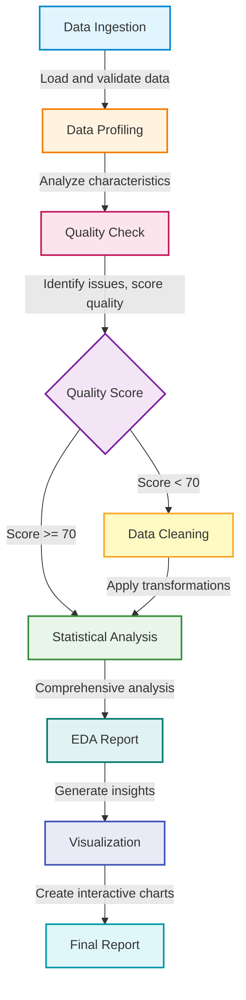

# FastReports 🚀

**Automated Data Analysis Pipeline with IBM Bob Integration**

FastReports is an intelligent data analysis system that automates the entire workflow from raw data to actionable insights, leveraging IBM Bob as an AI development partner throughout the process.

## 🎯 Project Overview

FastReports demonstrates meaningful IBM Bob integration by using AI assistance in every phase of the data analysis pipeline:

- **Data Ingestion**: Automatically detect and load various file formats
- **Data Profiling**: Analyze data characteristics and quality
- **Data Cleaning**: Generate and apply intelligent cleaning strategies
- **Statistical Analysis**: Perform comprehensive statistical tests
- **Visualization**: Create interactive charts with smart recommendations
- **Reporting**: Generate comprehensive analysis reports

## 🏆 Hackathon Highlights

### IBM Bob Integration Points

1. **Architecture Design** (Plan Mode)
   - System architecture planning
   - Pipeline workflow design
   - Strategy recommendations

2. **Code Generation** (Code Mode)
   - Module implementation
   - Function generation
   - Data transformations

3. **Analysis Assistance** (Advanced Mode - Conceptual)
   - Statistical test selection
   - Insight generation
   - Complex queries

4. **Session Tracking**
   - All Bob interactions logged
   - Usage analytics
   - Mode tracking
   - Export capabilities

## 📋 Features

### ✅ Implemented Core Features

- **Multi-format Data Loading**: CSV, XLSX, JSON, Parquet
- **Comprehensive Profiling**: Statistics, distributions, correlations
- **Quality Assessment**: Scoring system with issue detection
- **Automated Cleaning**: Multiple strategies (imputation, standardization, validation)
- **Statistical Analysis**: Descriptive stats, correlations, hypothesis testing
- **EDA Reports**: Key findings, recommendations, insights
- **Interactive Visualizations**: 9+ chart types with Plotly
- **Smart Recommendations**: AI-driven visualization suggestions
- **Pipeline Orchestration**: End-to-end workflow management
- **Bob Session Management**: Complete interaction tracking
- **REST API Backend**: FastAPI server with DuckDB query engine
- **Interactive Dashboard**: Preact-based web UI with real-time filtering

## 🚀 Quick Start

### Option 1: Full Stack (API + Dashboard)

```bash
# Install Python dependencies
pip install -r requirements.txt

# Install dashboard dependencies
cd dashboard && npm install && cd ..

# Start both API server and dashboard
chmod +x start_all.sh
./start_all.sh

# Access the dashboard at http://localhost:3000
# API documentation at http://localhost:8000/docs
```

### Option 2: API Server Only

```bash
# Install dependencies
pip install -r requirements.txt

# Start API server
chmod +x start_server.sh
./start_server.sh

# Or on Windows
start_server.bat

# API available at http://localhost:8000
```

### Option 3: Command-Line Pipeline

### Prerequisites

```bash
# Python 3.10 or higher
python --version

# Install dependencies
pip install -r requirements.txt
```

### Basic Usage

```bash
# Run with default dataset (layoffs)
python main.py

# Run with specific dataset
python main.py data/soccer/laliga_22_23.csv --dataset-name laliga

# Auto-clean data without prompts
python main.py --auto-clean

# Skip visualization generation
python main.py --no-viz
```

### Command-Line Options

```
usage: main.py [-h] [--dataset-name DATASET_NAME] [--auto-clean] [--no-viz] [data_path]

positional arguments:
  data_path             Path to the data file (default: data/layoffs/layoffs.csv)

optional arguments:
  -h, --help            Show this help message and exit
  --dataset-name DATASET_NAME
                        Name of the dataset (default: layoffs)
  --auto-clean          Automatically apply cleaning strategies
  --no-viz              Skip visualization generation
```

## 📊 Sample Datasets

The project includes three diverse datasets for demonstration:

1. **Layoffs Dataset** (`data/layoffs/layoffs.csv`)
   - Tech company layoffs data
   - Mixed data types, missing values
   - Good for demonstrating cleaning strategies

2. **Soccer Dataset** (`data/soccer/laliga_*.csv`)
   - La Liga match statistics
   - Time series data, high dimensionality
   - Good for trend analysis

3. **Pizza Delivery** (`data/pizza_delivery_app/*.xlsx`)
   - Customer surveys and transactions
   - Multiple files, text data
   - Good for sentiment analysis

## 🏗️ Architecture

### Module Structure

```
fastreports/
├── src/
│   ├── ingestion/          # Data loading and format detection
│   │   ├── file_detector.py
│   │   └── data_loader.py
│   ├── profiling/          # Data profiling and quality assessment
│   │   ├── profiler.py
│   │   └── quality_checker.py
│   ├── cleaning/           # Data cleaning and validation
│   │   ├── strategy_generator.py
│   │   ├── transformers.py
│   │   └── validator.py
│   ├── analysis/           # Statistical analysis and EDA
│   │   ├── statistics.py
│   │   └── eda.py
│   ├── visualization/      # Chart generation and recommendations
│   │   ├── chart_generator.py
│   │   ├── plotly_charts.py
│   │   └── recommender.py
│   ├── orchestration/      # Pipeline management
│   │   └── pipeline.py
│   ├── bob_integration/    # IBM Bob integration
│   │   ├── session_manager.py
│   │   └── prompt_templates.py
│   └── utils/              # Utilities
│       ├── logger.py
│       └── config_loader.py
├── data/                   # Sample datasets
├── output/                 # Generated reports and logs
├── bob_sessions/           # Bob interaction logs
├── main.py                 # Application entry point
└── requirements.txt        # Python dependencies
```

### Pipeline Flow



## 🤖 IBM Bob Integration

### How Bob is Used

1. **Prompt Templates** (`src/bob_integration/prompt_templates.py`)
   - Pre-built prompts for each pipeline phase
   - Context-aware generation
   - Reusable across datasets

2. **Session Management** (`src/bob_integration/session_manager.py`)
   - Tracks all Bob interactions
   - Logs prompts, responses, and metadata
   - Generates usage analytics
   - Exports session history

3. **Mode Utilization**
   - **Plan Mode**: Architecture and strategy planning
   - **Code Mode**: Implementation and code generation
   - **Advanced Mode**: Complex analysis (conceptual)

### Bob Session Output

Every run generates a Bob session log in `bob_sessions/` with:
- Session ID and timestamp
- All interactions with prompts and responses
- Modes used
- Success/failure tracking
- Metadata for each interaction

### Example Bob Interaction

```python
# Starting a session
bob_session.start_session("layoffs", "Complete data analysis")

# Logging an interaction
bob_session.log_interaction(
    mode="Code Mode",
    phase="cleaning",
    prompt="Generate cleaning strategies for missing values",
    response="Applied mean imputation for numeric columns",
    success=True,
    metadata={"columns_cleaned": 5}
)

# Ending session
summary = bob_session.end_session()
```

## 📈 Output Examples

### Console Output

```
================================================================================
FastReports - Automated Data Analysis Pipeline
IBM Bob Integration Demonstration
================================================================================

[INFO] Starting Data Analysis Pipeline for: layoffs
[INFO] ════════════════════════════════════════════════════════════════════════
[INFO] PHASE: Data Ingestion
[INFO] ════════════════════════════════════════════════════════════════════════
[INFO] Loaded dataset: layoffs
[INFO] Shape: (2361, 9)
[INFO] Working directory: processed_data/layoffs

[INFO] ════════════════════════════════════════════════════════════════════════
[INFO] PHASE: Data Profiling
[INFO] ════════════════════════════════════════════════════════════════════════
[INFO] Profile generated successfully

[INFO] ════════════════════════════════════════════════════════════════════════
[INFO] PHASE: Quality Checking
[INFO] ════════════════════════════════════════════════════════════════════════
[INFO] Quality Score: 72.5/100

KEY RESULTS
================================================================================
Data Quality Score: 72.5/100

Key Findings (5):
  1. Large dataset with 2,361 rows - suitable for robust analysis
  2. Significant missing data (15.3%) requires attention
  3. Found 3 strong correlations between variables
  4. 2 variables show non-normal distributions
  5. Outliers detected in 3 columns

Visualizations Generated: 15
================================================================================
```

### Bob Session Summary

```
================================================================================
BOB SESSION SUMMARY: layoffs_20260516_123045
================================================================================

Dataset: layoffs
Purpose: Complete data analysis pipeline execution
Start Time: 2026-05-16T12:30:45
End Time: 2026-05-16T12:35:22

Total Interactions: 8
Modes Used: Plan Mode, Code Mode

INTERACTIONS:
--------------------------------------------------------------------------------
1. ✓ [Plan Mode] initialization
   Time: 2026-05-16T12:30:45
   
2. ✓ [Code Mode] ingestion
   Time: 2026-05-16T12:31:12
   
3. ✓ [Code Mode] profiling
   Time: 2026-05-16T12:32:05
   
...
================================================================================
```

## 📊 Data Quality Scoring

The system provides a comprehensive quality score (0-100) based on:

- **Missing Values** (30 points): Percentage of missing data
- **Duplicates** (20 points): Duplicate row detection
- **Outliers** (20 points): Outlier prevalence
- **Consistency** (15 points): Data type consistency
- **Completeness** (15 points): Column completeness

### Quality Grades

- **A (90-100)**: Excellent - Ready for analysis
- **B (80-89)**: Good - Minor issues
- **C (70-79)**: Fair - Cleaning recommended
- **D (60-69)**: Poor - Significant issues
- **F (<60)**: Critical - Major cleaning required

## 🎨 Visualization Types

The system automatically generates appropriate visualizations:

1. **Histogram**: Distribution of numeric values
2. **Box Plot**: Outlier detection and quartiles
3. **Bar Chart**: Categorical frequency comparison
4. **Scatter Plot**: Relationship between variables
5. **Line Chart**: Trends over time
6. **Heatmap**: Correlation matrix
7. **Pie Chart**: Composition and proportions
8. **Area Chart**: Cumulative trends
9. **Grouped Bar**: Multi-category comparisons

## 🔧 Configuration

Edit `config.yaml` to customize:

```yaml
pipeline:
  auto_clean: false
  quality_threshold: 70
  max_visualizations: 20

logging:
  level: INFO
  format: detailed

output:
  directory: output/
  save_intermediate: true
```

## 📝 Logging

Comprehensive logging at multiple levels:

- **Console**: Real-time progress and key results
- **File Logs**: Detailed execution logs in `output/logs/`
- **Bob Sessions**: Interaction logs in `bob_sessions/`
- **Phase Tracking**: Start/end times for each phase

## 🧪 Testing

```bash
# Run with test dataset
python main.py data/layoffs/layoffs.csv --dataset-name layoffs_test

# Verify all phases complete
python main.py --auto-clean

# Check Bob session logs
ls -la bob_sessions/
```

## 🌐 API & Dashboard

### REST API

The FastAPI backend provides:
- **GET /api/datasets**: List available datasets
- **GET /api/data**: Load dataset with pagination
- **POST /api/query**: Execute SQL queries with DuckDB
- **GET /api/profile**: Get detailed dataset profiling

See [API_DOCUMENTATION.md](API_DOCUMENTATION.md) for complete API reference.

### Interactive Dashboard

The Preact-based dashboard offers:
- Real-time data filtering and search
- SQL query builder with DuckDB
- Interactive Plotly visualizations
- Multiple chart types (bar, line, scatter, pie, histogram, box)
- CSV export functionality
- Responsive design

**Access**: http://localhost:3000 (when running `start_all.sh`)

## 🚧 Known Limitations

1. **HTML Report Generator**: Not yet implemented
2. **Large Files**: Memory constraints for files >1GB
3. **Real-time Bob API**: Uses simulated interactions for demo

## 🔮 Future Enhancements

### High Priority
- HTML report generator with embedded visualizations
- Report compiler for multiple datasets
- Example outputs for all sample datasets

### Medium Priority
- User checkpoint system for approvals
- Domain-specific analyzers (time series, text, transactions)
- Authentication and authorization for API
- WebSocket support for real-time updates

### Low Priority
- Cloud deployment (AWS, Azure, GCP)
- Performance optimizations and caching
- Export to PDF and PowerPoint
- Advanced ML-based anomaly detection

## 📚 Documentation

- **ARCHITECTURE.md**: Detailed system architecture
- **IMPLEMENTATION_PLAN.md**: Phase-by-phase implementation guide
- **IMPLEMENTATION_SUMMARY.md**: What was built and how
- **DATA_CLEANING_STRATEGIES.md**: Cleaning approach documentation
- **API_DOCUMENTATION.md**: Complete API reference and examples

## 🤝 Contributing

This is a hackathon project demonstrating IBM Bob integration. Contributions welcome!

## 📄 License

MIT License - See LICENSE file for details

## 🙏 Acknowledgments

- **IBM Bob**: AI-assisted development throughout
- **Plotly**: Interactive visualization library
- **Pandas**: Data manipulation foundation
- **SciPy**: Statistical analysis tools

## 📧 Contact

For questions or feedback about this hackathon submission, please reach out through the IBM Bob hackathon platform.

---

**Built with IBM Bob** 🤖 | **Hackathon 2026** 🏆

*Demonstrating meaningful AI integration in data analysis workflows*

---

## 🎯 Quick Demo

```bash
# 1. Install dependencies
pip install -r requirements.txt

# 2. Run the pipeline
python main.py

# 3. Check the outputs
cat output/logs/fastreports_*.log
ls bob_sessions/

# 4. Try with different dataset
python main.py data/soccer/laliga_22_23.csv --dataset-name laliga --auto-clean
```

**Expected Runtime**: 30-60 seconds per dataset
**Memory Usage**: ~200-500 MB
**Output Files**: Logs, session data, processed datasets

---

*Made with ❤️ and IBM Bob*
