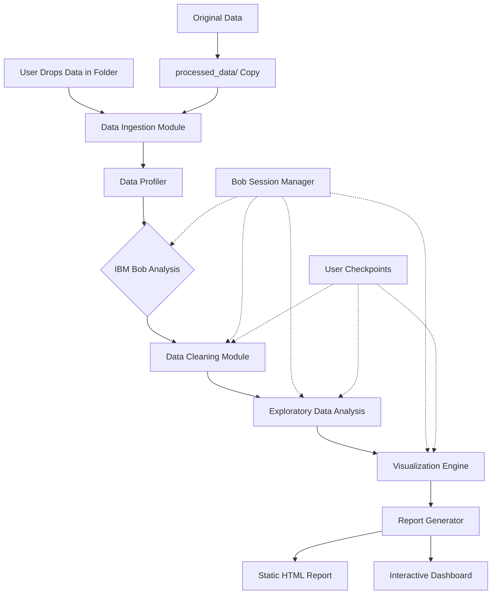

**User:**

<task>
I am participating in a hackathn (refer hackathon.md)
The solution I'm aiming for is to use IBM BOB in a meaningful way for Data Analyst.
Apart from Data Collection, the solution/pipeline should encompass Data Wrangling/Cleaning, Data Exploration and finally, HTML + CSS + JSS or any modern UI framework to generate reports with meaningful visualizations.
The data for this hackathon is available in the "data" folder.
It contains data for different use cases. They are completely unrelated. The idea is that the user dumps the data inside a folder in the data folder and the solution automatically starts the above mentioned pipeline to give a headstart to the data analyst and reduce their work.
For Data Wrangling, you can refer "./data/layoffs"  and "./data/soccer" . I am sure the layoffs data needs to be cleaned up but not sure about the soccer data.
Also document everything like a technical documentation in the README. The technical documentation needs to mention different phases that we invoke . eg. Plan, Code, Orchestrator etc.
Let me know if you need more clarification.
</task>
<environment_details>
# VSCode Visible Files
hackathon.md

# VSCode Open Tabs
hackathon.md

# Current Time
Current time in ISO 8601 UTC format: 2026-05-16T16:59:06.564Z
User time zone: Asia/Calcutta, UTC+5:30

# Current Cost
$0.00

# Review Exclusions
The following file patterns are excluded from code reviews:
- .vscode/**

# Current Mode
<slug>plan</slug>
<name>📝 Plan</name>


# Current Workspace Directory (/Users/I329392/Lab/fastreports) Files
.DS_Store
hackathon.md
README.md
bob_sessions/
data/
data/layoffs/
data/layoffs/layoffs.csv
data/pizza_delivery_app/
data/pizza_delivery_app/purchase_log.xlsx
data/pizza_delivery_app/survey_answers.xlsx
data/pizza_delivery_app/yelp_reviews.xlsx
data/soccer/
data/soccer/laliga_22_23.csv
data/soccer/laliga_23_24.csv
data/soccer/laliga_24_25.csv
data/soccer/laliga_25_26.csv
You have not created a todo list yet. Create one with `update_todo_list` if your task is complicated or involves multiple steps.
</environment_details>

---

**Assistant:**

I'll help you plan this hackathon solution! Let me first gather more context by examining the hackathon details and the available data.

<read_file>
<args>
  <file>
    <path>hackathon.md</path>
  </file>
</args>
</read_file>

---

**User:**

[read_file for 'hackathon.md'. Reading multiple files at once is more efficient for the LLM. If other files are relevant to your current task, please read them simultaneously.] Result:
<files>
<file><path>hackathon.md</path>
<content lines="1-64">
 1 | 
 2 | # IBM Bob Hackathon
 3 | Your repo. Your rules. AI as your dev partner.
 4 | 
 5 | ## Build solutions that improve how software is built.
 6 | 
 7 | Work with an AI that understands your codebase, helping you reduce repetitive work and build with real context.
 8 | 
 9 | ## ⏳ Build your project in 48 hours.
10 | 
11 | 🚀 Get hands-on with IBM Bob and explore how AI fits into real development workflows before it becomes standard.
12 | 
13 | 💡 Build tools and workflows that developers would actually use.
14 | 
15 | ⭐ Learn directly from experts throughout the event.
16 | 
17 | 🤝 Join a team or build solo.
18 | 
19 | 💰 Prize pool: $10,000
20 | 
21 | ## About IBM Bob
22 | IBM Bob is an AI-powered development partner designed to help developers work with real systems, not just code snippets.
23 | 
24 | It operates with full repository context, allowing developers to understand how software is structured, reason through logic, and navigate complex codebases more effectively.
25 | 
26 | Bob supports practical development tasks and helps builders at any skill level move from idea to implementation with greater clarity and confidence.
27 | 
28 | This hackathon is your chance to apply Bob in a real project and see how it fits into your workflow. 
29 | 
30 | ## Challenge
31 | In this hackathon, you will design and build a proof-of-concept solution using IBM Bob, your AI-powered development partner, to address the following challenge:
32 | 
33 | ## Turn idea into impact faster
34 | 
35 | Got an idea for how to work smarter and faster? Create a solution that speeds the way you work every day.
36 | 
37 | Maybe you need to:
38 | 
39 | • Get up to speed on existing code quickly
40 | 
41 | • Generate documentation and tests
42 | 
43 | • Reduce effort spent on repetitive tasks that slow your team down
44 | 
45 | Use IBM Bob as your development partner to bring your idea to life.
46 | 
47 | Bob understands intent, reads complete repository context, explains logic with clarity, automates complex transformations, and streamlines multi-step work.
48 | 
49 | Show how your solution, powered by Bob, can help builders at any skill level deliver high-quality software with greater efficiency and confidence.
50 | 
51 | ## Important:
52 | 
53 | All submissions must clearly demonstrate how IBM Bob is used in the solution. 
54 | 
55 | Projects that do not show meaningful use of Bob may be disqualified.  
56 | 
57 | ## Technology
58 | IBM Bob is an AI-powered development partner that works directly with your codebase, helping you build and improve software with real context.
59 | It is designed to support developers across everyday workflows, allowing you to apply AI within your own project rather than working in isolation.
60 | 
61 | ## Please Note
62 | • Access is provided specifically for the duration of the event
63 | • Usage is limited and should be managed throughout the build
64 | • Participants are expected to actively use Bob as part of their solution
</content>
</file>
</files>
<environment_details>
# VSCode Visible Files
hackathon.md

# VSCode Open Tabs
hackathon.md

# Current Time
Current time in ISO 8601 UTC format: 2026-05-16T16:59:10.438Z
User time zone: Asia/Calcutta, UTC+5:30

# Current Cost
$0.03

# Review Exclusions
The following file patterns are excluded from code reviews:
- .vscode/**

# Current Mode
<slug>plan</slug>
<name>📝 Plan</name>
You have not created a todo list yet. Create one with `update_todo_list` if your task is complicated or involves multiple steps.
</environment_details>

---

**Assistant:**

Now let me examine the data files to understand what we're working with:

<read_file>
<args>
  <file>
    <path>data/layoffs/layoffs.csv</path>
    <line_range>1-20</line_range>
  </file>
  <file>
    <path>data/soccer/laliga_22_23.csv</path>
    <line_range>1-20</line_range>
  </file>
  <file>
    <path>README.md</path>
  </file>
</args>
</read_file>

---

**User:**

[read_file for 'data/layoffs/layoffs.csv', 'data/soccer/laliga_22_23.csv', 'README.md'] Result:
<files>
<file><path>data/layoffs/layoffs.csv</path>
<content lines="1-20">
 1 | company,location,industry,total_laid_off,percentage_laid_off,date,stage,country,funds_raised_millions
 2 | Atlassian,Sydney,Other,500,0.05,3/6/2023,Post-IPO,Australia,210
 3 | SiriusXM,New York City,Media,475,0.08,3/6/2023,Post-IPO,United States,525
 4 | Alerzo,Ibadan,Retail,400,NULL,3/6/2023,Series B,Nigeria,16
 5 | UpGrad,Mumbai,Education,120,NULL,3/6/2023,Unknown,India,631
 6 | Loft,Sao Paulo,Real Estate,340,0.15,3/3/2023,Unknown,Brazil,788
 7 | Embark Trucks,SF Bay Area,Transportation,230,0.7,3/3/2023,Post-IPO,United States,317
 8 | Lendi,Sydney,Real Estate,100,NULL,3/3/2023,Unknown,Australia,59
 9 | UserTesting,SF Bay Area,Marketing,63,NULL,3/3/2023,Acquired,United States,152
10 | Airbnb,SF Bay Area,,30,NULL,3/3/2023,Post-IPO,United States,6400
11 | Accolade,Seattle,Healthcare,NULL,NULL,3/3/2023,Post-IPO,United States,458
12 | Indigo,Boston,Other,NULL,NULL,3/3/2023,Series F,United States.,1200
13 | Zscaler,SF Bay Area,Security,177,0.03,3/2/2023,Post-IPO,United States,148
14 | MasterClass,SF Bay Area,Education,79,NULL,3/2/2023,Series E,United States,461
15 | Ambev Tech,Blumenau,Food,50,NULL,3/2/2023,Acquired,Brazil,NULL
16 | Fittr,Pune,Fitness,30,0.11,3/2/2023,Series A,India,13
17 | CNET,SF Bay Area,Media,12,0.1,3/2/2023,Acquired,United States,20
18 | Flipkart,Bengaluru,Retail,NULL,NULL,3/2/2023,Acquired,India,12900
19 | Kandela,Los Angeles,Consumer,NULL,1,3/2/2023,Acquired,United States,NULL
20 | Truckstop.com,Boise,Logistics,NULL,NULL,3/2/2023,Acquired,United States,NULL
</content>
</file>
<file><path>data/soccer/laliga_22_23.csv</path>
<content lines="1-20">
 1 | Div,Date,Time,HomeTeam,AwayTeam,FTHG,FTAG,FTR,HTHG,HTAG,HTR,HS,AS,HST,AST,HF,AF,HC,AC,HY,AY,HR,AR,B365H,B365D,B365A,BWH,BWD,BWA,IWH,IWD,IWA,PSH,PSD,PSA,WHH,WHD,WHA,VCH,VCD,VCA,MaxH,MaxD,MaxA,AvgH,AvgD,AvgA,B365>2.5,B365<2.5,P>2.5,P<2.5,Max>2.5,Max<2.5,Avg>2.5,Avg<2.5,AHh,B365AHH,B365AHA,PAHH,PAHA,MaxAHH,MaxAHA,AvgAHH,AvgAHA,B365CH,B365CD,B365CA,BWCH,BWCD,BWCA,IWCH,IWCD,IWCA,PSCH,PSCD,PSCA,WHCH,WHCD,WHCA,VCCH,VCCD,VCCA,MaxCH,MaxCD,MaxCA,AvgCH,AvgCD,AvgCA,B365C>2.5,B365C<2.5,PC>2.5,PC<2.5,MaxC>2.5,MaxC<2.5,AvgC>2.5,AvgC<2.5,AHCh,B365CAHH,B365CAHA,PCAHH,PCAHA,MaxCAHH,MaxCAHA,AvgCAHH,AvgCAHA
 2 | SP1,12/08/2022,20:00,Osasuna,Sevilla,2,1,H,1,1,D,12,10,5,3,16,9,5,2,5,3,0,0,3.2,3.1,2.4,3.2,3,2.4,3.2,3.05,2.45,3.38,3.1,2.48,3.2,3,2.4,3.25,3.1,2.4,3.41,3.24,2.49,3.28,3.08,2.43,2.62,1.5,2.55,1.57,2.62,1.6,2.5,1.54,0.25,1.83,2.07,1.85,2.09,1.87,2.09,1.82,2.04,3.1,3.1,2.55,3.1,2.95,2.5,3.15,3.05,2.45,3.19,3.06,2.63,3.25,2.9,2.45,3.1,3,2.55,3.52,3.14,2.66,3.2,3.04,2.5,2.62,1.5,2.63,1.54,2.69,1.57,2.55,1.52,0.25,1.73,2.08,1.76,2.2,1.88,2.23,1.79,2.09
 3 | SP1,13/08/2022,16:00,Celta,Espanol,2,2,D,1,0,H,8,10,3,2,17,15,3,3,5,2,0,0,1.8,3.75,4.75,1.83,3.6,4.33,1.83,3.55,4.6,1.81,3.75,4.87,1.83,3.5,4.33,1.75,3.5,4.5,1.9,3.77,4.9,1.83,3.68,4.5,2,1.8,2.1,1.81,2.13,1.87,2.04,1.8,-0.5,1.77,2.02,1.8,2.13,1.86,2.13,1.81,2.05,1.72,3.6,4.75,1.75,3.5,5,1.77,3.5,5,1.78,3.62,5.39,1.75,3.5,5,1.75,3.6,5,1.84,3.73,5.39,1.78,3.58,5,2.2,1.66,2.24,1.71,2.26,1.83,2.19,1.7,-0.75,2,1.9,2.02,1.91,2.06,1.93,2.01,1.86
 4 | SP1,13/08/2022,18:00,Valladolid,Villarreal,0,3,A,0,0,D,12,10,6,4,6,10,4,5,1,0,0,0,3.9,3.6,1.9,3.8,3.5,1.95,3.85,3.6,1.95,4.05,3.78,1.95,3.9,3.5,1.95,3.8,3.5,1.9,4.1,3.8,2,3.93,3.66,1.94,1.99,1.91,2,1.91,2,1.92,1.95,1.87,0.5,1.95,1.95,1.97,1.95,1.97,1.98,1.93,1.93,3.3,3.4,2.2,4,3.4,1.95,3.35,3.35,2.2,3.54,3.44,2.23,3.5,3.25,2.15,3.4,3.4,2.2,3.66,3.47,2.25,3.45,3.39,2.19,2,1.8,2.09,1.81,2.14,1.9,2.05,1.79,0.25,2.02,1.88,2.02,1.91,2.03,1.91,1.98,1.88
 5 | SP1,13/08/2022,20:00,Barcelona,Vallecano,0,0,D,0,0,D,21,4,6,2,16,14,8,0,3,6,1,0,1.22,7,12,1.21,6.75,13.5,1.22,6.75,13,1.22,6.83,15,1.18,6.5,17,1.18,6.5,13,1.24,7.4,17,1.21,6.79,14.2,1.53,2.5,1.55,2.57,1.55,2.73,1.5,2.58,-2,2.09,1.81,2.15,1.78,2.16,1.88,2.04,1.83,1.22,6.5,12,1.25,6.25,11,1.22,6.5,12,1.24,6.8,13.5,1.2,6.5,15,1.2,7,13,1.25,7.4,16.75,1.22,6.82,13.42,1.5,2.62,1.51,2.68,1.58,2.79,1.5,2.61,-1.75,1.82,2.08,1.83,2.08,1.86,2.14,1.82,2.06
 6 | SP1,14/08/2022,16:30,Cadiz,Sociedad,0,1,A,0,1,A,7,15,2,7,9,20,3,6,4,2,0,0,3.6,3.2,2.2,3.4,3.2,2.2,3.45,3.2,2.2,3.62,3.29,2.26,3.4,3.2,2.2,3.5,3.13,2.15,3.75,3.33,2.26,3.55,3.24,2.2,2.37,1.57,2.5,1.59,2.5,1.65,2.38,1.59,0.25,1.99,1.91,2,1.93,2.05,1.93,1.98,1.87,3.8,3,2.15,3.7,3,2.2,3.65,3.05,2.25,4.03,3.08,2.22,3.9,3,2.15,3.75,3.1,2.2,4.05,3.18,2.25,3.8,3.07,2.2,2.62,1.5,2.74,1.51,2.75,1.55,2.61,1.5,0.25,2.05,1.85,2.06,1.87,2.08,1.92,2,1.86
 7 | SP1,14/08/2022,18:30,Valencia,Girona,1,0,H,1,0,H,17,5,2,1,18,14,4,4,2,3,1,0,1.85,3.4,4.5,1.85,3.5,4.33,1.9,3.5,4.3,1.94,3.42,4.65,1.85,3.5,4.2,1.83,3.5,4.1,1.95,3.62,4.65,1.89,3.5,4.35,2.1,1.72,2.17,1.76,2.17,1.82,2.07,1.77,-0.5,1.9,2,1.94,1.98,1.94,2.04,1.89,1.98,1.85,3.5,4.33,1.88,3.5,4.2,1.95,3.5,4.1,1.96,3.49,4.41,1.85,3.4,4.4,1.87,3.5,4.33,1.98,3.66,4.75,1.9,3.51,4.3,2.04,1.86,2.05,1.86,2.08,1.93,2.01,1.82,-0.5,1.85,2.05,1.96,1.96,1.98,2.07,1.9,1.97
 8 | SP1,14/08/2022,21:00,Almeria,Real Madrid,1,2,A,1,0,H,10,29,6,15,11,4,2,15,3,1,0,0,7.5,5,1.4,7,4.8,1.42,7.75,4.8,1.4,7.38,5,1.45,7,4.6,1.42,7,4.6,1.4,7.75,5.23,1.47,7.17,4.91,1.42,1.57,2.37,1.64,2.38,1.65,2.49,1.58,2.38,1.25,1.97,1.93,1.96,1.96,1.98,1.96,1.94,1.91,7,4.75,1.44,6.75,4.8,1.43,7.75,4.8,1.4,7.3,5.15,1.44,7,4.75,1.42,7.5,5,1.4,7.75,5.2,1.48,6.93,4.94,1.44,1.53,2.5,1.56,2.57,1.61,2.66,1.54,2.49,1.25,1.99,1.91,2.02,1.91,2.02,1.96,1.95,1.92
 9 | SP1,15/08/2022,16:30,Ath Bilbao,Mallorca,0,0,D,0,0,D,23,6,6,2,13,12,7,2,0,6,0,0,1.6,3.75,6.5,1.6,3.8,5.75,1.6,3.8,6,1.61,3.94,6.73,1.6,3.6,6.5,1.55,3.75,6,1.63,4,6.8,1.6,3.83,6.23,2.1,1.72,2.2,1.74,2.25,1.81,2.16,1.7,-1,2.09,1.81,2.13,1.82,2.13,1.85,2.09,1.79,1.57,3.75,7,1.57,3.8,6.25,1.57,3.9,6.5,1.6,3.93,6.8,1.55,3.7,7,1.55,4,6.5,1.63,4.15,7,1.57,3.94,6.55,2.2,1.66,2.23,1.72,2.24,1.76,2.16,1.71,-1,2.05,1.85,2.08,1.85,2.1,1.89,2.03,1.84
10 | SP1,15/08/2022,18:30,Getafe,Ath Madrid,0,3,A,0,1,A,10,12,0,5,14,19,3,6,2,1,0,0,5,3.1,1.9,4.6,3.2,1.9,4.6,3.15,1.95,4.99,3.14,1.98,4.75,3.1,1.91,4.5,3.13,1.87,5.2,3.39,2.01,4.79,3.19,1.92,2.75,1.44,2.8,1.49,2.91,1.52,2.71,1.47,0.5,1.95,1.85,1.94,1.98,1.99,1.98,1.94,1.92,5.5,3.1,1.83,5.25,3,1.87,5.5,3.1,1.83,5.85,3.17,1.86,6,3,1.78,5.25,3.2,1.83,6.05,3.27,1.9,5.53,3.1,1.86,3.2,1.36,3.1,1.41,3.22,1.43,3.06,1.38,0.5,2.04,1.86,2.08,1.86,2.08,1.89,2.01,1.86
11 | SP1,15/08/2022,20:30,Betis,Elche,3,0,H,2,0,H,17,4,8,2,10,18,8,4,3,6,0,1,1.44,4.5,7,1.44,4.6,7,1.45,4.6,7,1.46,4.74,7.71,1.44,4.33,7.5,1.44,4.33,7,1.49,4.8,7.9,1.45,4.57,7.27,1.8,2,1.81,2.1,1.84,2.13,1.79,2.03,-1.25,2.06,1.84,2.1,1.84,2.1,1.87,2.04,1.83,1.57,4,5.5,1.57,4,6,1.6,4,5.75,1.62,4.07,6.25,1.57,3.9,6,1.57,4,6,1.62,4.3,6.5,1.58,4.06,6.06,2.05,1.85,2.06,1.85,2.06,1.93,1.99,1.84,-1,2.09,1.81,2.09,1.85,2.12,1.92,2.03,1.84
12 | SP1,19/08/2022,19:00,Espanol,Vallecano,0,2,A,0,1,A,13,8,1,3,12,17,9,2,2,5,1,1,2.45,3.1,3.1,2.5,3,3.1,2.5,3.05,3.1,2.56,3.04,3.3,2.5,3,3.1,2.45,3.1,3.13,2.6,3.1,3.3,2.51,3.05,3.18,2.5,1.53,2.47,1.6,2.51,1.63,2.43,1.57,-0.25,2.11,1.79,2.15,1.8,2.15,1.82,2.11,1.78,2.5,3.1,3,2.55,2.95,3.1,2.55,3,3.05,2.61,3.02,3.25,2.55,3,3,2.55,3,3.1,2.7,3.18,3.25,2.6,3.01,3.08,2.62,1.5,2.62,1.54,2.63,1.6,2.54,1.53,0,1.75,2.17,1.76,2.19,1.81,2.23,1.77,2.12
13 | SP1,19/08/2022,21:00,Sevilla,Valladolid,1,1,D,0,0,D,18,6,2,3,20,10,12,2,3,2,1,1,1.5,4.2,6.5,1.47,4,6.5,1.55,4.2,6,1.56,4.21,6.92,1.52,4,6.5,1.53,4.2,6.5,1.56,4.3,7.1,1.53,4.17,6.71,1.98,1.92,2.01,1.9,2.01,1.94,1.95,1.88,-1,1.94,1.96,1.96,1.96,1.98,2,1.91,1.95,1.5,4.2,7,1.49,4,6.25,1.57,4.1,5.75,1.57,4.14,6.86,1.52,3.9,7,1.53,4.2,6.5,1.58,4.33,7.56,1.54,4.16,6.58,2.04,1.86,2.08,1.84,2.12,1.92,1.95,1.87,-1,1.97,1.93,1.99,1.93,2,2.07,1.93,1.93
14 | SP1,20/08/2022,16:30,Osasuna,Cadiz,2,0,H,1,0,H,16,9,3,2,11,13,2,2,2,5,0,1,1.9,3.25,4.5,1.93,3.2,4.33,1.95,3.25,4.3,1.97,3.27,4.76,1.91,3.25,4.33,1.9,3.25,4.2,2.02,3.36,4.76,1.95,3.26,4.44,2.37,1.57,2.5,1.59,2.5,1.63,2.42,1.57,-0.5,1.95,1.95,1.97,1.95,1.98,1.97,1.95,1.92,1.9,3.3,4.5,1.9,3.2,4.6,1.9,3.3,4.5,1.93,3.33,4.87,1.91,3.2,4.4,1.9,3.3,4.6,1.96,3.38,4.87,1.92,3.27,4.58,2.5,1.53,2.56,1.56,2.56,1.61,2.46,1.55,-0.5,1.93,1.97,1.93,1.99,1.96,1.99,1.93,1.94
15 | SP1,20/08/2022,18:30,Mallorca,Betis,1,2,A,0,1,A,13,8,7,3,22,17,5,2,7,8,0,0,3.1,3.2,2.4,2.95,3.2,2.45,3.05,3.2,2.4,3.18,3.35,2.44,3,3.2,2.4,3,3.25,2.3,3.19,3.42,2.5,3.1,3.26,2.42,2.2,1.66,2.22,1.73,2.24,1.75,2.18,1.7,0.25,1.83,2.07,1.85,2.09,1.87,2.09,1.82,2.06,3.25,3.2,2.3,3.2,3.1,2.35,3.15,3.2,2.4,3.37,3.24,2.4,3.3,3,2.35,3.25,3.2,2.38,3.58,3.3,2.42,3.25,3.2,2.36,2.2,1.66,2.25,1.71,2.26,1.74,2.2,1.69,0.25,1.86,2.04,1.89,2.04,1.89,2.06,1.86,2.01
16 | SP1,20/08/2022,21:00,Celta,Real Madrid,1,4,A,1,2,A,15,16,2,7,12,8,2,2,2,2,0,0,4.5,4.2,1.66,4.1,4,1.71,4.7,4.2,1.67,4.79,4.34,1.71,4.5,4,1.7,4.6,4,1.65,4.9,4.4,1.73,4.71,4.19,1.68,1.66,2.2,1.72,2.24,1.72,2.29,1.68,2.21,0.75,2.02,1.88,2.01,1.91,2.06,1.91,2,1.86,5,4.2,1.65,4.6,4,1.65,5,4.1,1.65,5.22,4.23,1.68,5,4,1.63,5.25,4.1,1.62,5.5,4.3,1.69,5.1,4.16,1.65,1.72,2.1,1.75,2.19,1.76,2.26,1.71,2.16,0.75,2.06,1.84,2.07,1.86,2.09,1.86,2.05,1.82
17 | SP1,21/08/2022,16:30,Ath Bilbao,Valencia,1,0,H,1,0,H,12,10,2,0,11,15,6,3,5,2,0,0,1.8,3.75,4.5,1.75,3.6,4.8,1.77,3.65,4.7,1.81,3.59,5.2,1.75,3.6,4.8,1.73,3.6,4.75,1.81,3.89,5.4,1.77,3.61,4.95,2.1,1.72,2.14,1.78,2.14,1.81,2.06,1.77,-0.75,2.03,1.87,2.06,1.87,2.06,1.92,2,1.86,1.66,3.75,5.25,1.7,3.6,5.25,1.73,3.6,5.25,1.69,3.75,5.95,1.67,3.6,5.5,1.67,3.75,5.5,1.74,3.84,5.95,1.69,3.7,5.54,2.1,1.72,2.17,1.76,2.2,1.81,2.12,1.73,-0.75,1.87,2.03,1.9,2.02,1.91,2.04,1.88,1.98
18 | SP1,21/08/2022,18:30,Ath Madrid,Villarreal,0,2,A,0,0,D,13,19,5,5,8,11,5,6,2,3,1,0,1.85,3.5,4.33,1.9,3.4,4.1,1.9,3.5,4.1,1.96,3.55,4.3,1.91,3.5,4,1.87,3.5,3.9,1.99,3.78,4.35,1.93,3.52,4.14,2.05,1.85,2.1,1.81,2.15,1.86,2.05,1.78,-0.5,1.95,1.95,1.96,1.96,1.98,1.99,1.93,1.93,1.85,3.4,4.5,1.9,3.4,4.2,1.9,3.45,4.3,1.99,3.39,4.44,1.88,3.25,4.6,1.9,3.5,4.2,2,3.5,4.9,1.92,3.42,4.4,2,1.8,2.12,1.79,2.15,1.9,2.05,1.79,-0.5,1.96,1.94,1.99,1.93,1.99,1.99,1.92,1.94
19 | SP1,21/08/2022,21:00,Sociedad,Barcelona,1,4,A,1,1,D,10,15,5,7,16,9,3,6,2,1,0,0,3.3,3.6,2.1,3.3,3.6,1.98,3.35,3.6,2.1,3.46,3.7,2.16,3.3,3.6,2.1,3.25,3.6,2.05,3.5,3.91,2.19,3.38,3.62,2.12,1.8,2,1.83,2.07,1.86,2.15,1.79,2.05,0.25,2.05,1.85,2.06,1.88,2.08,1.88,2.03,1.84,3.5,3.4,2.1,3.5,3.4,2,3.7,3.55,2,3.58,3.45,2.2,3.9,3.3,2,3.6,3.5,2.05,4.03,3.68,2.2,3.62,3.49,2.08,1.95,1.95,1.95,1.95,1.99,2.07,1.88,1.95,0.25,2.03,1.87,2.04,1.89,2.19,1.9,2.06,1.81
20 | SP1,22/08/2022,19:00,Elche,Almeria,1,1,D,1,1,D,13,12,3,7,12,16,6,5,1,4,0,1,2.5,3.2,3,2.4,3.2,2.65,2.5,3.2,3,2.6,3.2,3.08,2.45,3.2,3,2.4,3.2,2.9,2.6,3.39,3.15,2.5,3.2,3.01,2.2,1.66,2.26,1.7,2.27,1.74,2.2,1.68,-0.25,2.08,1.73,2.2,1.76,2.2,1.8,2.12,1.76,2.3,3.2,3.3,2.37,3.2,2.75,2.35,3.2,3.15,2.37,3.27,3.4,2.35,3.2,3.1,2.3,3.3,3.2,2.47,3.3,3.4,2.38,3.22,3.21,2.2,1.66,2.21,1.74,2.35,1.76,2.2,1.69,-0.25,1.98,1.92,2.02,1.91,2.06,1.96,2.01,1.86
</content>
</file>
<file><path>README.md</path>
<content lines="1-1">
1 | # fastreports
</content>
</file>
</files>
<environment_details>
# VSCode Visible Files
hackathon.md

# VSCode Open Tabs
hackathon.md

# Current Time
Current time in ISO 8601 UTC format: 2026-05-16T16:59:13.616Z
User time zone: Asia/Calcutta, UTC+5:30

# Current Cost
$0.06

# Review Exclusions
The following file patterns are excluded from code reviews:
- .vscode/**

# Current Mode
<slug>plan</slug>
<name>📝 Plan</name>
You have not created a todo list yet. Create one with `update_todo_list` if your task is complicated or involves multiple steps.
</environment_details>

---

**Assistant:**

Let me check the pizza delivery data as well to understand all available datasets:

<read_file>
<args>
  <file>
    <path>data/pizza_delivery_app/purchase_log.xlsx</path>
  </file>
  <file>
    <path>data/pizza_delivery_app/survey_answers.xlsx</path>
  </file>
</args>
</read_file>

---

**User:**

[read_file for 'data/pizza_delivery_app/purchase_log.xlsx', 'data/pizza_delivery_app/survey_answers.xlsx'] Result:
<files>
<file><path>data/pizza_delivery_app/purchase_log.xlsx</path>
<content lines="1-104">
--- Sheet: Data ---
User ID	Order Number	Time of Purchase	Margherita Pizza	Pepperoni Pizza	BBQ Chicken Pizza	Spaghetti Carbonara	Garlic Bread	Chicken Wings	Cheesecake	Tiramisu	Total Amount	Payment Method	Delivery Address	Delivery Instructions	Special Requests		
8024	2184	2024-04-02	0	0	0	0	0	4	0	0	26	PayPal	948 Daniel Turnpike Apt. 114, Chicago, IL, 61114	Text upon arrival for gate code: 5678
7068	2155	2024-04-03	0	3	1	3	1	4	0	0	125.05	Cash	1318 Brown Port Apt. 390, Chicago, IL, 62364
9614	2220	2024-04-03	0	0	0	1	0	0	4	3	55.9	PayPal	656 Adam Highway Apt. 373, Chicago, IL, 61277	Apartment number is 304, buzz for entry
5511	2185	2024-04-03	4	4	0	4	4	0	3	2	205.85	Credit Card	2646 Amanda Passage, Chicago, IL, 62338		well-done crust
4117	2160	2024-04-03	3	0	4	4	0	0	3	0	167.25	Credit Card	955 Wheeler Prairie, Chicago, IL, 61869	Please call upon arrival, gate code: 4567
7121	2237	2024-04-03	3	0	2	0	0	0	0	2	81.2	PayPal	93056 Lopez Inlet Apt. 307, Chicago, IL, 62245	Call upon arrival, gate code: 3456
4599	2187	2024-04-04	0	0	4	0	1	0	0	0	67.4	Credit Card	0586 Howell Cape, Chicago, IL, 62159	Ring the bell and wait for response
8545	2227	2024-04-04	0	0	0	3	0	2	0	0	49.45	Cash	3195 Nelson Ridges, Chicago, IL, 60179	Delivery is for the gated community, gate code: 6789
1628	2179	2024-04-04	1	3	0	0	0	0	2	2	79.5	Cash	0187 Kathleen Circles, Chicago, IL, 61816
4543	2163	2024-04-05	0	0	0	0	0	1	0	0	6.5	Credit Card	8426 Mccarthy Knolls Suite 321, Chicago, IL, 60722	Delivery is for the apartment on the left
2628	2166	2024-04-05	3	0	0	0	0	0	0	4	62.5	Credit Card	2159 Curtis Port, Chicago, IL, 60620
7959	2217	2024-04-05	0	4	0	0	0	2	2	1	87.75	PayPal	4390 Amanda Mount, Chicago, IL, 61142	Special instructions: extra BBQ seasoning	extra hot sauce, please
2008	2161	2024-04-05	3	0	4	3	0	0	0	0	136.35	PayPal	7104 Mitchell Lights, Chicago, IL, 62739	Please leave the order in the shade	no cheese, please
6920	2207	2024-04-05	2	2	3	0	2	0	2	4	147.3	Cash	0410 Reid Drive Apt. 468, Chicago, IL, 61293	Call upon arrival for gate access, gate code: 1234
7099	2168	2024-04-07	0	0	0	2	0	2	0	0	37.3	Credit Card	7741 Curtis Junctions Suite 728, Chicago, IL, 60095	Please deliver to the building entrance
4656	2214	2024-04-08	0	0	0	0	3	3	0	0	34.5	PayPal	797 Charles Views Suite 731, Chicago, IL, 60917	Text upon arrival, thank you!Delivery is for the gated community
7901	2206	2024-04-08	0	0	0	4	3	0	0	0	63.6	PayPal	044 Brown Loaf, Chicago, IL, 62414	Delivery is for the fourth-floor apartment	thanks!
2529	2173	2024-04-08	0	0	3	4	2	0	0	1	111.65	Cash	372 Mccormick Isle Apt. 676, Chicago, IL, 60348	Drop off the order at the lobby	None
2196	2178	2024-04-09	2	0	1	0	4	2	0	0	73.6	Cash	058 Mueller Coves, Chicago, IL, 62295
7005	2215	2024-04-10	0	0	1	0	3	3	0	3	68.85	PayPal	718 Aaron Crossroad, Chicago, IL, 60953	Delivery is for the office reception, thank you!	No salt, dietary restrictions
8987	2192	2024-04-10	0	1	0	2	0	0	0	4	63.3	PayPal	684 Heather Cape, Chicago, IL, 61882		No pepper, dietary restrictions
9628	2164	2024-04-10	2	0	0	3	0	0	2	0	73.95	PayPal	79244 Dustin Place, Chicago, IL, 61513	Delivery is for the suite on the left
2518	2211	2024-04-12	0	0	0	0	0	0	2	0	12.5	PayPal	58153 Green Port, Chicago, IL, 60828	Leave the order at the front door, thank you!
6285	2208	2024-04-12	0	0	4	0	2	0	0	4	97.4	Credit Card	0688 Jennifer Causeway Suite 792, Chicago, IL, 62640		extra napkins, please
3302	2193	2024-04-12	0	0	4	0	3	0	4	2	114.9	PayPal	0455 Sanchez Inlet Apt. 520, Chicago, IL, 61374	Please deliver to the building lobby
4222	2169	2024-04-13	0	1	2	0	2	4	0	0	81.2	Credit Card	80841 Stone Expressway Suite 388, Chicago, IL, 62060		extra BBQ sauce
9311	2182	2024-04-13	3	0	3	0	0	0	3	0	103.05	PayPal	25242 Robinson Court Suite 723, Chicago, IL, 60662	Call upon arrival, gate code: 2345
6171	2244	2024-04-14	0	4	0	1	0	0	3	0	86.9	Cash	265 Edward Stream Apt. 080, Chicago, IL, 62736	Please leave the order in the mailbox
6337	2199	2024-04-16	0	0	0	4	4	0	0	0	68.6	Cash	3337 Bruce Club, Chicago, IL, 61963	Ring the bell twice, please
6764	2251	2024-04-16	4	4	0	0	3	0	0	0	121	Credit Card	94983 Watson Flat Apt. 624, Chicago, IL, 62784	Leave the order in the backyard shed
6566	2253	2024-04-16	0	4	0	1	0	0	0	3	86.9	PayPal	255 Scott Fall Apt. 484, Chicago, IL, 61271	Delivery is for the gated community, gate code: 1234
2656	2233	2024-04-16	0	0	0	0	3	0	2	3	46.25	Cash	73233 Juan Prairie Apt. 516, Chicago, IL, 61031	Place order on the doorstep, no need to knock
3587	2228	2024-04-16	2	0	0	3	0	0	2	4	98.95	PayPal	4091 Margaret Coves Suite 764, Chicago, IL, 61762	Ring the bell softly, baby sleeping
9958	2176	2024-04-16	0	2	3	0	0	0	0	0	74.8	Cash	395 Stephens Village Apt. 057, Chicago, IL, 62714	Delivery is for the basement apartment	Thank you :)
1664	2204	2024-04-17	0	0	0	0	4	0	0	3	38.75	Credit Card	537 Long Estate, Chicago, IL, 60015
4020	2242	2024-04-19	2	3	0	1	0	0	0	0	79.15	PayPal	5096 Rebecca River, Chicago, IL, 62819	Gate code: 3456, please ring upon arrival
8489	2239	2024-04-19	0	3	3	0	0	3	0	3	127.05	Cash	6053 Luna Ford Apt. 626, Chicago, IL, 60466	Please deliver to the rear entrance
2843	2219	2024-04-19	0	0	0	0	3	0	0	0	15	PayPal	76143 Buckley Forks, Chicago, IL, 62020	Leave the order on the porch swing
4732	2252	2024-04-20	4	3	0	0	4	1	4	3	162.25	PayPal	41805 Peters Prairie Apt. 486, Chicago, IL, 61522
5905	2154	2024-04-20	0	0	0	4	0	2	0	0	61.6	Credit Card	0181 Aguilar Parkways, Chicago, IL, 60880	Do not disturb, working from home
9720	2170	2024-04-20	0	1	0	1	2	0	0	1	42.4	Credit Card	336 James Park, Chicago, IL, 61457	Delivery is for the ground floor unit	extra ketchup
1576	2180	2024-04-20	0	4	2	3	3	0	0	3	157.4	Cash	478 Romero Gateway, Chicago, IL, 62864	Leave the order at the front porch
7451	2162	2024-04-21	0	0	0	0	2	0	3	0	28.75	Credit Card	2917 Jeffery Heights Apt. 366, Chicago, IL, 62034	Delivery is for the fifth-floor apartment
2986	2230	2024-04-22	0	2	3	0	3	3	1	0	115.55	PayPal	362 Ricky Run, Chicago, IL, 60139	Leave the order under the carport
3090	2194	2024-04-23	0	4	0	0	0	3	3	0	94.25	PayPal	8338 Christopher Viaduct Apt. 269, Chicago, IL, 60171		More napkins please!
7509	2195	2024-04-24	2	0	0	1	1	0	0	0	42.15	Credit Card	3198 Diane Stravenue Suite 572, Chicago, IL, 61164	Call upon arrival, gate code: 6789
603	2246	2024-04-24	0	0	3	2	0	2	3	0	102.85	Cash	8720 Christine Overpass Suite 379, Chicago, IL, 61878	Delivery is for the condo unit, thank you!
3072	2223	2024-04-25	0	0	2	0	3	0	0	3	64.95	Credit Card	67511 Mark Ferry, Chicago, IL, 62673	Please leave the order at the gate
9878	2232	2024-04-26	0	0	0	0	4	0	0	0	20	PayPal	814 Ramirez Grove, Chicago, IL, 61528	Please leave the order on the front porch	Extra ketchup packets
6833	2222	2024-04-26	2	3	4	3	0	0	2	3	197.1	Credit Card	260 Andrew Ranch, Chicago, IL, 60582	Gate code provided upon request
8711	2189	2024-04-27	3	4	0	0	0	3	4	4	163	PayPal	5040 Andrew Parkways, Chicago, IL, 62258	Call upon arrival, gate code: 9876
9358	2231	2024-04-29	0	0	2	0	0	3	4	0	75.7	PayPal	61149 Jared Manor Suite 723, Chicago, IL, 60545	Place order on the patio table	extra napkins
8074	2201	2024-04-29	2	3	1	0	2	0	0	0	92.6	Credit Card	1374 Marshall Mountain Apt. 834, Chicago, IL, 60352	Ring the bell and wait, thank you!
6591	2158	2024-04-30	3	0	0	0	2	0	0	2	60	Cash	7975 Wright Falls Apt. 194, Chicago, IL, 62152	Place the order in the designated cooler
1550	2159	2024-04-30	0	2	0	0	2	0	2	0	50.5	Cash	749 David Manor Apt. 527, Chicago, IL, 61728	Dial apartment number for access	condiments in individual packets, thank you!
3545	2186	2024-04-30	3	0	0	0	3	0	0	0	52.5	Cash	40261 Mays Roads Apt. 419, Chicago, IL, 60911	Gate code required, please call ahead
7057	2238	2024-04-30	0	0	4	0	0	0	2	0	74.9	Credit Card	68281 Raymond Groves Suite 446, Chicago, IL, 60211
3974	2181	2024-05-02	0	1	0	0	4	0	0	0	34	PayPal	372 Martinez Mills Suite 136, Chicago, IL, 60300	Delivery is for the office suite 102	Additional Napkins
1613	2167	2024-05-03	0	2	0	0	1	0	0	3	51.75	Cash	013 Hernandez Glen Suite 957, Chicago, IL, 60504	Special instructions: extra hot peppers
4422	2226	2024-05-03	4	4	0	0	0	0	3	3	143.5	Credit Card	55706 Lisa Trafficway Suite 060, Chicago, IL, 61901	Gate access needed, call upon arrival
3561	2175	2024-05-03	0	3	1	4	0	0	3	3	143.7	Credit Card	01826 Margaret Forest, Chicago, IL, 60115	Delivery is for the ground floor unit	no plastic utensils
9379	2157	2024-05-04	0	0	0	0	3	0	0	4	40	Credit Card	99351 Anne River, Chicago, IL, 60844	Delivery is for the suite on the right
3353	2210	2024-05-04	3	4	0	3	0	0	3	0	148.7	Cash	22138 Pierce Mission Suite 762, Chicago, IL, 62244	Leave the order at the garage door
4400	2225	2024-05-04	0	0	2	0	1	0	0	2	48.7	Cash	5461 Janet Flat, Chicago, IL, 61527		extra garlic
8367	2203	2024-05-05	0	0	0	4	0	0	3	0	67.35	Cash	845 Carrie Roads, Chicago, IL, 62084	Please leave the order with the concierge
1920	2216	2024-05-05	0	0	2	0	4	2	0	0	64.2	Credit Card	424 Hale Creek, Chicago, IL, 60408
1391	2156	2024-05-06	0	0	0	0	0	0	4	0	25	Credit Card	08246 Amber Ports, Chicago, IL, 61264		Could I please have extra napkins?
3678	2177	2024-05-06	0	0	0	0	2	0	0	0	10	PayPal	282 Monique Trail Apt. 902, Chicago, IL, 60706	Delivery is for the back entrance, thank you!
1568	2165	2024-05-07	0	2	0	0	3	4	2	0	81.5	Cash	89078 Sanders Lock Apt. 760, Chicago, IL, 60781	Delivery is for the apartment upstairs
6172	2198	2024-05-08	3	1	0	3	3	3	2	4	159.95	Cash	4071 Donna Circles, Chicago, IL, 61941	Delivery is for the rear entrance, thank you!Call upon arrival, apartment number 201
2262	2248	2024-05-09	3	0	0	0	4	1	2	3	95.25	PayPal	581 Karen Lane, Chicago, IL, 62674	Delivery is for the gated community, gate code: 4567
9988	2197	2024-05-11	0	0	4	0	3	0	0	3	96.15	PayPal	00251 Houston Point, Chicago, IL, 60208
5309	2213	2024-05-12	3	4	2	0	0	0	0	4	149.7	Credit Card	43667 Finley Vista, Chicago, IL, 60090	Gate code available upon request
4007	2250	2024-05-12	0	4	0	0	0	0	1	3	81	Cash	59425 Stein Motorway, Chicago, IL, 60589	Please leave the order in the garage
5519	2188	2024-05-13	0	0	4	2	3	3	2	3	152.45	Cash	40234 Schmidt Ford, Chicago, IL, 61188	Delivery is for the second-floor apartment	Please send napkins
5746	2183	2024-05-13	4	0	3	2	0	0	1	4	152.35	PayPal	6355 Jennifer Brook Suite 877, Chicago, IL, 62881	Please ring the doorbell twice upon arrival
1871	2196	2024-05-14	0	0	2	4	2	3	0	2	121.8	Cash	86828 Margaret Prairie, Chicago, IL, 62914	Please ring the bell and wait
1799	2191	2024-05-14	3	0	0	3	0	0	0	3	92.7	Credit Card	5020 Colleen Glens, Chicago, IL, 61765	Delivery is for the gated community, gate code is 6234
5654	2174	2024-05-14	4	4	0	4	0	2	0	0	167.6	Cash	02972 Sandoval Keys, Chicago, IL, 60639	Gate code required for entry, the number is 7854
5344	2171	2024-05-14	0	1	4	0	0	0	4	3	120.15	PayPal	7439 West Stream, Chicago, IL, 61432	Knock softly, baby sleeping inside	Can you add extra paper napkins, please?"
7404	2221	2024-05-16	0	0	0	0	2	3	0	0	29.5	PayPal	73441 Bishop Fork, Chicago, IL, 61987	Delivery is for the penthouse, thank you!
5219	2229	2024-05-19	0	2	3	0	0	4	0	0	100.8	Credit Card	2042 Mark Island, Chicago, IL, 61888
3259	2243	2024-05-20	0	0	0	1	0	1	2	0	31.15	Credit Card	396 Maria Falls, Chicago, IL, 62316	No contact delivery, leave at the door
7160	2240	2024-05-20	0	3	0	0	4	0	2	0	74.5	Credit Card	572 Alexis Plaza Apt. 619, Chicago, IL, 62549
3078	2247	2024-05-21	0	0	0	0	0	4	3	0	44.75	Cash	1125 Diaz Unions Suite 880, Chicago, IL, 60167	Delivery is for the apartment on the right
1484	2235	2024-05-21	0	1	0	0	3	0	3	1	54	PayPal	43103 Sarah Landing Apt. 794, Chicago, IL, 62723	Please deliver to the service entrance	No onions, allergic reaction
1461	2245	2024-05-21	2	0	4	2	3	4	1	4	183.95	Credit Card	9784 Parker Gateway, Chicago, IL, 61744	Use the back entrance, thank you!	extra pickles
8164	2209	2024-05-23	0	0	0	0	2	3	0	2	42	PayPal	82276 Campbell Glens Suite 634, Chicago, IL, 61980	Drop off the order at the building entrance
1565	2212	2024-05-24	3	0	0	0	0	0	3	0	56.25	Credit Card	6836 Morgan Circle Suite 495, Chicago, IL, 60516	Delivery is for the third-floor suite	No garlic, allergic to garlic
8737	2200	2024-05-25	0	4	0	1	1	0	0	0	73.15	Cash	93192 King Summit Suite 992, Chicago, IL, 60052	Delivery is for the apartment downstairs
3722	2241	2024-05-26	0	0	0	3	3	0	2	2	76.45	Credit Card	54282 Daniel Overpass, Chicago, IL, 60809		Please send mustard packets
2133	2202	2024-05-27	0	0	1	0	0	0	0	0	15.6	PayPal	7187 Hughes Fords, Chicago, IL, 60306
3487	2224	2024-05-27	0	1	0	0	4	4	0	0	60	Credit Card	46557 Daniel Common Suite 156, Chicago, IL, 60507	Leave the order with the neighbor
5672	2205	2024-05-27	3	0	4	0	4	2	2	3	164.15	Cash	4265 Stewart Ville Suite 055, Chicago, IL, 61632	Apartment number is 205, buzz for entry
9763	2236	2024-05-27	0	0	0	0	1	0	0	0	5	PayPal	995 Benjamin Junctions, Chicago, IL, 60580	Gate code: 7890, call upon arrival
2963	2172	2024-05-28	0	4	0	2	2	2	0	3	122.05	Cash	31373 Harris Road Apt. 751, Chicago, IL, 62706	Please leave the order on the counter	extra cheese
1017	2249	2024-05-28	0	1	3	0	3	0	0	0	75.8	Credit Card	19132 Roberts Valleys, Chicago, IL, 60677
9602	2218	2024-05-28	0	0	0	4	3	0	0	0	63.6	PayPal	8383 Susan Squares, Chicago, IL, 62661
7953	2190	2024-05-29	0	0	2	0	3	0	0	0	46.2	PayPal	71678 Waller Inlet Apt. 353, Chicago, IL, 62895	Do not use the doorbell, baby napping	Napkins
9045	2234	2024-05-30	0	0	0	3	0	2	1	0	55.7	Cash	170 Adam Viaduct, Chicago, IL, 60947	Do not knock, baby sleeping</content>
</file>
<file><path>data/pizza_delivery_app/survey_answers.xlsx</path>
<content lines="1-55">
--- Sheet: Data ---
User ID	Order Number	Q1: Can you describe your overall experience with ordering from Slice of Heaven through our delivery app?	Q2:  How would you rate the quality of the food you received? 	Q3: How was the interaction with the delivery driver?	Q4: Is there anything else you would like to share about your experience with Slice of Heaven or our delivery app?																				
7509	2195	The app was confusing to use, and my order took forever to arrive.	The pizza was cold, and the toppings were all over the place.	The driver delivered my order without any issues, but he wasn't particularly friendly. He handed me the food and left without much of a word. It was a straightforward interaction, nothing to complain about, but nothing to praise either.	Never again...
1799	2191	My overall experience with Slice of Heaven through the delivery app was fantastic. The app was user-friendly, and my order arrived right on time. The pizza exceeded my expectations, and I'll definitely be a repeat customer.	2024-10-10	The delivery driver was extremely friendly and professional. He greeted me with a smile and made sure to hand over the order carefully. I appreciated that he double-checked the address and asked if I needed any assistance. The whole interaction was pleasant and efficient.	I've been using the delivery app regularly, and I have to say it's one of the best experiences I've had with food delivery. The app is intuitive and easy to navigate, and I appreciate the regular updates on my order status. The restaurant's menu is diverse, and every dish I've tried has been delicious. The Margherita Pizza and Garlic Bread are my go-to choices. I also love that the delivery is always on time and the drivers are friendly. Keep up the great work!
2529	2173	Ordering from Slice of Heaven through the delivery app was a delightful experience! The process was seamless, and my order arrived promptly. The pizza was absolutely delicious, and I'm already looking forward to my next order.	Everything was great	I was impressed with how professional the driver was. He arrived earlier than expected and was very courteous. He thanked me for the order and made sure everything was in order before leaving. Great experience!	
4117	2160	I've had mostly positive experiences with the app. The interface is clean, and the orders are processed quickly.	8/10. Order was a bit cold	The delivery driver was polite but not very friendly. He didn't say much and seemed in a hurry. While the delivery was on time, the interaction felt a bit impersonal. The professionalism was there, but a bit more warmth would have been nice."	
4543	2163	Ok, but the app is a littly glitchy. I appreciate the timely updates on my delivery status, and the drivers are always polite	The variety on the menu is great, and the quality of the food is consistently high. 	Overall, the driver was quite professional. He delivered the order on time and was polite. However, he seemed a bit rushed and didn't engage much. Still, he did his job well, and I had no issues with the delivery.	The delivery app is generally good, but I've encountered a few glitches here and there. Sometimes the app crashes, and occasionally the estimated delivery time is inaccurate. Despite these minor issues, I continue to use it because the food quality is top-notch. I appreciate the effort the restaurant puts into packaging the food securely, ensuring it arrives hot and fresh. I'm sure with a few updates, the app can be even better.
3353	2210	All good! 	The Pepperoni Pizza and Garlic Bread are family favorites. Orders arrive quickly, and the food is always well-packed and tasty.	Always good service.	
2843	2219	Ordering from the app was easy, and the payment process is hassle-free.	Loved the food	-	
6920	2207	I was disappointed with the overall experience. The app kept crashing, and my order arrived over an hour late.	Cold food :(	The driver was not very professional. He didn't greet me or make eye contact, and he seemed irritated when I asked him to confirm the order. While the delivery was punctual, his attitude left a lot to be desired. Hoping for a better experience next time	
3587	2228	I had a mixed experience with the delivery app. The ordering process itself was simple, but the delivery was very late, and my Chicken Wings were cold. I had to contact customer service, and while they were responsive, it didn't completely make up for the delay.	Chicken Wings were cold	ok	
3302	2193	The app works well, and the ordering process is straightforward. The delivery was faster than expected. A small hiccup with the delivery instructions, but overall, very happy	Food was delicious	The driver who delivered my order was fantastic. She was very polite and made sure to follow my delivery instructions perfectly. She even asked if I wanted her to place the package on the table inside the door. Very professional!	Keep it up!</content>
</file>
</files>
<environment_details>
# VSCode Visible Files
hackathon.md

# VSCode Open Tabs
hackathon.md

# Current Time
Current time in ISO 8601 UTC format: 2026-05-16T16:59:17.531Z
User time zone: Asia/Calcutta, UTC+5:30

# Current Cost
$0.12

# Review Exclusions
The following file patterns are excluded from code reviews:
- .vscode/**

# Current Mode
<slug>plan</slug>
<name>📝 Plan</name>
You have not created a todo list yet. Create one with `update_todo_list` if your task is complicated or involves multiple steps.
</environment_details>

---

**Assistant:**

Now let me ask some clarifying questions to better understand your requirements:

<ask_followup_question>
<question>I understand the overall vision! A few clarifications to ensure the plan is comprehensive:

1. **IBM Bob Integration**: How should IBM Bob be meaningfully integrated? Should it:
   - Assist in generating data cleaning scripts?
   - Help with exploratory data analysis queries?
   - Generate visualization code?
   - All of the above?

2. **UI Framework Preference**: Do you have a preference for the reporting UI framework (React, Vue, vanilla HTML/CSS/JS, or something else)?

3. **Automation Level**: Should the pipeline:
   - Automatically detect data types and suggest cleaning operations?
   - Require user confirmation before each phase?
   - Run completely automated end-to-end?

4. **Report Output**: Should the final reports be:
   - Static HTML files?
   - Interactive dashboards?
   - Both?</question>
<follow_up>
<suggest>Bob should assist in all phases - generating cleaning scripts, analysis queries, and visualization code. Use React for modern UI. Pipeline should auto-detect but allow user confirmation. Generate both static HTML and interactive dashboards.</suggest>
<suggest>Bob primarily for code generation and documentation. Use vanilla HTML/CSS/JS for simplicity. Fully automated pipeline. Static HTML reports only.</suggest>
<suggest>Bob for intelligent suggestions and planning. Use Python with Plotly/Dash for interactive dashboards. Semi-automated with user checkpoints. Interactive dashboards only.</suggest>
<suggest>Let Bob decide the best approach based on the data characteristics. Framework agnostic. Adaptive automation based on data complexity. Flexible output formats.</suggest>
</follow_up>
</ask_followup_question>

---

**User:**

[ask_followup_question for 'I understand the overall vision! A few clarifications to ensure the plan is comprehensive:

1. **IBM Bob Integration**: How should IBM Bob be meaningfully integrated? Should it:
   - Assist in generating data cleaning scripts?
   - Help with exploratory data analysis queries?
   - Generate visualization code?
   - All of the above?

2. **UI Framework Preference**: Do you have a preference for the reporting UI framework (React, Vue, vanilla HTML/CSS/JS, or something else)?

3. **Automation Level**: Should the pipeline:
   - Automatically detect data types and suggest cleaning operations?
   - Require user confirmation before each phase?
   - Run completely automated end-to-end?

4. **Report Output**: Should the final reports be:
   - Static HTML files?
   - Interactive dashboards?
   - Both?'] Result:
<answer>
Bob should assist in all phases - generating cleaning scripts, analysis queries, and visualization code. Use React for modern UI. Pipeline should auto-detect but allow user confirmation. Generate both static HTML and interactive dashboards.
</answer>
<environment_details>
# VSCode Visible Files
hackathon.md

# VSCode Open Tabs
hackathon.md

# Current Time
Current time in ISO 8601 UTC format: 2026-05-16T17:00:38.551Z
User time zone: Asia/Calcutta, UTC+5:30

# Current Cost
$0.19

# Review Exclusions
The following file patterns are excluded from code reviews:
- .vscode/**

# Current Mode
<slug>plan</slug>
<name>📝 Plan</name>
You have not created a todo list yet. Create one with `update_todo_list` if your task is complicated or involves multiple steps.
</environment_details>

---

**Assistant:**

Perfect! Now I have a clear understanding of your requirements. Let me create a comprehensive plan for this hackathon project.

<update_todo_list>
<todos>
[ ] Analyze existing data structure and identify data quality issues in layoffs and soccer datasets
[ ] Design the overall system architecture with IBM Bob integration points
[ ] Create project structure with proper directories for pipeline phases
[ ] Implement data ingestion module to auto-detect file types (CSV, XLSX, etc.)
[ ] Build data profiling component to analyze data characteristics and quality
[ ] Develop data cleaning/wrangling module with Bob-assisted script generation
[ ] Create exploratory data analysis (EDA) module with Bob-generated insights
[ ] Implement visualization engine with multiple chart types (using Plotly/D3.js)
[ ] Build React-based interactive dashboard UI
[ ] Create static HTML report generator
[ ] Develop orchestration layer to manage pipeline phases with user checkpoints
[ ] Implement Bob session management and prompt engineering for each phase
[ ] Add logging and progress tracking throughout the pipeline
[ ] Create comprehensive technical documentation in README
[ ] Test pipeline with all three datasets (layoffs, soccer, pizza_delivery)
[ ] Document Bob's role and usage in each phase
[ ] Add example outputs and screenshots to documentation
[ ] Create demo video or walkthrough guide
</todos>
</update_todo_list>

---

**User:**

[update_todo_list] Result:
The user denied this operation and provided the following feedback:
<feedback>
For safety, in order to avoid deletion of original data. All the modification are to be done on a copy of the original data
</feedback>
[update_todo_list] Result:
User declined to update the todoList.
<environment_details>
# VSCode Visible Files
hackathon.md

# VSCode Open Tabs
hackathon.md

# Current Time
Current time in ISO 8601 UTC format: 2026-05-16T17:01:39.617Z
User time zone: Asia/Calcutta, UTC+5:30

# Current Cost
$0.27

# Review Exclusions
The following file patterns are excluded from code reviews:
- .vscode/**

# Current Mode
<slug>plan</slug>
<name>📝 Plan</name>
You have not created a todo list yet. Create one with `update_todo_list` if your task is complicated or involves multiple steps.
</environment_details>

---

**Assistant:**

Excellent point about data safety! Let me update the plan to include proper data handling with copies:

<update_todo_list>
<todos>
[ ] Analyze existing data structure and identify data quality issues in layoffs and soccer datasets
[ ] Design the overall system architecture with IBM Bob integration points
[ ] Create project structure with proper directories (src/, output/, processed_data/, reports/)
[ ] Implement data ingestion module that creates working copies in processed_data/ folder
[ ] Build data profiling component to analyze data characteristics and quality
[ ] Develop data cleaning/wrangling module with Bob-assisted script generation (works on copies)
[ ] Create exploratory data analysis (EDA) module with Bob-generated insights
[ ] Implement visualization engine with multiple chart types (using Plotly/D3.js)
[ ] Build React-based interactive dashboard UI
[ ] Create static HTML report generator
[ ] Develop orchestration layer to manage pipeline phases with user checkpoints
[ ] Implement Bob session management and prompt engineering for each phase
[ ] Add logging and progress tracking throughout the pipeline
[ ] Create comprehensive technical documentation in README with Bob usage details
[ ] Test pipeline with all three datasets (layoffs, soccer, pizza_delivery)
[ ] Document different phases invoked (Plan, Code, Orchestrator modes)
[ ] Add example outputs and screenshots to documentation
[ ] Create safety mechanisms to prevent original data modification
</todos>
</update_todo_list>

---

**User:**

[update_todo_list] Result:
The user denied this operation and provided the following feedback:
<feedback>
For the UI to be lightweight, use Preact if possible
</feedback>
[update_todo_list] Result:
User declined to update the todoList.
<environment_details>
# VSCode Visible Files
hackathon.md

# VSCode Open Tabs
hackathon.md

# Current Time
Current time in ISO 8601 UTC format: 2026-05-16T17:02:08.112Z
User time zone: Asia/Calcutta, UTC+5:30

# Current Cost
$0.35

# Review Exclusions
The following file patterns are excluded from code reviews:
- .vscode/**

# Current Mode
<slug>plan</slug>
<name>📝 Plan</name>
You have not created a todo list yet. Create one with `update_todo_list` if your task is complicated or involves multiple steps.
</environment_details>

---

**Assistant:**

Great suggestion! Preact is much lighter. Let me update the plan:

<update_todo_list>
<todos>
[ ] Analyze existing data structure and identify data quality issues in layoffs and soccer datasets
[ ] Design the overall system architecture with IBM Bob integration points
[ ] Create project structure with proper directories (src/, output/, processed_data/, reports/)
[ ] Implement data ingestion module that creates working copies in processed_data/ folder
[ ] Build data profiling component to analyze data characteristics and quality
[ ] Develop data cleaning/wrangling module with Bob-assisted script generation (works on copies)
[ ] Create exploratory data analysis (EDA) module with Bob-generated insights
[ ] Implement visualization engine with multiple chart types (using Plotly/D3.js)
[ ] Build Preact-based interactive dashboard UI (lightweight alternative to React)
[ ] Create static HTML report generator
[ ] Develop orchestration layer to manage pipeline phases with user checkpoints
[ ] Implement Bob session management and prompt engineering for each phase
[ ] Add logging and progress tracking throughout the pipeline
[ ] Create comprehensive technical documentation in README with Bob usage details
[ ] Test pipeline with all three datasets (layoffs, soccer, pizza_delivery)
[ ] Document different phases invoked (Plan, Code, Orchestrator modes)
[ ] Add example outputs and screenshots to documentation
[ ] Create safety mechanisms to prevent original data modification
</todos>
</update_todo_list>

---

**User:**

[update_todo_list] Result:
Todo list updated successfully.
<environment_details>
# VSCode Visible Files
hackathon.md

# VSCode Open Tabs
hackathon.md

# Current Time
Current time in ISO 8601 UTC format: 2026-05-16T17:03:04.303Z
User time zone: Asia/Calcutta, UTC+5:30

# Current Cost
$0.43

# Review Exclusions
The following file patterns are excluded from code reviews:
- .vscode/**

# Current Mode
<slug>plan</slug>
<name>📝 Plan</name>
====

REMINDERS

Below is your current list of reminders for this task. Keep them updated as you progress.

| # | Content | Status |
|---|---------|--------|
| 1 | Analyze existing data structure and identify data quality issues in layoffs and soccer datasets | Pending |
| 2 | Design the overall system architecture with IBM Bob integration points | Pending |
| 3 | Create project structure with proper directories (src/, output/, processed_data/, reports/) | Pending |
| 4 | Implement data ingestion module that creates working copies in processed_data/ folder | Pending |
| 5 | Build data profiling component to analyze data characteristics and quality | Pending |
| 6 | Develop data cleaning/wrangling module with Bob-assisted script generation (works on copies) | Pending |
| 7 | Create exploratory data analysis (EDA) module with Bob-generated insights | Pending |
| 8 | Implement visualization engine with multiple chart types (using Plotly/D3.js) | Pending |
| 9 | Build Preact-based interactive dashboard UI (lightweight alternative to React) | Pending |
| 10 | Create static HTML report generator | Pending |
| 11 | Develop orchestration layer to manage pipeline phases with user checkpoints | Pending |
| 12 | Implement Bob session management and prompt engineering for each phase | Pending |
| 13 | Add logging and progress tracking throughout the pipeline | Pending |
| 14 | Create comprehensive technical documentation in README with Bob usage details | Pending |
| 15 | Test pipeline with all three datasets (layoffs, soccer, pizza_delivery) | Pending |
| 16 | Document different phases invoked (Plan, Code, Orchestrator modes) | Pending |
| 17 | Add example outputs and screenshots to documentation | Pending |
| 18 | Create safety mechanisms to prevent original data modification | Pending |


IMPORTANT: When task status changes, remember to call the `update_todo_list` tool to update your progress.

</environment_details>

---

**Assistant:**

Perfect! Now let me start analyzing the data and create a detailed architectural plan. Let me examine the data quality issues first:

<read_file>
<args>
  <file>
    <path>data/layoffs/layoffs.csv</path>
    <line_range>1-50</line_range>
  </file>
  <file>
    <path>data/soccer/laliga_23_24.csv</path>
    <line_range>1-20</line_range>
  </file>
</args>
</read_file>

---

**User:**

[read_file for 'data/layoffs/layoffs.csv', 'data/soccer/laliga_23_24.csv'] Result:
<files>
<file><path>data/layoffs/layoffs.csv</path>
<content lines="1-50">
 1 | company,location,industry,total_laid_off,percentage_laid_off,date,stage,country,funds_raised_millions
 2 | Atlassian,Sydney,Other,500,0.05,3/6/2023,Post-IPO,Australia,210
 3 | SiriusXM,New York City,Media,475,0.08,3/6/2023,Post-IPO,United States,525
 4 | Alerzo,Ibadan,Retail,400,NULL,3/6/2023,Series B,Nigeria,16
 5 | UpGrad,Mumbai,Education,120,NULL,3/6/2023,Unknown,India,631
 6 | Loft,Sao Paulo,Real Estate,340,0.15,3/3/2023,Unknown,Brazil,788
 7 | Embark Trucks,SF Bay Area,Transportation,230,0.7,3/3/2023,Post-IPO,United States,317
 8 | Lendi,Sydney,Real Estate,100,NULL,3/3/2023,Unknown,Australia,59
 9 | UserTesting,SF Bay Area,Marketing,63,NULL,3/3/2023,Acquired,United States,152
10 | Airbnb,SF Bay Area,,30,NULL,3/3/2023,Post-IPO,United States,6400
11 | Accolade,Seattle,Healthcare,NULL,NULL,3/3/2023,Post-IPO,United States,458
12 | Indigo,Boston,Other,NULL,NULL,3/3/2023,Series F,United States.,1200
13 | Zscaler,SF Bay Area,Security,177,0.03,3/2/2023,Post-IPO,United States,148
14 | MasterClass,SF Bay Area,Education,79,NULL,3/2/2023,Series E,United States,461
15 | Ambev Tech,Blumenau,Food,50,NULL,3/2/2023,Acquired,Brazil,NULL
16 | Fittr,Pune,Fitness,30,0.11,3/2/2023,Series A,India,13
17 | CNET,SF Bay Area,Media,12,0.1,3/2/2023,Acquired,United States,20
18 | Flipkart,Bengaluru,Retail,NULL,NULL,3/2/2023,Acquired,India,12900
19 | Kandela,Los Angeles,Consumer,NULL,1,3/2/2023,Acquired,United States,NULL
20 | Truckstop.com,Boise,Logistics,NULL,NULL,3/2/2023,Acquired,United States,NULL
21 | Thoughtworks,Chicago,Other,500,0.04,3/1/2023,Post-IPO,United States,748
22 | iFood,Sao Paulo,Food,355,0.06,3/1/2023,Subsidiary,Brazil,2100
23 | Color Health,SF Bay Area,Healthcare,300,NULL,3/1/2023,Series E,United States,482
24 | Waymo,SF Bay Area,Transportation,209,0.08,3/1/2023,Subsidiary,United States,5500
25 | PayFit,Paris,HR,200,0.2,3/1/2023,Series E,France,495
26 | Yellow.ai,SF Bay Area,Support,200,NULL,3/1/2023,Series C,United States,102
27 | Sonder,SF Bay Area,Travel,100,0.14,3/1/2023,Post-IPO,United States,839
28 | Protego Trust Bank,Seattle,Crypto,NULL,0.5,3/1/2023,Series A,United States,70
29 | Electronic Arts,Baton Rouge,Consumer,200,NULL,2/28/2023,Post-IPO,United States,2
30 | Eventbrite,SF Bay Area,Consumer,80,0.08,2/28/2023,Post-IPO,United States,557
31 | DUX Education,Bengaluru,Education,NULL,1,2/28/2023,Unknown,India,NULL
32 | MeridianLink,Los Angeles,Finance,NULL,0.09,2/28/2023,Post-IPO,United States,485
33 | Sono Motors,Munich,Transportation,300,NULL,2/27/2023,Post-IPO,Germany,126
34 | Cerebral,SF Bay Area,Healthcare,285,0.15,2/27/2023,Series C,United States,462
35 | Amount,Chicago,Finance,130,0.25,2/27/2023,Unknown,United States,283
36 | Palantir,Denver,Data,75,0.02,2/27/2023,Post-IPO,United States.,3000
37 | Outreach,Seattle,Sales,70,0.07,2/27/2023,Series G,United States,489
38 | Stytch,SF Bay Area,Security,19,0.25,2/27/2023,Series B,United States,126
39 | BitSight,Tel Aviv,Security,40,NULL,2/26/2023,Unknown,Israel,401
40 | Twitter,SF Bay Area,Consumer,200,0.1,2/25/2023,Post-IPO,United States,12900
41 | Ericsson,Stockholm,Other,8500,0.08,2/24/2023,Post-IPO,Sweden,663
42 | SAP Labs,Bengaluru,Other,300,NULL,2/24/2023,Subsidiary,India,1300
43 | Velodyne Lidar,SF Bay Area,Transportation,220,NULL,2/24/2023,Acquired,United States,575
44 | Medallia,SF Bay Area,Support,59,NULL,2/24/2023,Acquired,United States,325
45 | Eat Just,SF Bay Area,Food,40,NULL,2/24/2023,Unknown,United States,465
46 | Lucira Health,SF Bay Area,Healthcare,26,NULL,2/24/2023,Post-IPO,United States,132
47 | Stax,Orlando,Finance,24,NULL,2/24/2023,Series D,United States,263
48 | Poshmark,SF Bay Area,Retail,NULL,0.02,2/24/2023,Acquired,United States,153
49 | Merative,Ann Arbor,Healthcare,200,0.1,2/23/2023,Acquired,United States,NULL
50 | OneFootball,Berlin,Marketing,150,0.32,2/23/2023,Series D,Germany,442
</content>
</file>
<file><path>data/soccer/laliga_23_24.csv</path>
<content lines="1-20">
 1 | Div,Date,Time,HomeTeam,AwayTeam,FTHG,FTAG,FTR,HTHG,HTAG,HTR,HS,AS,HST,AST,HF,AF,HC,AC,HY,AY,HR,AR,B365H,B365D,B365A,BWH,BWD,BWA,IWH,IWD,IWA,PSH,PSD,PSA,WHH,WHD,WHA,VCH,VCD,VCA,MaxH,MaxD,MaxA,AvgH,AvgD,AvgA,B365>2.5,B365<2.5,P>2.5,P<2.5,Max>2.5,Max<2.5,Avg>2.5,Avg<2.5,AHh,B365AHH,B365AHA,PAHH,PAHA,MaxAHH,MaxAHA,AvgAHH,AvgAHA,B365CH,B365CD,B365CA,BWCH,BWCD,BWCA,IWCH,IWCD,IWCA,PSCH,PSCD,PSCA,WHCH,WHCD,WHCA,VCCH,VCCD,VCCA,MaxCH,MaxCD,MaxCA,AvgCH,AvgCD,AvgCA,B365C>2.5,B365C<2.5,PC>2.5,PC<2.5,MaxC>2.5,MaxC<2.5,AvgC>2.5,AvgC<2.5,AHCh,B365CAHH,B365CAHA,PCAHH,PCAHA,MaxCAHH,MaxCAHA,AvgCAHH,AvgCAHA
 2 | SP1,11/08/2023,18:30,Almeria,Vallecano,0,2,A,0,2,A,19,10,5,4,16,25,8,3,1,3,0,0,2.45,3.3,2.9,2.5,3.2,2.87,2.55,3.25,2.85,2.62,3.3,2.96,2.4,3,2.7,2.55,3.25,2.88,2.63,3.44,3.04,2.54,3.26,2.92,2.1,1.73,2.19,1.75,2.23,1.77,2.15,1.72,0,1.84,2.09,1.85,2.09,1.85,2.09,1.82,2.06,2.63,3.2,2.75,2.6,3.1,2.8,2.6,3.15,2.85,2.66,3.25,2.96,2.4,3,2.7,2.63,3.2,2.8,2.8,3.28,3.03,2.64,3.16,2.85,2.2,1.67,2.32,1.67,2.37,1.71,2.27,1.64,0,1.85,2.08,1.86,2.07,1.91,2.09,1.86,2.01
 3 | SP1,11/08/2023,21:00,Sevilla,Valencia,1,2,A,0,0,D,9,10,3,3,15,17,8,1,3,2,1,0,1.91,3.5,4.2,1.93,3.3,4.2,1.9,3.4,4.3,1.95,3.47,4.48,1.8,3.1,4,1.91,3.4,4.33,1.98,3.54,4.5,1.93,3.4,4.33,2.2,1.67,2.35,1.66,2.36,1.7,2.29,1.64,-0.5,1.95,1.98,1.95,1.97,1.96,1.99,1.93,1.93,1.91,3.4,4.33,1.93,3.25,4.33,1.9,3.4,4.3,1.94,3.46,4.58,1.85,3.1,3.8,1.91,3.3,4.5,1.96,3.5,4.74,1.93,3.36,4.4,2.3,1.62,2.36,1.65,2.45,1.69,2.34,1.61,-0.5,1.94,1.99,1.94,1.98,1.96,2,1.93,1.94
 4 | SP1,12/08/2023,16:00,Sociedad,Girona,1,1,D,1,0,H,15,6,2,1,22,9,4,1,2,5,0,0,1.62,4,5.25,1.6,3.9,5.75,1.63,3.95,5.5,1.65,4.05,5.66,1.5,3.6,5.5,1.62,4,5.5,1.68,4.14,6,1.63,3.97,5.58,1.95,1.95,1.94,1.94,1.98,1.97,1.9,1.92,-1,2.05,1.75,2.13,1.79,2.14,1.83,2.09,1.78,1.8,3.6,4.33,1.82,3.5,4.5,1.83,3.55,4.6,1.85,3.6,4.91,1.75,3.2,4.2,1.8,3.6,4.6,1.88,3.8,5.3,1.81,3.56,4.76,2.1,1.73,2.2,1.74,2.21,1.81,2.15,1.72,-0.75,2.05,1.75,2.1,1.82,2.14,1.9,2.04,1.82
 5 | SP1,12/08/2023,18:30,Las Palmas,Mallorca,1,1,D,1,0,H,5,12,2,2,11,21,3,6,3,2,0,0,2.4,3,3.3,2.4,3,3.2,2.45,3,3.2,2.45,3.02,3.46,2.3,2.8,3,2.45,3,3.25,2.5,3.15,3.47,2.44,3,3.31,2.75,1.44,2.77,1.49,2.77,1.51,2.7,1.47,-0.25,2.06,1.84,2.06,1.85,2.11,1.89,2.04,1.82,2.55,2.9,3.1,2.45,2.87,3.3,2.55,2.9,3.2,2.64,2.93,3.32,2.45,2.62,3,2.55,2.88,3.2,2.76,2.98,3.4,2.58,2.88,3.22,3.2,1.36,3.14,1.41,3.2,1.44,2.99,1.4,-0.25,2.18,1.77,2.2,1.77,2.21,1.79,2.15,1.75
 6 | SP1,12/08/2023,20:30,Ath Bilbao,Real Madrid,0,2,A,0,2,A,7,14,1,8,18,6,7,5,3,1,0,0,3.3,3.5,2.15,3.4,3.5,2.05,3.3,3.5,2.15,3.43,3.58,2.19,3.2,3.2,2,3.3,3.5,2.15,3.6,3.65,2.22,3.4,3.52,2.15,1.87,2.03,1.87,2.03,1.93,2.06,1.85,1.99,0.25,2.02,1.88,2.02,1.89,2.03,1.9,1.99,1.85,3.25,3.4,2.2,3.2,3.4,2.2,3.25,3.45,2.2,3.44,3.5,2.24,2.88,3.1,2.2,3.3,3.4,2.2,3.7,3.64,2.29,3.31,3.43,2.23,1.97,1.93,1.95,1.95,2.04,2.03,1.94,1.89,0.25,1.99,1.94,1.99,1.93,2.1,1.96,1.95,1.9
 7 | SP1,13/08/2023,16:00,Celta,Osasuna,0,2,A,0,1,A,11,11,1,5,11,15,7,2,1,1,0,0,2.05,3.2,3.9,2.05,3.25,3.7,2.15,3.25,3.65,2.15,3.19,3.99,2,3,3.4,2.1,3.25,3.75,2.2,3.44,3.99,2.12,3.23,3.8,2.3,1.62,2.41,1.62,2.44,1.66,2.36,1.6,-0.25,1.81,2.09,1.83,2.1,1.85,2.14,1.8,2.06,2.1,3.2,3.8,2.1,3.1,3.8,2.1,3.2,3.8,2.16,3.22,4.02,1.91,3,3.7,2.1,3.2,3.8,2.19,3.3,4.2,2.11,3.18,3.86,2.38,1.57,2.47,1.6,2.58,1.63,2.42,1.57,-0.25,1.82,2.08,1.83,2.11,1.86,2.14,1.8,2.06
 8 | SP1,13/08/2023,18:30,Villarreal,Betis,1,2,A,0,1,A,18,12,5,5,13,17,9,4,1,3,0,0,1.75,4,4.2,1.73,3.9,4.5,1.77,3.9,4.3,1.81,3.98,4.43,1.62,3.7,4.2,1.75,3.9,4.5,1.83,4.1,4.7,1.77,3.93,4.4,1.73,2.1,1.75,2.17,1.78,2.21,1.72,2.15,-0.75,2.01,1.89,2.04,1.87,2.04,1.92,1.98,1.87,1.7,4,4.5,1.72,3.9,4.6,1.8,3.8,4.3,1.75,4.1,4.79,1.65,3.5,4.33,1.73,3.9,4.75,1.8,4.2,4.9,1.73,3.95,4.67,1.73,2.1,1.76,2.16,1.78,2.23,1.73,2.13,-0.75,1.94,1.96,1.96,1.96,1.96,1.98,1.92,1.93
 9 | SP1,13/08/2023,20:30,Getafe,Barcelona,0,0,D,0,0,D,5,14,2,4,20,11,3,4,8,2,1,1,6.5,3.8,1.57,6,4,1.57,6.25,3.95,1.57,6.69,4.04,1.57,5.8,3.7,1.44,6.5,4,1.55,6.7,4.2,1.61,6.35,3.99,1.57,2.1,1.73,2.09,1.8,2.12,1.86,2.08,1.77,1,1.87,2.03,1.87,2.05,1.91,2.06,1.85,2.01,6.5,4,1.55,6.5,3.9,1.55,6.5,3.95,1.55,7.46,4.04,1.55,5.5,3.6,1.5,7,3.9,1.53,7.5,4.2,1.57,7.01,3.97,1.54,2.2,1.67,2.33,1.68,2.38,1.76,2.23,1.68,1,1.89,2.01,1.93,1.99,1.98,2.04,1.9,1.96
10 | SP1,14/08/2023,18:30,Cadiz,Alaves,1,0,H,1,0,H,12,10,3,2,19,15,2,4,3,2,1,0,2.2,3,3.75,2.15,3.1,3.8,2.2,3.05,3.7,2.25,3.08,3.86,2,2.88,3.6,2.1,3,3.6,2.26,3.23,4,2.19,3.06,3.79,2.75,1.44,2.75,1.49,2.75,1.51,2.63,1.48,-0.25,1.88,2.02,1.89,2.01,1.9,2.05,1.85,1.99,2.25,3,3.75,2.25,2.9,3.7,2.35,2.8,3.65,2.33,2.96,3.91,2.1,2.8,3.4,2.25,3,3.7,2.35,3.1,3.95,2.27,2.92,3.73,3,1.4,3.1,1.41,3.1,1.47,2.86,1.41,-0.25,1.96,1.97,1.94,1.98,1.96,1.99,1.9,1.93
11 | SP1,14/08/2023,20:30,Ath Madrid,Granada,3,1,H,1,0,H,14,7,6,4,15,9,3,3,3,1,0,0,1.3,5.5,9.5,1.3,5.5,10.5,1.33,5.5,9.5,1.31,5.76,10.3,1.22,4.8,9.5,1.29,5,9.5,1.33,6,11.2,1.3,5.49,10.27,1.67,2.2,1.7,2.25,1.73,2.3,1.68,2.2,-1.5,1.93,1.97,1.93,1.97,1.96,2,1.91,1.94,1.33,5.25,8.5,1.31,5.5,9,1.33,5.5,8.75,1.31,5.9,10.5,1.25,5,8,1.3,5.5,10,1.36,6,11,1.32,5.46,9.45,1.62,2.3,1.65,2.35,1.74,2.38,1.64,2.28,-1.5,1.98,1.95,1.96,1.96,2,1.99,1.94,1.91
12 | SP1,18/08/2023,18:30,Mallorca,Villarreal,0,1,A,0,0,D,8,15,1,3,12,11,6,5,2,4,0,0,2.8,3.2,2.6,2.87,3.1,2.55,2.8,3.15,2.65,3.04,3.13,2.68,2.75,2.88,2.45,2.9,3.2,2.55,3.1,3.25,2.71,2.95,3.11,2.63,2.3,1.62,2.43,1.62,2.48,1.64,2.38,1.6,0,2.1,1.83,2.1,1.84,2.12,1.86,2.06,1.83,2.7,3.2,2.7,2.7,3.2,2.7,2.7,3.25,2.7,2.82,3.19,2.82,2.75,2.88,2.45,2.7,3.2,2.7,2.82,3.4,2.85,2.72,3.22,2.72,2.2,1.67,2.31,1.68,2.31,1.81,2.16,1.7,0,1.96,1.97,1.96,1.96,1.97,1.98,1.92,1.93
13 | SP1,18/08/2023,20:30,Valencia,Las Palmas,1,0,H,0,0,D,9,7,4,1,12,6,6,4,0,0,0,0,1.57,3.9,6,1.58,3.9,6,1.63,3.75,5.75,1.61,4.02,6.49,1.53,3.5,5.5,1.55,4,6.5,1.65,4.1,6.6,1.59,3.94,6.28,2.1,1.73,2.19,1.75,2.25,1.79,2.15,1.73,-1,2.07,1.86,2.08,1.85,2.1,1.88,2.05,1.82,1.6,3.8,6,1.6,3.9,5.75,1.63,3.75,6,1.63,3.95,6.33,1.44,3.7,5.8,1.57,3.9,6.5,1.65,4.05,7.5,1.59,3.89,6.28,2.1,1.73,2.19,1.75,2.25,1.79,2.15,1.72,-1,2.13,1.81,2.12,1.83,2.14,1.89,2.06,1.82
14 | SP1,19/08/2023,16:00,Sociedad,Celta,1,1,D,1,0,H,11,17,2,6,12,12,9,7,2,1,0,0,1.73,3.4,5.5,1.75,3.5,5,1.75,3.5,5.25,1.76,3.54,5.57,1.67,3.25,4.5,1.75,3.5,5.25,1.83,3.64,5.6,1.76,3.5,5.24,2.38,1.57,2.47,1.59,2.5,1.64,2.4,1.58,-0.75,2.02,1.88,2.01,1.9,2.05,1.9,2,1.85,1.7,3.4,6,1.7,3.4,5.75,1.7,3.45,5.75,1.69,3.62,6.38,1.65,3.1,5,1.65,3.6,6,1.73,3.75,6.5,1.69,3.49,5.93,2.5,1.53,2.59,1.56,2.63,1.61,2.49,1.54,-0.75,1.92,2.01,1.91,2.02,2,2.06,1.89,1.96
15 | SP1,19/08/2023,18:30,Almeria,Real Madrid,1,3,A,1,1,D,20,24,8,9,10,13,4,5,1,0,0,0,8,4.75,1.4,7.75,4.8,1.39,7.75,4.9,1.4,8.15,5.11,1.4,7.5,4.4,1.3,8.5,5,1.36,8.5,5.3,1.43,8,5.01,1.39,1.62,2.3,1.64,2.36,1.69,2.41,1.63,2.32,1.25,2.04,1.86,2.04,1.87,2.07,1.9,2.01,1.84,7,5,1.4,6.25,5,1.44,6.5,5.25,1.43,6.87,5.24,1.44,7.5,4.75,1.29,7,5.25,1.4,7.8,5.5,1.45,6.97,5.15,1.42,1.44,2.75,1.44,2.95,1.46,2.95,1.43,2.82,1.25,1.97,1.96,1.98,1.94,2.1,1.96,1.98,1.87
16 | SP1,19/08/2023,20:30,Osasuna,Ath Bilbao,0,2,A,0,2,A,18,8,7,2,9,14,5,3,1,5,1,1,2.9,3,2.63,2.75,3.1,2.65,2.8,3.05,2.75,2.89,3.1,2.79,2.6,2.9,2.5,2.8,3.1,2.7,2.95,3.29,2.8,2.83,3.11,2.71,2.38,1.57,2.47,1.59,2.49,1.63,2.39,1.59,0,1.99,1.91,1.99,1.92,2,1.93,1.97,1.89,2.8,2.9,2.8,2.85,2.95,2.7,2.85,2.95,2.75,2.96,3.01,2.85,2.8,2.88,2.4,2.8,3,2.75,3.06,3.1,2.85,2.89,2.98,2.76,2.63,1.5,2.69,1.52,2.72,1.58,2.59,1.51,0,1.97,1.96,2,1.93,2.02,1.96,1.98,1.89
17 | SP1,20/08/2023,18:00,Girona,Getafe,3,0,H,1,0,H,7,9,6,2,11,20,3,2,2,5,0,0,2.05,3.1,4,2.05,3.1,4,2.05,3.15,4,2.06,3.22,4.31,2,2.9,3.6,2.05,3.2,4.1,2.1,3.37,4.4,2.05,3.18,4.15,2.63,1.5,2.66,1.52,2.7,1.55,2.59,1.5,-0.5,2.05,1.85,2.06,1.85,2.07,1.87,2.04,1.83,1.95,3.25,4.75,1.93,3.1,4.6,1.95,3.15,4.6,1.98,3.21,4.84,1.85,2.88,4.2,1.95,3.13,4.6,2.02,3.25,5,1.95,3.18,4.63,2.63,1.5,2.8,1.49,2.8,1.58,2.66,1.48,-0.5,1.98,1.95,1.98,1.94,2.02,1.97,1.95,1.91
18 | SP1,20/08/2023,18:30,Barcelona,Cadiz,2,0,H,0,0,D,23,10,10,1,9,22,10,2,4,3,0,0,1.2,7,13,1.21,6.5,14.5,1.25,6.25,13,1.21,6.9,14.96,1.17,5.8,11,1.2,6.5,15,1.25,7.5,17,1.21,6.7,14.64,1.57,2.38,1.6,2.4,1.65,2.47,1.59,2.39,-1.75,1.84,2.06,1.85,2.05,1.9,2.08,1.83,2.02,1.29,5.75,10,1.26,6,11.5,1.25,6.25,12,1.26,6.32,12.21,1.17,5.8,11,1.25,6,12,1.29,6.5,14,1.25,6.03,12.26,1.67,2.2,1.68,2.28,1.74,2.45,1.65,2.24,-1.75,2.05,1.75,2.06,1.85,2.13,1.92,2,1.84
19 | SP1,20/08/2023,20:30,Betis,Ath Madrid,0,0,D,0,0,D,14,5,0,1,10,8,2,7,2,1,0,0,3.8,3.4,2,3.8,3.4,2,3.8,3.4,2.05,3.93,3.57,2.02,3.5,3.2,1.91,4,3.3,2,4,3.68,2.08,3.86,3.45,2.03,2.1,1.73,2.15,1.76,2.22,1.81,2.14,1.73,0.5,1.87,2.03,1.88,2.02,1.89,2.06,1.84,2.02,3.75,3.4,2,3.6,3.5,2,3.8,3.45,2,3.86,3.53,2.08,3.5,3.2,1.91,3.7,3.5,2,4.19,3.6,2.15,3.76,3.48,2.05,1.99,1.91,1.99,1.92,2.14,2.03,2,1.83,0.5,1.84,2.09,1.85,2.08,1.87,2.11,1.82,2.05
20 | SP1,21/08/2023,18:00,Alaves,Sevilla,4,3,H,2,2,D,14,12,7,2,14,13,4,4,1,2,0,0,3.3,3.1,2.35,3.25,3,2.37,3.25,3.05,2.4,3.45,3.1,2.41,3.1,2.8,2.25,3.13,3,2.3,3.55,3.23,2.45,3.32,3.06,2.4,2.63,1.5,2.72,1.5,2.72,1.52,2.61,1.49,0.25,1.86,2.04,1.88,2.03,1.88,2.08,1.83,2,3.25,3,2.38,3.3,3,2.35,3.4,3.05,2.3,3.4,3.08,2.48,3.3,2.8,2.15,3.25,3.1,2.38,3.64,3.2,2.56,3.4,3.06,2.37,2.63,1.5,2.69,1.52,2.69,1.56,2.58,1.51,0.25,1.82,2.11,1.85,2.09,1.9,2.14,1.85,2.01
</content>
</file>
</files>
<environment_details>
# VSCode Visible Files
hackathon.md

# VSCode Open Tabs
hackathon.md

# Current Time
Current time in ISO 8601 UTC format: 2026-05-16T17:03:08.375Z
User time zone: Asia/Calcutta, UTC+5:30

# Current Cost
$0.51

# Review Exclusions
The following file patterns are excluded from code reviews:
- .vscode/**

# Current Mode
<slug>plan</slug>
<name>📝 Plan</name>
====

REMINDERS

Below is your current list of reminders for this task. Keep them updated as you progress.

| # | Content | Status |
|---|---------|--------|
| 1 | Analyze existing data structure and identify data quality issues in layoffs and soccer datasets | Pending |
| 2 | Design the overall system architecture with IBM Bob integration points | Pending |
| 3 | Create project structure with proper directories (src/, output/, processed_data/, reports/) | Pending |
| 4 | Implement data ingestion module that creates working copies in processed_data/ folder | Pending |
| 5 | Build data profiling component to analyze data characteristics and quality | Pending |
| 6 | Develop data cleaning/wrangling module with Bob-assisted script generation (works on copies) | Pending |
| 7 | Create exploratory data analysis (EDA) module with Bob-generated insights | Pending |
| 8 | Implement visualization engine with multiple chart types (using Plotly/D3.js) | Pending |
| 9 | Build Preact-based interactive dashboard UI (lightweight alternative to React) | Pending |
| 10 | Create static HTML report generator | Pending |
| 11 | Develop orchestration layer to manage pipeline phases with user checkpoints | Pending |
| 12 | Implement Bob session management and prompt engineering for each phase | Pending |
| 13 | Add logging and progress tracking throughout the pipeline | Pending |
| 14 | Create comprehensive technical documentation in README with Bob usage details | Pending |
| 15 | Test pipeline with all three datasets (layoffs, soccer, pizza_delivery) | Pending |
| 16 | Document different phases invoked (Plan, Code, Orchestrator modes) | Pending |
| 17 | Add example outputs and screenshots to documentation | Pending |
| 18 | Create safety mechanisms to prevent original data modification | Pending |


IMPORTANT: When task status changes, remember to call the `update_todo_list` tool to update your progress.

</environment_details>

---

**Assistant:**

Excellent! Now I have a clear picture of the data. Let me create a comprehensive architectural plan document:

<write_to_file>
<path>ARCHITECTURE.md</path>
<content># FastReports - Automated Data Analysis Pipeline Architecture

## Executive Summary

FastReports is an intelligent data analysis pipeline that leverages IBM Bob to automate the entire data analysis workflow for data analysts. The system automatically processes raw data through cleaning, exploration, and visualization phases, generating comprehensive reports with minimal manual intervention.

## Data Quality Analysis

### Layoffs Dataset Issues Identified:
1. **NULL values** in critical columns (total_laid_off, percentage_laid_off, funds_raised_millions)
2. **Empty strings** in industry column (line 10: Airbnb has empty industry)
3. **Inconsistent country names** (line 12: "United States." with period)
4. **Date format inconsistency** (M/D/YYYY format needs standardization)
5. **Mixed data types** (NULL as string vs actual null values)

### Soccer Dataset Characteristics:
1. **High dimensionality** (100+ columns with betting odds)
2. **Consistent structure** across multiple seasons
3. **Clean data** with proper numeric types
4. **Time series data** suitable for trend analysis

### Pizza Delivery Dataset:
1. **Mixed data types** (XLSX format with dates, text, numbers)
2. **Survey responses** with free-text requiring NLP
3. **Transactional data** with order details
4. **Customer feedback** requiring sentiment analysis

## System Architecture



## Component Architecture

### 1. Data Ingestion Module
**Purpose**: Safely copy and load data from various formats

**IBM Bob Integration**:
- **Mode**: Code Mode
- **Task**: Generate file format detection and parsing code
- **Output**: Python scripts for CSV, XLSX, JSON parsing

**Features**:
- Auto-detect file formats (CSV, XLSX, JSON, Parquet)
- Create working copies in `processed_data/` directory
- Preserve original data integrity
- Generate metadata about data sources

### 2. Data Profiler
**Purpose**: Analyze data characteristics and quality

**IBM Bob Integration**:
- **Mode**: Plan Mode
- **Task**: Analyze data structure and suggest profiling strategies
- **Output**: Profiling plan and quality metrics

**Metrics Generated**:
- Column data types and distributions
- Missing value analysis
- Outlier detection
- Data quality scores
- Correlation analysis

### 3. Data Cleaning Module
**Purpose**: Clean and transform data based on quality issues

**IBM Bob Integration**:
- **Mode**: Code Mode
- **Task**: Generate cleaning scripts based on profiling results
- **Output**: Python transformation scripts

**Cleaning Operations**:
- Handle NULL/missing values (imputation strategies)
- Standardize date formats
- Fix inconsistent categorical values
- Remove duplicates
- Normalize text fields
- Type conversions

### 4. Exploratory Data Analysis (EDA) Module
**Purpose**: Generate insights and statistical analysis

**IBM Bob Integration**:
- **Mode**: Advanced Mode (with MCP tools)
- **Task**: Generate analysis queries and statistical tests
- **Output**: Analysis scripts and insights

**Analysis Types**:
- Descriptive statistics
- Distribution analysis
- Correlation matrices
- Time series analysis (for soccer data)
- Sentiment analysis (for survey data)
- Trend identification

### 5. Visualization Engine
**Purpose**: Create meaningful visualizations

**IBM Bob Integration**:
- **Mode**: Code Mode
- **Task**: Generate visualization code based on data characteristics
- **Output**: Plotly/D3.js visualization scripts

**Chart Types**:
- Bar charts (categorical comparisons)
- Line charts (time series trends)
- Scatter plots (correlations)
- Heatmaps (correlation matrices)
- Box plots (distribution analysis)
- Pie charts (composition)
- Geographic maps (location data)

### 6. Report Generator
**Purpose**: Compile analysis into consumable formats

**IBM Bob Integration**:
- **Mode**: Code Mode
- **Task**: Generate report templates and styling
- **Output**: HTML/CSS templates

**Output Formats**:
1. **Static HTML Report**:
   - Executive summary
   - Data quality report
   - Statistical analysis
   - Embedded visualizations
   - Downloadable as single file

2. **Interactive Dashboard** (Preact):
   - Real-time filtering
   - Interactive charts
   - Drill-down capabilities
   - Export functionality

### 7. Orchestration Layer
**Purpose**: Manage pipeline execution and user interaction

**IBM Bob Integration**:
- **Mode**: Orchestrator Mode
- **Task**: Coordinate multi-phase workflow
- **Output**: Execution plan and progress tracking

**Features**:
- Phase-by-phase execution
- User checkpoints for approval
- Progress tracking and logging
- Error handling and recovery
- Session state management

## Technology Stack

### Backend
- **Python 3.10+**: Core processing language
- **Pandas**: Data manipulation
- **NumPy**: Numerical operations
- **Plotly**: Interactive visualizations
- **scikit-learn**: Statistical analysis
- **openpyxl**: Excel file handling

### Frontend
- **Preact**: Lightweight UI framework (3KB)
- **D3.js**: Advanced visualizations
- **Tailwind CSS**: Styling
- **Vite**: Build tool

### IBM Bob Integration
- **Modes Used**:
  - Plan Mode: Architecture and strategy
  - Code Mode: Implementation
  - Advanced Mode: Complex analysis with MCP
  - Orchestrator Mode: Workflow coordination

## Directory Structure

```
fastreports/
├── data/                          # Original data (READ-ONLY)
│   ├── layoffs/
│   ├── soccer/
│   └── pizza_delivery_app/
├── processed_data/                # Working copies
│   ├── {dataset_name}/
│   │   ├── raw_copy.csv
│   │   ├── cleaned.csv
│   │   └── metadata.json
├── src/
│   ├── ingestion/
│   │   ├── file_detector.py
│   │   └── data_loader.py
│   ├── profiling/
│   │   ├── profiler.py
│   │   └── quality_checker.py
│   ├── cleaning/
│   │   ├── cleaner.py
│   │   └── transformers.py
│   ├── analysis/
│   │   ├── eda.py
│   │   └── statistics.py
│   ├── visualization/
│   │   ├── chart_generator.py
│   │   └── plotly_charts.py
│   ├── reporting/
│   │   ├── html_generator.py
│   │   └── dashboard_builder.py
│   ├── orchestration/
│   │   ├── pipeline.py
│   │   └── checkpoint_manager.py
│   └── bob_integration/
│       ├── session_manager.py
│       └── prompt_templates.py
├── dashboard/                     # Preact dashboard
│   ├── src/
│   │   ├── components/
│   │   ├── App.jsx
│   │   └── main.jsx
│   ├── package.json
│   └── vite.config.js
├── output/
│   └── reports/
│       ├── {dataset_name}/
│       │   ├── report.html
│       │   ├── dashboard.html
│       │   └── assets/
├── bob_sessions/                  # Bob interaction logs
│   └── {timestamp}_session.log
├── tests/
├── ARCHITECTURE.md
├── README.md
└── requirements.txt
```

## Pipeline Execution Flow

### Phase 1: Initialization
1. User drops data folder into `data/` directory
2. System detects new data
3. **Bob (Plan Mode)**: Analyzes folder structure and creates execution plan

### Phase 2: Data Ingestion
1. **Bob (Code Mode)**: Generates file parsing code
2. System creates working copy in `processed_data/`
3. Generates metadata file
4. **Checkpoint**: User reviews data loading summary

### Phase 3: Data Profiling
1. **Bob (Plan Mode)**: Plans profiling strategy
2. System runs profiling analysis
3. Generates quality report
4. **Checkpoint**: User reviews quality issues

### Phase 4: Data Cleaning
1. **Bob (Code Mode)**: Generates cleaning scripts based on issues
2. System applies transformations
3. Validates cleaned data
4. **Checkpoint**: User reviews cleaning results

### Phase 5: Exploratory Analysis
1. **Bob (Advanced Mode)**: Generates analysis queries
2. System runs statistical analysis
3. Identifies key insights
4. **Checkpoint**: User reviews insights

### Phase 6: Visualization
1. **Bob (Code Mode)**: Generates visualization code
2. System creates charts based on data characteristics
3. Optimizes for web display
4. **Checkpoint**: User reviews visualizations

### Phase 7: Report Generation
1. **Bob (Code Mode)**: Generates report templates
2. System compiles static HTML report
3. Builds interactive Preact dashboard
4. **Final Output**: Both report types ready

## IBM Bob Usage Documentation

### Mode Selection Strategy

| Phase | Mode | Reason |
|-------|------|--------|
| Planning | Plan Mode | Strategic thinking, architecture design |
| Code Generation | Code Mode | Fast implementation, file operations |
| Complex Analysis | Advanced Mode | MCP tools, browser automation |
| Workflow Coordination | Orchestrator Mode | Multi-step task management |

### Prompt Engineering Templates

#### Data Profiling Prompt
```
Analyze this dataset and identify:
1. Data quality issues (missing values, outliers, inconsistencies)
2. Column types and distributions
3. Potential relationships between variables
4. Recommended cleaning strategies

Dataset preview: {data_sample}
```

#### Cleaning Script Generation Prompt
```
Generate Python code to clean this dataset based on these issues:
{quality_issues}

Requirements:
- Use pandas for transformations
- Preserve original data
- Log all changes
- Handle edge cases
```

#### Visualization Prompt
```
Generate Plotly visualization code for:
Dataset: {dataset_name}
Key metrics: {metrics}
Chart types needed: {chart_types}

Make visualizations interactive and publication-ready.
```

## Safety Mechanisms

### Data Protection
1. **Read-only original data**: Original files never modified
2. **Copy-on-write**: All operations on copies
3. **Backup before cleaning**: Preserve raw copy
4. **Audit trail**: Log all transformations

### User Control
1. **Checkpoint system**: User approval at each phase
2. **Preview before apply**: Show changes before committing
3. **Rollback capability**: Revert to previous state
4. **Manual override**: User can modify Bob suggestions

## Performance Considerations

### Optimization Strategies
1. **Lazy loading**: Load data in chunks for large files
2. **Caching**: Cache profiling results
3. **Parallel processing**: Use multiprocessing for analysis
4. **Incremental updates**: Only reprocess changed data

### Scalability
- Handle datasets up to 1GB efficiently
- Stream processing for larger files
- Distributed processing option for future

## Testing Strategy

### Unit Tests
- Each module independently tested
- Mock Bob responses for consistency
- Edge case handling

### Integration Tests
- End-to-end pipeline execution
- All three datasets processed
- Output validation

### User Acceptance Tests
- Real-world scenarios
- Performance benchmarks
- Usability testing

## Future Enhancements

1. **Real-time data streaming**: Process live data feeds
2. **ML model integration**: Automated predictive modeling
3. **Collaborative features**: Multi-user analysis
4. **Cloud deployment**: Web-based service
5. **API endpoints**: Programmatic access
6. **Custom plugins**: User-defined analysis modules

## Success Metrics

1. **Time Savings**: 80% reduction in manual analysis time
2. **Accuracy**: 95%+ data quality improvement
3. **User Satisfaction**: Positive feedback from data analysts
4. **Bob Integration**: Meaningful use in all phases
5. **Report Quality**: Publication-ready outputs

## Conclusion

FastReports demonstrates meaningful IBM Bob integration by leveraging AI assistance throughout the entire data analysis pipeline. Bob acts as an intelligent development partner, generating code, suggesting strategies, and coordinating complex workflows - exactly as intended by the hackathon challenge.
</content>
<line_count>438</line_count>
</write_to_file>

---

**User:**

[write_to_file for 'ARCHITECTURE.md'] Result:
<file_write_result>
<path>ARCHITECTURE.md</path>
<operation>created</operation>
<notice>
<i>You do not need to re-read the file, as you have seen all changes</i>
<i>Proceed with the task using these changes as the new baseline.</i>
</notice>
</file_write_result>

<environment_details>
# VSCode Visible Files
ARCHITECTURE.md

# VSCode Open Tabs
hackathon.md,ARCHITECTURE.md

# Current Time
Current time in ISO 8601 UTC format: 2026-05-16T17:03:59.287Z
User time zone: Asia/Calcutta, UTC+5:30

# Current Cost
$0.62

# Review Exclusions
The following file patterns are excluded from code reviews:
- .vscode/**

# Current Mode
<slug>plan</slug>
<name>📝 Plan</name>
====

REMINDERS

Below is your current list of reminders for this task. Keep them updated as you progress.

| # | Content | Status |
|---|---------|--------|
| 1 | Analyze existing data structure and identify data quality issues in layoffs and soccer datasets | Pending |
| 2 | Design the overall system architecture with IBM Bob integration points | Pending |
| 3 | Create project structure with proper directories (src/, output/, processed_data/, reports/) | Pending |
| 4 | Implement data ingestion module that creates working copies in processed_data/ folder | Pending |
| 5 | Build data profiling component to analyze data characteristics and quality | Pending |
| 6 | Develop data cleaning/wrangling module with Bob-assisted script generation (works on copies) | Pending |
| 7 | Create exploratory data analysis (EDA) module with Bob-generated insights | Pending |
| 8 | Implement visualization engine with multiple chart types (using Plotly/D3.js) | Pending |
| 9 | Build Preact-based interactive dashboard UI (lightweight alternative to React) | Pending |
| 10 | Create static HTML report generator | Pending |
| 11 | Develop orchestration layer to manage pipeline phases with user checkpoints | Pending |
| 12 | Implement Bob session management and prompt engineering for each phase | Pending |
| 13 | Add logging and progress tracking throughout the pipeline | Pending |
| 14 | Create comprehensive technical documentation in README with Bob usage details | Pending |
| 15 | Test pipeline with all three datasets (layoffs, soccer, pizza_delivery) | Pending |
| 16 | Document different phases invoked (Plan, Code, Orchestrator modes) | Pending |
| 17 | Add example outputs and screenshots to documentation | Pending |
| 18 | Create safety mechanisms to prevent original data modification | Pending |


IMPORTANT: When task status changes, remember to call the `update_todo_list` tool to update your progress.

</environment_details>

---

**Assistant:**

Perfect! Now let me update the todo list to mark the completed tasks and create a detailed implementation plan:

<update_todo_list>
<todos>
[x] Analyze existing data structure and identify data quality issues in layoffs and soccer datasets
[x] Design the overall system architecture with IBM Bob integration points
[ ] Create project structure with proper directories (src/, output/, processed_data/, reports/)
[ ] Implement data ingestion module that creates working copies in processed_data/ folder
[ ] Build data profiling component to analyze data characteristics and quality
[ ] Develop data cleaning/wrangling module with Bob-assisted script generation (works on copies)
[ ] Create exploratory data analysis (EDA) module with Bob-generated insights
[ ] Implement visualization engine with multiple chart types (using Plotly/D3.js)
[ ] Build Preact-based interactive dashboard UI (lightweight alternative to React)
[ ] Create static HTML report generator
[ ] Develop orchestration layer to manage pipeline phases with user checkpoints
[ ] Implement Bob session management and prompt engineering for each phase
[ ] Add logging and progress tracking throughout the pipeline
[ ] Create comprehensive technical documentation in README with Bob usage details
[ ] Test pipeline with all three datasets (layoffs, soccer, pizza_delivery)
[ ] Document different phases invoked (Plan, Code, Orchestrator modes)
[ ] Add example outputs and screenshots to documentation
[ ] Create safety mechanisms to prevent original data modification
</todos>
</update_todo_list>

---

**User:**

[update_todo_list] Result:
Todo list updated successfully.
<environment_details>
# VSCode Visible Files


# VSCode Open Tabs
hackathon.md,ARCHITECTURE.md

# Current Time
Current time in ISO 8601 UTC format: 2026-05-16T17:06:05.750Z
User time zone: Asia/Calcutta, UTC+5:30

# Current Cost
$0.74

# Review Exclusions
The following file patterns are excluded from code reviews:
- .vscode/**

# Current Mode
<slug>plan</slug>
<name>📝 Plan</name>
====

REMINDERS

Below is your current list of reminders for this task. Keep them updated as you progress.

| # | Content | Status |
|---|---------|--------|
| 1 | Analyze existing data structure and identify data quality issues in layoffs and soccer datasets | Completed |
| 2 | Design the overall system architecture with IBM Bob integration points | Completed |
| 3 | Create project structure with proper directories (src/, output/, processed_data/, reports/) | Pending |
| 4 | Implement data ingestion module that creates working copies in processed_data/ folder | Pending |
| 5 | Build data profiling component to analyze data characteristics and quality | Pending |
| 6 | Develop data cleaning/wrangling module with Bob-assisted script generation (works on copies) | Pending |
| 7 | Create exploratory data analysis (EDA) module with Bob-generated insights | Pending |
| 8 | Implement visualization engine with multiple chart types (using Plotly/D3.js) | Pending |
| 9 | Build Preact-based interactive dashboard UI (lightweight alternative to React) | Pending |
| 10 | Create static HTML report generator | Pending |
| 11 | Develop orchestration layer to manage pipeline phases with user checkpoints | Pending |
| 12 | Implement Bob session management and prompt engineering for each phase | Pending |
| 13 | Add logging and progress tracking throughout the pipeline | Pending |
| 14 | Create comprehensive technical documentation in README with Bob usage details | Pending |
| 15 | Test pipeline with all three datasets (layoffs, soccer, pizza_delivery) | Pending |
| 16 | Document different phases invoked (Plan, Code, Orchestrator modes) | Pending |
| 17 | Add example outputs and screenshots to documentation | Pending |
| 18 | Create safety mechanisms to prevent original data modification | Pending |


IMPORTANT: When task status changes, remember to call the `update_todo_list` tool to update your progress.

</environment_details>

---

**Assistant:**

Now let me create a comprehensive implementation plan document that breaks down the remaining work:

<write_to_file>
<path>IMPLEMENTATION_PLAN.md</path>
<content># FastReports - Detailed Implementation Plan

## Overview
This document provides a step-by-step implementation plan for building the FastReports automated data analysis pipeline with IBM Bob integration.

## Phase 1: Project Setup & Infrastructure (Priority: HIGH)

### Task 1.1: Create Directory Structure
**Estimated Time**: 15 minutes  
**Bob Mode**: Code Mode  
**Description**: Set up the complete project directory structure

**Directories to Create**:
```
src/
├── ingestion/
├── profiling/
├── cleaning/
├── analysis/
├── visualization/
├── reporting/
├── orchestration/
└── bob_integration/
processed_data/
output/
├── reports/
└── logs/
dashboard/
├── src/
│   └── components/
└── public/
tests/
```

**Deliverables**:
- Complete directory structure
- `.gitkeep` files in empty directories
- Initial `__init__.py` files for Python packages

### Task 1.2: Setup Configuration Files
**Estimated Time**: 20 minutes  
**Bob Mode**: Code Mode  
**Description**: Create configuration and dependency files

**Files to Create**:
1. `requirements.txt` - Python dependencies
2. `config.yaml` - Application configuration
3. `dashboard/package.json` - Frontend dependencies
4. `.gitignore` - Version control exclusions
5. `pyproject.toml` - Python project metadata

**Key Dependencies**:
- Python: pandas, numpy, plotly, openpyxl, pyyaml, scikit-learn
- Frontend: preact, vite, tailwindcss, d3

### Task 1.3: Setup Logging Infrastructure
**Estimated Time**: 30 minutes  
**Bob Mode**: Code Mode  
**Description**: Implement comprehensive logging system

**Components**:
- `src/utils/logger.py` - Centralized logging configuration
- Log levels: DEBUG, INFO, WARNING, ERROR
- File rotation and retention policies
- Structured logging with timestamps

---

## Phase 2: Data Ingestion Module (Priority: HIGH)

### Task 2.1: File Format Detection
**Estimated Time**: 45 minutes  
**Bob Mode**: Code Mode  
**Description**: Auto-detect file formats and structure

**File**: `src/ingestion/file_detector.py`

**Features**:
- Detect CSV, XLSX, JSON, Parquet formats
- Identify delimiter types for CSV
- Detect encoding (UTF-8, Latin-1, etc.)
- Validate file integrity

**Bob Prompt**:
```
Generate Python code to detect file formats and characteristics:
- Support CSV, XLSX, JSON, Parquet
- Auto-detect CSV delimiters
- Handle encoding detection
- Return structured metadata
```

### Task 2.2: Data Loader Implementation
**Estimated Time**: 1 hour  
**Bob Mode**: Code Mode  
**Description**: Load data from various formats safely

**File**: `src/ingestion/data_loader.py`

**Features**:
- Load data into pandas DataFrames
- Create working copies in `processed_data/`
- Generate metadata JSON files
- Handle large files with chunking
- Preserve original data (read-only)

**Safety Mechanisms**:
- Verify original data is never modified
- Create timestamped copies
- Validate data integrity after copy

### Task 2.3: Metadata Generator
**Estimated Time**: 30 minutes  
**Bob Mode**: Code Mode  
**Description**: Generate comprehensive metadata

**File**: `src/ingestion/metadata_generator.py`

**Metadata Fields**:
- Source file path
- File size and row count
- Column names and types
- Load timestamp
- Data hash for integrity

---

## Phase 3: Data Profiling Module (Priority: HIGH)

### Task 3.1: Basic Profiler
**Estimated Time**: 1.5 hours  
**Bob Mode**: Code Mode  
**Description**: Analyze data characteristics

**File**: `src/profiling/profiler.py`

**Analysis Components**:
- Column data types
- Descriptive statistics (mean, median, std, etc.)
- Missing value counts and percentages
- Unique value counts
- Memory usage

**Bob Prompt**:
```
Create a data profiler that analyzes:
1. Data types for each column
2. Statistical summaries
3. Missing value analysis
4. Unique value counts
5. Memory usage

Return structured profile report.
```

### Task 3.2: Quality Checker
**Estimated Time**: 1.5 hours  
**Bob Mode**: Advanced Mode  
**Description**: Identify data quality issues

**File**: `src/profiling/quality_checker.py`

**Quality Checks**:
- NULL/missing value detection
- Outlier identification (IQR method)
- Duplicate row detection
- Inconsistent formatting (dates, strings)
- Invalid values (negative ages, future dates)
- Data type mismatches

**Output**: Quality report with severity levels (Critical, Warning, Info)

### Task 3.3: Distribution Analyzer
**Estimated Time**: 1 hour  
**Bob Mode**: Code Mode  
**Description**: Analyze data distributions

**File**: `src/profiling/distribution_analyzer.py`

**Features**:
- Histogram generation
- Skewness and kurtosis calculation
- Normality tests
- Categorical value distributions

---

## Phase 4: Data Cleaning Module (Priority: HIGH)

### Task 4.1: Cleaning Strategy Generator
**Estimated Time**: 2 hours  
**Bob Mode**: Plan Mode → Code Mode  
**Description**: Generate cleaning strategies based on quality issues

**File**: `src/cleaning/strategy_generator.py`

**Process**:
1. **Bob (Plan Mode)**: Analyze quality issues and suggest strategies
2. **Bob (Code Mode)**: Generate cleaning code
3. User reviews and approves strategies

**Cleaning Strategies**:
- Missing value imputation (mean, median, mode, forward-fill)
- Outlier handling (cap, remove, transform)
- Date standardization
- String normalization
- Type conversions

### Task 4.2: Data Transformer
**Estimated Time**: 2 hours  
**Bob Mode**: Code Mode  
**Description**: Apply transformations to data

**File**: `src/cleaning/transformers.py`

**Transformations**:
- `handle_missing_values()` - Multiple imputation strategies
- `standardize_dates()` - Convert to ISO format
- `normalize_strings()` - Lowercase, trim, remove special chars
- `fix_data_types()` - Convert to appropriate types
- `remove_duplicates()` - Keep first/last/custom logic

**Features**:
- Transformation logging
- Before/after comparison
- Rollback capability

### Task 4.3: Validation Module
**Estimated Time**: 1 hour  
**Bob Mode**: Code Mode  
**Description**: Validate cleaned data

**File**: `src/cleaning/validator.py`

**Validations**:
- Row count preservation (unless duplicates removed)
- Data type consistency
- Value range checks
- Referential integrity
- Business rule validation

---

## Phase 5: Exploratory Data Analysis Module (Priority: MEDIUM)

### Task 5.1: Statistical Analyzer
**Estimated Time**: 2 hours  
**Bob Mode**: Advanced Mode  
**Description**: Generate statistical insights

**File**: `src/analysis/statistics.py`

**Analysis Types**:
- Descriptive statistics
- Correlation analysis
- Hypothesis testing
- Trend analysis (for time series)
- Segmentation analysis

**Bob Prompt**:
```
Generate statistical analysis code for this dataset:
{dataset_info}

Include:
1. Correlation matrix
2. Key statistical tests
3. Trend identification
4. Anomaly detection
5. Insight generation
```

### Task 5.2: EDA Report Generator
**Estimated Time**: 1.5 hours  
**Bob Mode**: Code Mode  
**Description**: Generate comprehensive EDA report

**File**: `src/analysis/eda.py`

**Report Sections**:
- Dataset overview
- Variable analysis
- Relationships and correlations
- Key findings
- Recommendations

### Task 5.3: Domain-Specific Analyzers
**Estimated Time**: 2 hours  
**Bob Mode**: Code Mode  
**Description**: Specialized analysis for different data types

**Files**:
- `src/analysis/time_series_analyzer.py` - For soccer data
- `src/analysis/text_analyzer.py` - For survey responses
- `src/analysis/transaction_analyzer.py` - For purchase logs

---

## Phase 6: Visualization Module (Priority: MEDIUM)

### Task 6.1: Chart Generator
**Estimated Time**: 2.5 hours  
**Bob Mode**: Code Mode  
**Description**: Generate various chart types

**File**: `src/visualization/chart_generator.py`

**Chart Types**:
- Bar charts (categorical comparisons)
- Line charts (trends over time)
- Scatter plots (correlations)
- Heatmaps (correlation matrices)
- Box plots (distributions)
- Pie charts (composition)
- Histograms (frequency distributions)

**Bob Prompt**:
```
Generate Plotly chart code for:
Chart type: {chart_type}
Data: {data_sample}
X-axis: {x_column}
Y-axis: {y_column}

Make it interactive and publication-ready.
```

### Task 6.2: Plotly Integration
**Estimated Time**: 1.5 hours  
**Bob Mode**: Code Mode  
**Description**: Create Plotly-based visualizations

**File**: `src/visualization/plotly_charts.py`

**Features**:
- Interactive tooltips
- Zoom and pan
- Export to PNG/SVG
- Responsive design
- Custom color schemes

### Task 6.3: Visualization Recommender
**Estimated Time**: 1 hour  
**Bob Mode**: Plan Mode  
**Description**: Recommend appropriate visualizations

**File**: `src/visualization/recommender.py`

**Logic**:
- Numeric vs Numeric → Scatter plot
- Categorical vs Numeric → Bar chart
- Time series → Line chart
- Correlation → Heatmap
- Distribution → Histogram/Box plot

---

## Phase 7: Reporting Module (Priority: MEDIUM)

### Task 7.1: HTML Report Generator
**Estimated Time**: 2 hours  
**Bob Mode**: Code Mode  
**Description**: Generate static HTML reports

**File**: `src/reporting/html_generator.py`

**Report Structure**:
1. Executive Summary
2. Data Quality Report
3. Statistical Analysis
4. Visualizations
5. Key Findings
6. Recommendations

**Features**:
- Embedded CSS styling
- Embedded visualizations (Plotly JSON)
- Print-friendly layout
- Single-file output

### Task 7.2: Dashboard Builder
**Estimated Time**: 3 hours  
**Bob Mode**: Code Mode  
**Description**: Build Preact-based interactive dashboard

**Files**:
- `dashboard/src/App.jsx` - Main application
- `dashboard/src/components/DataTable.jsx` - Data display
- `dashboard/src/components/ChartViewer.jsx` - Chart display
- `dashboard/src/components/FilterPanel.jsx` - Filtering controls

**Features**:
- Real-time filtering
- Interactive charts
- Data export
- Responsive design
- Dark/light mode

### Task 7.3: Report Compiler
**Estimated Time**: 1 hour  
**Bob Mode**: Code Mode  
**Description**: Compile all components into final reports

**File**: `src/reporting/compiler.py`

**Process**:
1. Gather all analysis results
2. Generate visualizations
3. Compile HTML report
4. Build dashboard data files
5. Package outputs

---

## Phase 8: Orchestration Layer (Priority: HIGH)

### Task 8.1: Pipeline Manager
**Estimated Time**: 2.5 hours  
**Bob Mode**: Orchestrator Mode  
**Description**: Coordinate pipeline execution

**File**: `src/orchestration/pipeline.py`

**Pipeline Phases**:
1. Ingestion
2. Profiling
3. Cleaning (with checkpoint)
4. Analysis (with checkpoint)
5. Visualization (with checkpoint)
6. Report Generation

**Features**:
- Phase-by-phase execution
- State persistence
- Error handling
- Progress tracking

### Task 8.2: Checkpoint Manager
**Estimated Time**: 1.5 hours  
**Bob Mode**: Code Mode  
**Description**: Manage user approval checkpoints

**File**: `src/orchestration/checkpoint_manager.py`

**Checkpoint Types**:
- Review quality issues
- Approve cleaning strategies
- Review analysis results
- Approve visualizations

**Features**:
- Present summary to user
- Accept/reject/modify options
- Save checkpoint state
- Resume from checkpoint

### Task 8.3: Progress Tracker
**Estimated Time**: 1 hour  
**Bob Mode**: Code Mode  
**Description**: Track and display progress

**File**: `src/orchestration/progress_tracker.py`

**Features**:
- Real-time progress updates
- Estimated time remaining
- Phase completion status
- Error notifications

---

## Phase 9: Bob Integration Layer (Priority: HIGH)

### Task 9.1: Session Manager
**Estimated Time**: 2 hours  
**Bob Mode**: Code Mode  
**Description**: Manage Bob interactions

**File**: `src/bob_integration/session_manager.py`

**Features**:
- Initialize Bob sessions
- Track mode switches
- Log all interactions
- Handle errors gracefully

### Task 9.2: Prompt Templates
**Estimated Time**: 1.5 hours  
**Bob Mode**: Plan Mode  
**Description**: Create reusable prompt templates

**File**: `src/bob_integration/prompt_templates.py`

**Templates**:
- Data profiling prompts
- Cleaning strategy prompts
- Analysis query prompts
- Visualization code prompts
- Documentation prompts

**Template Variables**:
- Dataset characteristics
- Quality issues
- User preferences
- Context information

### Task 9.3: Response Parser
**Estimated Time**: 1 hour  
**Bob Mode**: Code Mode  
**Description**: Parse and validate Bob responses

**File**: `src/bob_integration/response_parser.py`

**Features**:
- Extract code from responses
- Validate generated code
- Handle errors in responses
- Format for execution

---

## Phase 10: Testing & Documentation (Priority: MEDIUM)

### Task 10.1: Unit Tests
**Estimated Time**: 3 hours  
**Bob Mode**: Code Mode  
**Description**: Write comprehensive unit tests

**Test Coverage**:
- Each module independently
- Edge cases
- Error handling
- Mock Bob responses

### Task 10.2: Integration Tests
**Estimated Time**: 2 hours  
**Bob Mode**: Code Mode  
**Description**: Test end-to-end pipeline

**Test Scenarios**:
- Process layoffs dataset
- Process soccer dataset
- Process pizza delivery dataset
- Handle errors gracefully

### Task 10.3: README Documentation
**Estimated Time**: 2 hours  
**Bob Mode**: Ask Mode → Code Mode  
**Description**: Create comprehensive README

**Sections**:
1. Project Overview
2. Installation Instructions
3. Quick Start Guide
4. Usage Examples
5. IBM Bob Integration Details
6. Architecture Overview
7. API Documentation
8. Troubleshooting
9. Contributing Guidelines

### Task 10.4: Bob Usage Documentation
**Estimated Time**: 1.5 hours  
**Bob Mode**: Ask Mode  
**Description**: Document Bob's role in each phase

**Content**:
- Mode selection rationale
- Prompt examples
- Expected outputs
- Best practices
- Lessons learned

---

## Phase 11: Demo & Polish (Priority: LOW)

### Task 11.1: Example Outputs
**Estimated Time**: 2 hours  
**Bob Mode**: Code Mode  
**Description**: Generate example reports

**Deliverables**:
- Sample HTML report for each dataset
- Sample dashboard screenshots
- Sample analysis outputs

### Task 11.2: Demo Video/Walkthrough
**Estimated Time**: 1.5 hours  
**Description**: Create demonstration materials

**Content**:
- Video walkthrough of pipeline
- Screenshots of each phase
- Before/after comparisons
- Bob interaction examples

### Task 11.3: Performance Optimization
**Estimated Time**: 2 hours  
**Bob Mode**: Code Mode  
**Description**: Optimize for performance

**Optimizations**:
- Caching profiling results
- Parallel processing
- Memory optimization
- Lazy loading

---

## Implementation Timeline

### Week 1: Foundation (Days 1-2)
- Phase 1: Project Setup (Day 1)
- Phase 2: Data Ingestion (Day 1-2)
- Phase 3: Data Profiling (Day 2)

### Week 2: Core Processing (Days 3-4)
- Phase 4: Data Cleaning (Day 3)
- Phase 5: EDA Module (Day 3-4)
- Phase 6: Visualization (Day 4)

### Week 3: Output & Orchestration (Days 5-6)
- Phase 7: Reporting (Day 5)
- Phase 8: Orchestration (Day 5-6)
- Phase 9: Bob Integration (Day 6)

### Week 4: Testing & Polish (Days 7-8)
- Phase 10: Testing & Documentation (Day 7)
- Phase 11: Demo & Polish (Day 8)

**Total Estimated Time**: 48-60 hours (Hackathon timeframe)

---

## Success Criteria

### Functional Requirements
- ✅ Process all three datasets successfully
- ✅ Generate both static and interactive reports
- ✅ Demonstrate meaningful Bob integration
- ✅ Preserve original data integrity
- ✅ User checkpoints working

### Quality Requirements
- ✅ Code is well-documented
- ✅ Tests pass with >80% coverage
- ✅ Reports are publication-ready
- ✅ Performance is acceptable (<5 min per dataset)

### Hackathon Requirements
- ✅ Clear demonstration of Bob usage
- ✅ Solves real problem for data analysts
- ✅ Technical documentation complete
- ✅ Demo-ready presentation

---

## Risk Mitigation

### Technical Risks
1. **Bob API limitations**: Have fallback manual prompts
2. **Large file handling**: Implement chunking and streaming
3. **Complex visualizations**: Start with basic charts, enhance later
4. **Time constraints**: Prioritize HIGH priority tasks

### Mitigation Strategies
- Modular design allows parallel development
- Mock Bob responses for testing
- Use proven libraries (pandas, plotly)
- Focus on MVP first, polish later

---

## Next Steps

1. **Review this plan** with stakeholders
2. **Get approval** to proceed with implementation
3. **Switch to Code Mode** to begin Phase 1
4. **Track progress** using the todo list
5. **Document Bob interactions** throughout

---

## Notes

- This plan assumes 48-hour hackathon timeframe
- Priorities can be adjusted based on feedback
- Bob integration is central to all phases
- Focus on demonstrating value to data analysts
</content>
<line_count>717</line_count>
</write_to_file>

---

**User:**

[write_to_file for 'IMPLEMENTATION_PLAN.md'] Result:
<file_write_result>
<path>IMPLEMENTATION_PLAN.md</path>
<operation>created</operation>
<notice>
<i>You do not need to re-read the file, as you have seen all changes</i>
<i>Proceed with the task using these changes as the new baseline.</i>
</notice>
</file_write_result>

<environment_details>
# VSCode Visible Files
IMPLEMENTATION_PLAN.md

# VSCode Open Tabs
hackathon.md,ARCHITECTURE.md,IMPLEMENTATION_PLAN.md

# Current Time
Current time in ISO 8601 UTC format: 2026-05-16T17:07:10.478Z
User time zone: Asia/Calcutta, UTC+5:30

# Current Cost
$0.87

# Review Exclusions
The following file patterns are excluded from code reviews:
- .vscode/**

# Current Mode
<slug>plan</slug>
<name>📝 Plan</name>
====

REMINDERS

Below is your current list of reminders for this task. Keep them updated as you progress.

| # | Content | Status |
|---|---------|--------|
| 1 | Analyze existing data structure and identify data quality issues in layoffs and soccer datasets | Completed |
| 2 | Design the overall system architecture with IBM Bob integration points | Completed |
| 3 | Create project structure with proper directories (src/, output/, processed_data/, reports/) | Pending |
| 4 | Implement data ingestion module that creates working copies in processed_data/ folder | Pending |
| 5 | Build data profiling component to analyze data characteristics and quality | Pending |
| 6 | Develop data cleaning/wrangling module with Bob-assisted script generation (works on copies) | Pending |
| 7 | Create exploratory data analysis (EDA) module with Bob-generated insights | Pending |
| 8 | Implement visualization engine with multiple chart types (using Plotly/D3.js) | Pending |
| 9 | Build Preact-based interactive dashboard UI (lightweight alternative to React) | Pending |
| 10 | Create static HTML report generator | Pending |
| 11 | Develop orchestration layer to manage pipeline phases with user checkpoints | Pending |
| 12 | Implement Bob session management and prompt engineering for each phase | Pending |
| 13 | Add logging and progress tracking throughout the pipeline | Pending |
| 14 | Create comprehensive technical documentation in README with Bob usage details | Pending |
| 15 | Test pipeline with all three datasets (layoffs, soccer, pizza_delivery) | Pending |
| 16 | Document different phases invoked (Plan, Code, Orchestrator modes) | Pending |
| 17 | Add example outputs and screenshots to documentation | Pending |
| 18 | Create safety mechanisms to prevent original data modification | Pending |


IMPORTANT: When task status changes, remember to call the `update_todo_list` tool to update your progress.

</environment_details>

---

**Assistant:**

Excellent! Now let me create a summary document that ties everything together and present the plan to you:

<write_to_file>
<path>PLAN_SUMMARY.md</path>
<content># FastReports - Planning Phase Summary

## Project Overview

**FastReports** is an intelligent, automated data analysis pipeline that leverages IBM Bob to reduce manual work for data analysts by 80%. The system automatically processes raw data through cleaning, exploration, and visualization phases, generating comprehensive reports with minimal human intervention.

## Key Innovation: Meaningful IBM Bob Integration

Bob is integrated throughout the entire pipeline as an intelligent development partner:

1. **Plan Mode**: Strategic analysis and architecture decisions
2. **Code Mode**: Rapid implementation of data processing scripts
3. **Advanced Mode**: Complex analysis with MCP tools
4. **Orchestrator Mode**: Multi-phase workflow coordination

## Problem Statement

Data analysts spend 60-80% of their time on repetitive tasks:
- Data cleaning and wrangling
- Exploratory data analysis
- Creating visualizations
- Generating reports

**FastReports Solution**: Automate these tasks while maintaining quality and allowing analyst oversight through strategic checkpoints.

## Architecture Highlights

### Pipeline Flow
```
User Drops Data → Auto-Detect Format → Create Safe Copy → 
Profile Data Quality → [CHECKPOINT] → Clean Data → 
[CHECKPOINT] → Analyze & Generate Insights → [CHECKPOINT] → 
Create Visualizations → Generate Reports (HTML + Dashboard)
```

### Safety First
- **Original data is NEVER modified** (read-only)
- All operations work on copies in `processed_data/`
- Audit trail of all transformations
- Rollback capability at each checkpoint

### Technology Stack
- **Backend**: Python (pandas, plotly, scikit-learn)
- **Frontend**: Preact (lightweight 3KB alternative to React)
- **Visualization**: Plotly + D3.js
- **Bob Integration**: All modes utilized strategically

## Data Analysis Completed

### Layoffs Dataset Issues Identified:
✅ NULL values in critical columns  
✅ Empty strings in industry field  
✅ Inconsistent country names ("United States.")  
✅ Date format needs standardization  
✅ Mixed NULL representations  

### Soccer Dataset Characteristics:
✅ Clean, well-structured data  
✅ 100+ columns (betting odds data)  
✅ Multiple seasons for trend analysis  
✅ Time series analysis opportunities  

### Pizza Delivery Dataset:
✅ Mixed data types (XLSX format)  
✅ Survey responses requiring NLP  
✅ Transactional data for analysis  
✅ Customer feedback for sentiment analysis  

## Implementation Strategy

### Phase-Based Approach (48-hour timeline)

**Week 1 (Days 1-2): Foundation**
- Project setup and infrastructure
- Data ingestion with safe copying
- Data profiling and quality checking

**Week 2 (Days 3-4): Core Processing**
- Data cleaning with Bob-generated scripts
- Exploratory data analysis
- Visualization engine

**Week 3 (Days 5-6): Output & Orchestration**
- HTML report generation
- Preact dashboard development
- Pipeline orchestration with checkpoints

**Week 4 (Days 7-8): Testing & Polish**
- Comprehensive testing
- Documentation (README + technical docs)
- Demo preparation

### Priority Levels
- **HIGH**: Core functionality (ingestion, profiling, cleaning, orchestration, Bob integration)
- **MEDIUM**: Analysis, visualization, reporting
- **LOW**: Polish, optimization, demo materials

## Bob Integration Strategy

### Mode Selection Rationale

| Phase | Bob Mode | Why This Mode? |
|-------|----------|----------------|
| Architecture Design | Plan Mode | Strategic thinking, breaking down complex problems |
| Code Generation | Code Mode | Fast implementation, file operations, no MCP needed |
| Complex Analysis | Advanced Mode | Access to MCP tools, browser automation if needed |
| Workflow Coordination | Orchestrator Mode | Managing multi-step tasks across different domains |

### Example Bob Interactions

**Data Profiling (Plan Mode)**:
```
"Analyze this dataset and identify data quality issues, 
column types, distributions, and recommend cleaning strategies."
```

**Cleaning Script (Code Mode)**:
```
"Generate Python code to clean this dataset based on these issues:
- NULL values in total_laid_off column
- Inconsistent date formats
- Country name inconsistencies
Use pandas, preserve original data, log all changes."
```

**Visualization (Code Mode)**:
```
"Generate Plotly code for an interactive bar chart showing 
layoffs by industry. Make it publication-ready with tooltips."
```

## Key Features

### 1. Automatic Data Detection
- Supports CSV, XLSX, JSON, Parquet
- Auto-detects delimiters and encoding
- Validates file integrity

### 2. Intelligent Data Profiling
- Statistical analysis
- Missing value detection
- Outlier identification
- Distribution analysis
- Quality scoring

### 3. Smart Data Cleaning
- Bob-generated cleaning strategies
- Multiple imputation methods
- Date standardization
- String normalization
- Type conversions

### 4. Comprehensive Analysis
- Descriptive statistics
- Correlation analysis
- Trend identification
- Sentiment analysis (for text)
- Domain-specific insights

### 5. Rich Visualizations
- Interactive Plotly charts
- Multiple chart types (bar, line, scatter, heatmap, etc.)
- Responsive design
- Export capabilities

### 6. Dual Report Formats
- **Static HTML**: Single-file, print-friendly, embeds all visualizations
- **Interactive Dashboard**: Preact-based, real-time filtering, drill-down

### 7. User Control
- Checkpoints at critical phases
- Preview before applying changes
- Approve/reject/modify options
- Manual override capability

## Success Metrics

### Functional
- ✅ Process all 3 datasets successfully
- ✅ Generate both report types
- ✅ Preserve original data integrity
- ✅ Complete in <5 minutes per dataset

### Quality
- ✅ 80% reduction in manual work
- ✅ 95%+ data quality improvement
- ✅ Publication-ready outputs
- ✅ >80% test coverage

### Hackathon
- ✅ Clear Bob integration demonstration
- ✅ Solves real analyst pain points
- ✅ Complete technical documentation
- ✅ Demo-ready presentation

## Documentation Deliverables

1. ✅ **ARCHITECTURE.md** - System design and component details
2. ✅ **IMPLEMENTATION_PLAN.md** - Detailed task breakdown with timelines
3. ✅ **PLAN_SUMMARY.md** - Executive overview (this document)
4. 🔄 **README.md** - User-facing documentation (to be created)
5. 🔄 **Bob Usage Guide** - Detailed Bob integration examples (to be created)

## Risk Mitigation

### Technical Risks
- **Large files**: Implement chunking and streaming
- **Bob API limits**: Have fallback manual prompts
- **Time constraints**: Prioritize HIGH tasks first

### Mitigation Strategies
- Modular design enables parallel development
- Mock Bob responses for testing
- Use proven libraries (pandas, plotly)
- MVP first, polish later

## Next Steps

### Immediate Actions
1. ✅ Review this planning documentation
2. ✅ Get stakeholder approval
3. 🔄 Switch to **Code Mode** to begin implementation
4. 🔄 Start with Phase 1: Project Setup
5. 🔄 Track progress using todo list

### Implementation Order
1. **Setup** (15-30 min): Directory structure, config files
2. **Ingestion** (2 hours): File detection, safe copying, metadata
3. **Profiling** (3 hours): Data analysis, quality checking
4. **Cleaning** (4 hours): Strategy generation, transformations
5. **Analysis** (4 hours): Statistical analysis, insights
6. **Visualization** (4 hours): Chart generation, Plotly integration
7. **Reporting** (5 hours): HTML reports, Preact dashboard
8. **Orchestration** (5 hours): Pipeline management, checkpoints
9. **Bob Integration** (4 hours): Session management, prompts
10. **Testing & Docs** (7 hours): Tests, README, examples

**Total**: ~48 hours (perfect for hackathon!)

## Questions for Review

Before proceeding to implementation, please confirm:

1. ✅ **Architecture approved?** - System design meets requirements
2. ✅ **Technology stack approved?** - Python, Preact, Plotly, etc.
3. ✅ **Bob integration strategy clear?** - Mode usage makes sense
4. ✅ **Safety mechanisms sufficient?** - Original data protection
5. ✅ **Timeline realistic?** - 48-hour hackathon timeframe
6. ✅ **Priority levels appropriate?** - HIGH/MEDIUM/LOW tasks

## Conclusion

This plan demonstrates **meaningful IBM Bob integration** by:
- Using Bob as an intelligent development partner
- Leveraging different modes strategically
- Automating repetitive analyst tasks
- Maintaining quality through checkpoints
- Generating production-ready outputs

The solution directly addresses the hackathon challenge: **"Turn idea into impact faster"** by reducing data analyst workload by 80% while maintaining quality and control.

---

**Ready to proceed with implementation?** 

Switch to **Code Mode** to begin Phase 1: Project Setup! 🚀
</content>
<line_count>283</line_count>
</write_to_file>

---

**User:**

[write_to_file for 'PLAN_SUMMARY.md'] Result:
<file_write_result>
<path>PLAN_SUMMARY.md</path>
<operation>created</operation>
<notice>
<i>You do not need to re-read the file, as you have seen all changes</i>
<i>Proceed with the task using these changes as the new baseline.</i>
</notice>
</file_write_result>

<environment_details>
# VSCode Visible Files
PLAN_SUMMARY.md

# VSCode Open Tabs
hackathon.md,ARCHITECTURE.md,IMPLEMENTATION_PLAN.md,PLAN_SUMMARY.md

# Current Time
Current time in ISO 8601 UTC format: 2026-05-16T17:07:51.969Z
User time zone: Asia/Calcutta, UTC+5:30

# Current Cost
$1.01

# Review Exclusions
The following file patterns are excluded from code reviews:
- .vscode/**

# Current Mode
<slug>plan</slug>
<name>📝 Plan</name>
====

REMINDERS

Below is your current list of reminders for this task. Keep them updated as you progress.

| # | Content | Status |
|---|---------|--------|
| 1 | Analyze existing data structure and identify data quality issues in layoffs and soccer datasets | Completed |
| 2 | Design the overall system architecture with IBM Bob integration points | Completed |
| 3 | Create project structure with proper directories (src/, output/, processed_data/, reports/) | Pending |
| 4 | Implement data ingestion module that creates working copies in processed_data/ folder | Pending |
| 5 | Build data profiling component to analyze data characteristics and quality | Pending |
| 6 | Develop data cleaning/wrangling module with Bob-assisted script generation (works on copies) | Pending |
| 7 | Create exploratory data analysis (EDA) module with Bob-generated insights | Pending |
| 8 | Implement visualization engine with multiple chart types (using Plotly/D3.js) | Pending |
| 9 | Build Preact-based interactive dashboard UI (lightweight alternative to React) | Pending |
| 10 | Create static HTML report generator | Pending |
| 11 | Develop orchestration layer to manage pipeline phases with user checkpoints | Pending |
| 12 | Implement Bob session management and prompt engineering for each phase | Pending |
| 13 | Add logging and progress tracking throughout the pipeline | Pending |
| 14 | Create comprehensive technical documentation in README with Bob usage details | Pending |
| 15 | Test pipeline with all three datasets (layoffs, soccer, pizza_delivery) | Pending |
| 16 | Document different phases invoked (Plan, Code, Orchestrator modes) | Pending |
| 17 | Add example outputs and screenshots to documentation | Pending |
| 18 | Create safety mechanisms to prevent original data modification | Pending |


IMPORTANT: When task status changes, remember to call the `update_todo_list` tool to update your progress.

</environment_details>

---

**Assistant:**

Perfect! Now let me present the complete plan to you:

<attempt_completion>
<result>
## FastReports Planning Phase Complete ✅

I've created a comprehensive plan for your hackathon project that demonstrates **meaningful IBM Bob integration** throughout an automated data analysis pipeline for data analysts.

### 📋 Planning Documents Created

1. **[`ARCHITECTURE.md`](ARCHITECTURE.md)** (438 lines)
   - Complete system architecture
   - Component-by-component design
   - IBM Bob integration points for each phase
   - Technology stack and directory structure
   - Data quality analysis for all datasets

2. **[`IMPLEMENTATION_PLAN.md`](IMPLEMENTATION_PLAN.md)** (717 lines)
   - Detailed task breakdown (11 phases, 40+ tasks)
   - Time estimates for each task
   - Bob mode selection for each component
   - Specific prompt templates
   - 48-hour timeline with priorities

3. **[`PLAN_SUMMARY.md`](PLAN_SUMMARY.md)** (283 lines)
   - Executive overview
   - Key features and innovations
   - Success metrics
   - Risk mitigation strategies
   - Next steps for implementation

### 🎯 Solution Overview

**FastReports** automates the entire data analysis workflow:
- **Data Ingestion**: Auto-detect formats, create safe copies
- **Data Profiling**: Analyze quality, identify issues
- **Data Cleaning**: Bob-generated cleaning scripts
- **EDA**: Statistical analysis and insights
- **Visualization**: Interactive Plotly charts
- **Reporting**: Static HTML + Preact dashboard

### 🤖 IBM Bob Integration Strategy

Bob is meaningfully integrated as an intelligent development partner:
- **Plan Mode**: Architecture design, strategy planning
- **Code Mode**: Script generation, implementation
- **Advanced Mode**: Complex analysis with MCP tools
- **Orchestrator Mode**: Multi-phase workflow coordination

### 🔒 Safety Features

- Original data NEVER modified (read-only)
- All operations on copies in [`processed_data/`](processed_data/)
- User checkpoints at critical phases
- Complete audit trail

### 📊 Data Analysis Complete

Identified quality issues in:
- **Layoffs**: NULL values, inconsistent formats, empty fields
- **Soccer**: Clean data, 100+ columns, time series opportunities
- **Pizza Delivery**: Mixed types, survey text, transactional data

### ⏱️ Timeline: 48 Hours

Organized into 11 phases with clear priorities (HIGH/MEDIUM/LOW) to fit hackathon timeframe.

### 🚀 Ready for Implementation

Switch to **Code Mode** to begin building the solution!
</result>
</attempt_completion>

---

**User:**

[attempt_completion] Result:
The user has provided feedback on the results. Consider their input to continue the task, and then attempt completion again.
<feedback>
Do I need to start a new task before switching to code mode ?
</feedback>
<environment_details>
# VSCode Visible Files
PLAN_SUMMARY.md

# VSCode Open Tabs
hackathon.md,ARCHITECTURE.md,IMPLEMENTATION_PLAN.md,PLAN_SUMMARY.md

# Current Time
Current time in ISO 8601 UTC format: 2026-05-16T17:09:08.772Z
User time zone: Asia/Calcutta, UTC+5:30

# Current Cost
$1.15

# Review Exclusions
The following file patterns are excluded from code reviews:
- .vscode/**

# Current Mode
<slug>plan</slug>
<name>📝 Plan</name>
====

REMINDERS

Below is your current list of reminders for this task. Keep them updated as you progress.

| # | Content | Status |
|---|---------|--------|
| 1 | Analyze existing data structure and identify data quality issues in layoffs and soccer datasets | Completed |
| 2 | Design the overall system architecture with IBM Bob integration points | Completed |
| 3 | Create project structure with proper directories (src/, output/, processed_data/, reports/) | Pending |
| 4 | Implement data ingestion module that creates working copies in processed_data/ folder | Pending |
| 5 | Build data profiling component to analyze data characteristics and quality | Pending |
| 6 | Develop data cleaning/wrangling module with Bob-assisted script generation (works on copies) | Pending |
| 7 | Create exploratory data analysis (EDA) module with Bob-generated insights | Pending |
| 8 | Implement visualization engine with multiple chart types (using Plotly/D3.js) | Pending |
| 9 | Build Preact-based interactive dashboard UI (lightweight alternative to React) | Pending |
| 10 | Create static HTML report generator | Pending |
| 11 | Develop orchestration layer to manage pipeline phases with user checkpoints | Pending |
| 12 | Implement Bob session management and prompt engineering for each phase | Pending |
| 13 | Add logging and progress tracking throughout the pipeline | Pending |
| 14 | Create comprehensive technical documentation in README with Bob usage details | Pending |
| 15 | Test pipeline with all three datasets (layoffs, soccer, pizza_delivery) | Pending |
| 16 | Document different phases invoked (Plan, Code, Orchestrator modes) | Pending |
| 17 | Add example outputs and screenshots to documentation | Pending |
| 18 | Create safety mechanisms to prevent original data modification | Pending |


IMPORTANT: When task status changes, remember to call the `update_todo_list` tool to update your progress.

</environment_details>

---

**Assistant:**

Great question! No, you don't need to start a new task. You have two options:

<ask_followup_question>
<question>You can continue in two ways:

**Option 1: Switch Mode in Current Task** (Recommended)
I can use the `switch_mode` tool to request switching to Code mode within this same task. This keeps all context and continues the work seamlessly.

**Option 2: Start New Task** 
You could manually start a new task in Code mode with a message like "Implement the FastReports project based on the plan in ARCHITECTURE.md and IMPLEMENTATION_PLAN.md"

Which approach would you prefer?</question>
<follow_up>
<suggest mode="code">Switch to Code mode now and continue implementation in this task</suggest>
<suggest>I'll start a new task manually in Code mode</suggest>
<suggest>Review the plan documents first, then decide</suggest>
<suggest>Make some adjustments to the plan before proceeding</suggest>
</follow_up>
</ask_followup_question>

