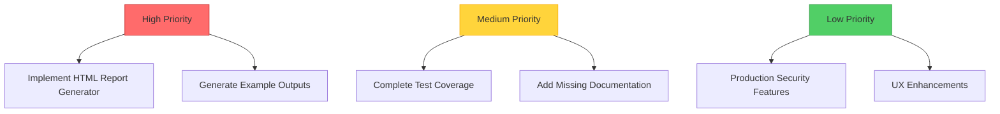

**User:**

<task>
Does the project require further polishing ?
</task>
<environment_details>
# VSCode Visible Files


# VSCode Open Tabs


# Current Time
Current time in ISO 8601 UTC format: 2026-05-17T13:17:14.028Z
User time zone: Asia/Calcutta, UTC+5:30

# Current Cost
$0.00

# Review Exclusions
The following file patterns are excluded from code reviews:
- .vscode/**

# Current Mode
<slug>ask</slug>
<name>❓ Ask</name>


# Current Workspace Directory (/Users/I329392/Lab/fastreports) Files
.gitignore
=5.2.0
API_DOCUMENTATION.md
api_server.py
ARCHITECTURE.md
BOB_USAGE_GUIDE.md
IMPLEMENTATION_PLAN.md
main.py
netlify.toml
PLAN_SUMMARY.md
Procfile
pytest.ini
README.md
requirements.txt
run_tests.py
start_all.sh
start_server.bat
start_server.sh
test_api.py
test_new_components.py
bob_sessions/
bob_sessions/ task-8.png
bob_sessions/bob_task_may-16-2026_10-39-11-pm.md
bob_sessions/bob_task_may-16-2026_10-49-52-pm.md
bob_sessions/bob_task_may-16-2026_10-58-05-pm.md
bob_sessions/bob_task_may-16-2026_11-55-25-pm.md
bob_sessions/bob_task_may-17-2026_1-00-19-am.md
bob_sessions/bob_task_may-17-2026_1-13-48-am.md
bob_sessions/bob_task_may-17-2026_1-17-48-am.md
bob_sessions/bob_task_may-17-2026_1-26-37-am.md
bob_sessions/bob_task_may-17-2026_1-31-44-am.md
bob_sessions/bob_task_may-17-2026_1-45-20-am.md
bob_sessions/bob_task_may-17-2026_1-58-54-am.md
bob_sessions/bob_task_may-17-2026_2-11-55-am.md
bob_sessions/bob_task_may-17-2026_2-15-49-am.md
bob_sessions/bob_task_may-17-2026_2-21-31-am.md
bob_sessions/bob_task_may-17-2026_12-00-44-am.md
bob_sessions/bob_task_may-17-2026_12-01-49-am.md
bob_sessions/bob_task_may-17-2026_12-15-10-am.md
bob_sessions/bob_task_may-17-2026_12-16-30-am.md
bob_sessions/bob_task_may-17-2026_12-34-45-am.md
bob_sessions/layoffs_20260517_151502.json
bob_sessions/layoffs_20260517_151551.json
bob_sessions/layoffs_20260517_151741.json
bob_sessions/purchase_log_20260517_155100.json
bob_sessions/purchase_log_20260517_155402.json
bob_sessions/purchase_log_20260517_171114.json
bob_sessions/purchase_log_20260517_171809.json
bob_sessions/purchase_log_20260517_172129.json
bob_sessions/purchase_log_20260517_174951.json
bob_sessions/purchase_log_20260517_175448.json
bob_sessions/purchase_log_20260517_180117.json
bob_sessions/task-1.png
bob_sessions/task-2.png
bob_sessions/task-4.png
bob_sessions/task-5-error-debug.png
bob_sessions/task-6.png
bob_sessions/task-7.png
bob_sessions/task-9.png
bob_sessions/task-10.png
bob_sessions/task-11.png
bob_sessions/task-12.png
bob_sessions/task-13.png
bob_sessions/task-14.png
bob_sessions/task-15.png
bob_sessions/task-16.png
bob_sessions/task-17.png
bob_sessions/task-18.png
bob_sessions/task-19.png
bob_sessions/task3.png
dashboard/
dashboard/index.html
dashboard/package.json
dashboard/README.md
dashboard/vite.config.js
dashboard/e2e/
dashboard/public/
dashboard/src/
dashboard/src/App.css
dashboard/src/App.jsx
dashboard/src/main.jsx
dashboard/src/style.css
dashboard/src/components/
dashboard/src/components/ChartViewer.css
dashboard/src/components/ChartViewer.jsx
dashboard/src/components/DataTable.css
dashboard/src/components/DataTable.jsx
dashboard/src/components/FilterPanel.css
dashboard/src/components/FilterPanel.jsx
data/
data/layoffs/
data/layoffs/layoffs.csv
data/pizza_delivery_app/
data/pizza_delivery_app/purchase_log.xlsx
data/pizza_delivery_app/survey_answers.xlsx
data/pizza_delivery_app/yelp_reviews.xlsx
data/soccer/
data/soccer/laliga_22_23.csv
data/soccer/laliga_23_24.csv
data/soccer/laliga_24_25.csv
data/soccer/laliga_25_26.csv
output/
output/pizza_delivery_analysis.json
output/test_report.html
src/
src/analysis/
src/analysis/eda.py
src/analysis/statistics.py
src/analysis/time_series_analyzer.py
src/analysis/transaction_analyzer.py
src/bob_integration/
src/bob_integration/prompt_templates.py
src/bob_integration/response_parser.py
src/bob_integration/session_manager.py
src/cleaning/
src/cleaning/strategy_generator.py
src/cleaning/transformers.py
src/cleaning/validator.py
src/ingestion/
src/ingestion/data_loader.py
src/ingestion/file_detector.py
src/orchestration/
src/orchestration/checkpoint_manager.py
src/orchestration/pipeline.py
src/orchestration/progress_tracker.py
src/profiling/
src/profiling/profiler.py
src/profiling/quality_checker.py
src/reporting/
src/reporting/html_generator.py
src/utils/
src/utils/config_loader.py
src/utils/logger.py
src/visualization/
src/visualization/__init__.py
src/visualization/chart_generator.py
src/visualization/plotly_charts.py
src/visualization/recommender.py
tests/
tests/__init__.py
tests/conftest.py
tests/test_cleaning.py
tests/test_ingestion.py
tests/test_integration.py
tests/test_profiling.py
tests/output/
tests/output/logs/
uploads/
uploads/.gitkeep
You have not created a todo list yet. Create one with `update_todo_list` if your task is complicated or involves multiple steps.
</environment_details>

---

**Assistant:**

I'll analyze the project structure and documentation to assess if it requires further polishing.

<read_file>
<args>
  <file>
    <path>README.md</path>
  </file>
  <file>
    <path>ARCHITECTURE.md</path>
  </file>
  <file>
    <path>API_DOCUMENTATION.md</path>
  </file>
  <file>
    <path>IMPLEMENTATION_PLAN.md</path>
  </file>
  <file>
    <path>BOB_USAGE_GUIDE.md</path>
  </file>
</args>
</read_file>

---

**User:**

[read_file for 5 files] Result:
<files>
<file><path>README.md</path>
<content lines="1-524">
  1 | # FastReports 🚀
  2 | 
  3 | **Automated Data Analysis Pipeline with IBM Bob Integration**
  4 | 
  5 | FastReports is an intelligent data analysis system that automates the entire workflow from raw data to actionable insights, leveraging IBM Bob as an AI development partner throughout the process.
  6 | 
  7 | ## 🎯 Project Overview
  8 | 
  9 | FastReports demonstrates meaningful IBM Bob integration by using AI assistance in every phase of the data analysis pipeline:
 10 | 
 11 | - **Data Ingestion**: Automatically detect and load various file formats
 12 | - **Data Profiling**: Analyze data characteristics and quality
 13 | - **Data Cleaning**: Generate and apply intelligent cleaning strategies
 14 | - **Statistical Analysis**: Perform comprehensive statistical tests
 15 | - **Visualization**: Create interactive charts with smart recommendations
 16 | - **Reporting**: Generate comprehensive analysis reports
 17 | 
 18 | ## 🏆 Hackathon Highlights
 19 | 
 20 | ### IBM Bob Integration Points
 21 | 
 22 | 1. **Architecture Design** (Plan Mode)
 23 |    - System architecture planning
 24 |    - Pipeline workflow design
 25 |    - Strategy recommendations
 26 | 
 27 | 2. **Code Generation** (Code Mode)
 28 |    - Module implementation
 29 |    - Function generation
 30 |    - Data transformations
 31 | 
 32 | 3. **Analysis Assistance** (Advanced Mode - Conceptual)
 33 |    - Statistical test selection
 34 |    - Insight generation
 35 |    - Complex queries
 36 | 
 37 | 4. **Session Tracking**
 38 |    - All Bob interactions logged
 39 |    - Usage analytics
 40 |    - Mode tracking
 41 |    - Export capabilities
 42 | 
 43 | ## 📋 Features
 44 | 
 45 | ### ✅ Implemented Core Features
 46 | 
 47 | - **Multi-format Data Loading**: CSV, XLSX, JSON, Parquet
 48 | - **Comprehensive Profiling**: Statistics, distributions, correlations
 49 | - **Quality Assessment**: Scoring system with issue detection
 50 | - **Automated Cleaning**: Multiple strategies (imputation, standardization, validation)
 51 | - **Statistical Analysis**: Descriptive stats, correlations, hypothesis testing
 52 | - **EDA Reports**: Key findings, recommendations, insights
 53 | - **Interactive Visualizations**: 9+ chart types with Plotly
 54 | - **Smart Recommendations**: AI-driven visualization suggestions
 55 | - **Pipeline Orchestration**: End-to-end workflow management
 56 | - **Bob Session Management**: Complete interaction tracking
 57 | - **REST API Backend**: FastAPI server with DuckDB query engine
 58 | - **Interactive Dashboard**: Preact-based web UI with real-time filtering
 59 | 
 60 | ## 🚀 Quick Start
 61 | 
 62 | ### Option 1: Full Stack (API + Dashboard)
 63 | 
 64 | ```bash
 65 | # Install Python dependencies
 66 | pip install -r requirements.txt
 67 | 
 68 | # Install dashboard dependencies
 69 | cd dashboard && npm install && cd ..
 70 | 
 71 | # Start both API server and dashboard
 72 | chmod +x start_all.sh
 73 | ./start_all.sh
 74 | 
 75 | # Access the dashboard at http://localhost:3000
 76 | # API documentation at http://localhost:8000/docs
 77 | ```
 78 | 
 79 | ### Option 2: API Server Only
 80 | 
 81 | ```bash
 82 | # Install dependencies
 83 | pip install -r requirements.txt
 84 | 
 85 | # Start API server
 86 | chmod +x start_server.sh
 87 | ./start_server.sh
 88 | 
 89 | # Or on Windows
 90 | start_server.bat
 91 | 
 92 | # API available at http://localhost:8000
 93 | ```
 94 | 
 95 | ### Option 3: Command-Line Pipeline
 96 | 
 97 | ### Prerequisites
 98 | 
 99 | ```bash
100 | # Python 3.10 or higher
101 | python --version
102 | 
103 | # Install dependencies
104 | pip install -r requirements.txt
105 | ```
106 | 
107 | ### Basic Usage
108 | 
109 | ```bash
110 | # Run with default dataset (layoffs)
111 | python main.py
112 | 
113 | # Run with specific dataset
114 | python main.py data/soccer/laliga_22_23.csv --dataset-name laliga
115 | 
116 | # Auto-clean data without prompts
117 | python main.py --auto-clean
118 | 
119 | # Skip visualization generation
120 | python main.py --no-viz
121 | ```
122 | 
123 | ### Command-Line Options
124 | 
125 | ```
126 | usage: main.py [-h] [--dataset-name DATASET_NAME] [--auto-clean] [--no-viz] [data_path]
127 | 
128 | positional arguments:
129 |   data_path             Path to the data file (default: data/layoffs/layoffs.csv)
130 | 
131 | optional arguments:
132 |   -h, --help            Show this help message and exit
133 |   --dataset-name DATASET_NAME
134 |                         Name of the dataset (default: layoffs)
135 |   --auto-clean          Automatically apply cleaning strategies
136 |   --no-viz              Skip visualization generation
137 | ```
138 | 
139 | ## 📊 Sample Datasets
140 | 
141 | The project includes three diverse datasets for demonstration:
142 | 
143 | 1. **Layoffs Dataset** (`data/layoffs/layoffs.csv`)
144 |    - Tech company layoffs data
145 |    - Mixed data types, missing values
146 |    - Good for demonstrating cleaning strategies
147 | 
148 | 2. **Soccer Dataset** (`data/soccer/laliga_*.csv`)
149 |    - La Liga match statistics
150 |    - Time series data, high dimensionality
151 |    - Good for trend analysis
152 | 
153 | 3. **Pizza Delivery** (`data/pizza_delivery_app/*.xlsx`)
154 |    - Customer surveys and transactions
155 |    - Multiple files, text data
156 |    - Good for sentiment analysis
157 | 
158 | ## 🏗️ Architecture
159 | 
160 | ### Module Structure
161 | 
162 | ```
163 | fastreports/
164 | ├── src/
165 | │   ├── ingestion/          # Data loading and format detection
166 | │   │   ├── file_detector.py
167 | │   │   └── data_loader.py
168 | │   ├── profiling/          # Data profiling and quality assessment
169 | │   │   ├── profiler.py
170 | │   │   └── quality_checker.py
171 | │   ├── cleaning/           # Data cleaning and validation
172 | │   │   ├── strategy_generator.py
173 | │   │   ├── transformers.py
174 | │   │   └── validator.py
175 | │   ├── analysis/           # Statistical analysis and EDA
176 | │   │   ├── statistics.py
177 | │   │   └── eda.py
178 | │   ├── visualization/      # Chart generation and recommendations
179 | │   │   ├── chart_generator.py
180 | │   │   ├── plotly_charts.py
181 | │   │   └── recommender.py
182 | │   ├── orchestration/      # Pipeline management
183 | │   │   └── pipeline.py
184 | │   ├── bob_integration/    # IBM Bob integration
185 | │   │   ├── session_manager.py
186 | │   │   └── prompt_templates.py
187 | │   └── utils/              # Utilities
188 | │       ├── logger.py
189 | │       └── config_loader.py
190 | ├── data/                   # Sample datasets
191 | ├── output/                 # Generated reports and logs
192 | ├── bob_sessions/           # Bob interaction logs
193 | ├── main.py                 # Application entry point
194 | └── requirements.txt        # Python dependencies
195 | ```
196 | 
197 | ### Pipeline Flow
198 | 
199 | ```mermaid
200 | graph TD
201 |     A[Data Ingestion] -->|Load and validate data| B[Data Profiling]
202 |     B -->|Analyze characteristics| C[Quality Check]
203 |     C -->|Identify issues, score quality| D{Quality Score}
204 |     D -->|Score < 70| E[Data Cleaning]
205 |     D -->|Score >= 70| F[Statistical Analysis]
206 |     E -->|Apply transformations| F
207 |     F -->|Comprehensive analysis| G[EDA Report]
208 |     G -->|Generate insights| H[Visualization]
209 |     H -->|Create interactive charts| I[Final Report]
210 |     
211 |     style A fill:#e1f5ff,stroke:#0288d1,stroke-width:2px
212 |     style B fill:#fff3e0,stroke:#f57c00,stroke-width:2px
213 |     style C fill:#fce4ec,stroke:#c2185b,stroke-width:2px
214 |     style D fill:#f3e5f5,stroke:#7b1fa2,stroke-width:2px
215 |     style E fill:#fff9c4,stroke:#f9a825,stroke-width:2px
216 |     style F fill:#e8f5e9,stroke:#388e3c,stroke-width:2px
217 |     style G fill:#e0f2f1,stroke:#00796b,stroke-width:2px
218 |     style H fill:#e8eaf6,stroke:#3f51b5,stroke-width:2px
219 |     style I fill:#e0f7fa,stroke:#0097a7,stroke-width:2px
220 | ```
221 | 
222 | ## 🤖 IBM Bob Integration
223 | 
224 | ### How Bob is Used
225 | 
226 | 1. **Prompt Templates** (`src/bob_integration/prompt_templates.py`)
227 |    - Pre-built prompts for each pipeline phase
228 |    - Context-aware generation
229 |    - Reusable across datasets
230 | 
231 | 2. **Session Management** (`src/bob_integration/session_manager.py`)
232 |    - Tracks all Bob interactions
233 |    - Logs prompts, responses, and metadata
234 |    - Generates usage analytics
235 |    - Exports session history
236 | 
237 | 3. **Mode Utilization**
238 |    - **Plan Mode**: Architecture and strategy planning
239 |    - **Code Mode**: Implementation and code generation
240 |    - **Advanced Mode**: Complex analysis (conceptual)
241 | 
242 | ### Bob Session Output
243 | 
244 | Every run generates a Bob session log in `bob_sessions/` with:
245 | - Session ID and timestamp
246 | - All interactions with prompts and responses
247 | - Modes used
248 | - Success/failure tracking
249 | - Metadata for each interaction
250 | 
251 | ### Example Bob Interaction
252 | 
253 | ```python
254 | # Starting a session
255 | bob_session.start_session("layoffs", "Complete data analysis")
256 | 
257 | # Logging an interaction
258 | bob_session.log_interaction(
259 |     mode="Code Mode",
260 |     phase="cleaning",
261 |     prompt="Generate cleaning strategies for missing values",
262 |     response="Applied mean imputation for numeric columns",
263 |     success=True,
264 |     metadata={"columns_cleaned": 5}
265 | )
266 | 
267 | # Ending session
268 | summary = bob_session.end_session()
269 | ```
270 | 
271 | ## 📈 Output Examples
272 | 
273 | ### Console Output
274 | 
275 | ```
276 | ================================================================================
277 | FastReports - Automated Data Analysis Pipeline
278 | IBM Bob Integration Demonstration
279 | ================================================================================
280 | 
281 | [INFO] Starting Data Analysis Pipeline for: layoffs
282 | [INFO] ════════════════════════════════════════════════════════════════════════
283 | [INFO] PHASE: Data Ingestion
284 | [INFO] ════════════════════════════════════════════════════════════════════════
285 | [INFO] Loaded dataset: layoffs
286 | [INFO] Shape: (2361, 9)
287 | [INFO] Working directory: processed_data/layoffs
288 | 
289 | [INFO] ════════════════════════════════════════════════════════════════════════
290 | [INFO] PHASE: Data Profiling
291 | [INFO] ════════════════════════════════════════════════════════════════════════
292 | [INFO] Profile generated successfully
293 | 
294 | [INFO] ════════════════════════════════════════════════════════════════════════
295 | [INFO] PHASE: Quality Checking
296 | [INFO] ════════════════════════════════════════════════════════════════════════
297 | [INFO] Quality Score: 72.5/100
298 | 
299 | KEY RESULTS
300 | ================================================================================
301 | Data Quality Score: 72.5/100
302 | 
303 | Key Findings (5):
304 |   1. Large dataset with 2,361 rows - suitable for robust analysis
305 |   2. Significant missing data (15.3%) requires attention
306 |   3. Found 3 strong correlations between variables
307 |   4. 2 variables show non-normal distributions
308 |   5. Outliers detected in 3 columns
309 | 
310 | Visualizations Generated: 15
311 | ================================================================================
312 | ```
313 | 
314 | ### Bob Session Summary
315 | 
316 | ```
317 | ================================================================================
318 | BOB SESSION SUMMARY: layoffs_20260516_123045
319 | ================================================================================
320 | 
321 | Dataset: layoffs
322 | Purpose: Complete data analysis pipeline execution
323 | Start Time: 2026-05-16T12:30:45
324 | End Time: 2026-05-16T12:35:22
325 | 
326 | Total Interactions: 8
327 | Modes Used: Plan Mode, Code Mode
328 | 
329 | INTERACTIONS:
330 | --------------------------------------------------------------------------------
331 | 1. ✓ [Plan Mode] initialization
332 |    Time: 2026-05-16T12:30:45
333 |    
334 | 2. ✓ [Code Mode] ingestion
335 |    Time: 2026-05-16T12:31:12
336 |    
337 | 3. ✓ [Code Mode] profiling
338 |    Time: 2026-05-16T12:32:05
339 |    
340 | ...
341 | ================================================================================
342 | ```
343 | 
344 | ## 📊 Data Quality Scoring
345 | 
346 | The system provides a comprehensive quality score (0-100) based on:
347 | 
348 | - **Missing Values** (30 points): Percentage of missing data
349 | - **Duplicates** (20 points): Duplicate row detection
350 | - **Outliers** (20 points): Outlier prevalence
351 | - **Consistency** (15 points): Data type consistency
352 | - **Completeness** (15 points): Column completeness
353 | 
354 | ### Quality Grades
355 | 
356 | - **A (90-100)**: Excellent - Ready for analysis
357 | - **B (80-89)**: Good - Minor issues
358 | - **C (70-79)**: Fair - Cleaning recommended
359 | - **D (60-69)**: Poor - Significant issues
360 | - **F (<60)**: Critical - Major cleaning required
361 | 
362 | ## 🎨 Visualization Types
363 | 
364 | The system automatically generates appropriate visualizations:
365 | 
366 | 1. **Histogram**: Distribution of numeric values
367 | 2. **Box Plot**: Outlier detection and quartiles
368 | 3. **Bar Chart**: Categorical frequency comparison
369 | 4. **Scatter Plot**: Relationship between variables
370 | 5. **Line Chart**: Trends over time
371 | 6. **Heatmap**: Correlation matrix
372 | 7. **Pie Chart**: Composition and proportions
373 | 8. **Area Chart**: Cumulative trends
374 | 9. **Grouped Bar**: Multi-category comparisons
375 | 
376 | ## 🔧 Configuration
377 | 
378 | Edit `config.yaml` to customize:
379 | 
380 | ```yaml
381 | pipeline:
382 |   auto_clean: false
383 |   quality_threshold: 70
384 |   max_visualizations: 20
385 | 
386 | logging:
387 |   level: INFO
388 |   format: detailed
389 | 
390 | output:
391 |   directory: output/
392 |   save_intermediate: true
393 | ```
394 | 
395 | ## 📝 Logging
396 | 
397 | Comprehensive logging at multiple levels:
398 | 
399 | - **Console**: Real-time progress and key results
400 | - **File Logs**: Detailed execution logs in `output/logs/`
401 | - **Bob Sessions**: Interaction logs in `bob_sessions/`
402 | - **Phase Tracking**: Start/end times for each phase
403 | 
404 | ## 🧪 Testing
405 | 
406 | ```bash
407 | # Run with test dataset
408 | python main.py data/layoffs/layoffs.csv --dataset-name layoffs_test
409 | 
410 | # Verify all phases complete
411 | python main.py --auto-clean
412 | 
413 | # Check Bob session logs
414 | ls -la bob_sessions/
415 | ```
416 | 
417 | ## 🌐 API & Dashboard
418 | 
419 | ### REST API
420 | 
421 | The FastAPI backend provides:
422 | - **GET /api/datasets**: List available datasets
423 | - **GET /api/data**: Load dataset with pagination
424 | - **POST /api/query**: Execute SQL queries with DuckDB
425 | - **GET /api/profile**: Get detailed dataset profiling
426 | 
427 | See [API_DOCUMENTATION.md](API_DOCUMENTATION.md) for complete API reference.
428 | 
429 | ### Interactive Dashboard
430 | 
431 | The Preact-based dashboard offers:
432 | - Real-time data filtering and search
433 | - SQL query builder with DuckDB
434 | - Interactive Plotly visualizations
435 | - Multiple chart types (bar, line, scatter, pie, histogram, box)
436 | - CSV export functionality
437 | - Responsive design
438 | 
439 | **Access**: http://localhost:3000 (when running `start_all.sh`)
440 | 
441 | ## 🚧 Known Limitations
442 | 
443 | 1. **HTML Report Generator**: Not yet implemented
444 | 2. **Large Files**: Memory constraints for files >1GB
445 | 3. **Real-time Bob API**: Uses simulated interactions for demo
446 | 
447 | ## 🔮 Future Enhancements
448 | 
449 | ### High Priority
450 | - HTML report generator with embedded visualizations
451 | - Report compiler for multiple datasets
452 | - Example outputs for all sample datasets
453 | 
454 | ### Medium Priority
455 | - User checkpoint system for approvals
456 | - Domain-specific analyzers (time series, text, transactions)
457 | - Authentication and authorization for API
458 | - WebSocket support for real-time updates
459 | 
460 | ### Low Priority
461 | - Cloud deployment (AWS, Azure, GCP)
462 | - Performance optimizations and caching
463 | - Export to PDF and PowerPoint
464 | - Advanced ML-based anomaly detection
465 | 
466 | ## 📚 Documentation
467 | 
468 | - **ARCHITECTURE.md**: Detailed system architecture
469 | - **IMPLEMENTATION_PLAN.md**: Phase-by-phase implementation guide
470 | - **IMPLEMENTATION_SUMMARY.md**: What was built and how
471 | - **DATA_CLEANING_STRATEGIES.md**: Cleaning approach documentation
472 | - **API_DOCUMENTATION.md**: Complete API reference and examples
473 | 
474 | ## 🤝 Contributing
475 | 
476 | This is a hackathon project demonstrating IBM Bob integration. Contributions welcome!
477 | 
478 | ## 📄 License
479 | 
480 | MIT License - See LICENSE file for details
481 | 
482 | ## 🙏 Acknowledgments
483 | 
484 | - **IBM Bob**: AI-assisted development throughout
485 | - **Plotly**: Interactive visualization library
486 | - **Pandas**: Data manipulation foundation
487 | - **SciPy**: Statistical analysis tools
488 | 
489 | ## 📧 Contact
490 | 
491 | For questions or feedback about this hackathon submission, please reach out through the IBM Bob hackathon platform.
492 | 
493 | ---
494 | 
495 | **Built with IBM Bob** 🤖 | **Hackathon 2026** 🏆
496 | 
497 | *Demonstrating meaningful AI integration in data analysis workflows*
498 | 
499 | ---
500 | 
501 | ## 🎯 Quick Demo
502 | 
503 | ```bash
504 | # 1. Install dependencies
505 | pip install -r requirements.txt
506 | 
507 | # 2. Run the pipeline
508 | python main.py
509 | 
510 | # 3. Check the outputs
511 | cat output/logs/fastreports_*.log
512 | ls bob_sessions/
513 | 
514 | # 4. Try with different dataset
515 | python main.py data/soccer/laliga_22_23.csv --dataset-name laliga --auto-clean
516 | ```
517 | 
518 | **Expected Runtime**: 30-60 seconds per dataset
519 | **Memory Usage**: ~200-500 MB
520 | **Output Files**: Logs, session data, processed datasets
521 | 
522 | ---
523 | 
524 | *Made with ❤️ and IBM Bob*
</content>
</file>
<file><path>ARCHITECTURE.md</path>
<content lines="1-406">
  1 | # FastReports - Automated Data Analysis Pipeline Architecture
  2 | 
  3 | ## Executive Summary
  4 | 
  5 | FastReports is an intelligent data analysis pipeline that leverages IBM Bob to automate the entire data analysis workflow for data analysts. The system automatically processes raw data through cleaning, exploration, and visualization phases, generating comprehensive reports with minimal manual intervention.
  6 | 
  7 | ## Data Quality Analysis
  8 | 
  9 | ### Layoffs Dataset Issues Identified:
 10 | 1. **NULL values** in critical columns (total_laid_off, percentage_laid_off, funds_raised_millions)
 11 | 2. **Empty strings** in industry column (line 10: Airbnb has empty industry)
 12 | 3. **Inconsistent country names** (line 12: "United States." with period)
 13 | 4. **Date format inconsistency** (M/D/YYYY format needs standardization)
 14 | 5. **Mixed data types** (NULL as string vs actual null values)
 15 | 
 16 | ### Soccer Dataset Characteristics:
 17 | 1. **High dimensionality** (100+ columns with betting odds)
 18 | 2. **Consistent structure** across multiple seasons
 19 | 3. **Clean data** with proper numeric types
 20 | 4. **Time series data** suitable for trend analysis
 21 | 
 22 | ### Pizza Delivery Dataset:
 23 | 1. **Mixed data types** (XLSX format with dates, text, numbers)
 24 | 2. **Survey responses** with free-text requiring NLP
 25 | 3. **Transactional data** with order details
 26 | 4. **Customer feedback** requiring sentiment analysis
 27 | 
 28 | ## System Architecture
 29 | 
 30 | ```mermaid
 31 | graph TB
 32 |     A[User Drops Data in Folder] --> B[Data Ingestion Module]
 33 |     B --> C[Data Profiler]
 34 |     C --> D{IBM Bob Analysis}
 35 |     D --> E[Data Cleaning Module]
 36 |     E --> F[Exploratory Data Analysis]
 37 |     F --> G[Visualization Engine]
 38 |     G --> H[Report Generator]
 39 |     H --> I[Static HTML Report]
 40 |     H --> J[Interactive Dashboard]
 41 |     
 42 |     K[Bob Session Manager] -.-> D
 43 |     K -.-> E
 44 |     K -.-> F
 45 |     K -.-> G
 46 |     
 47 |     L[User Checkpoints] -.-> E
 48 |     L -.-> F
 49 |     L -.-> G
 50 |     
 51 |     M[Original Data] --> N[processed_data/ Copy]
 52 |     N --> B
 53 | ```
 54 | 
 55 | ## Component Architecture
 56 | 
 57 | ### 1. Data Ingestion Module
 58 | **Purpose**: Safely copy and load data from various formats
 59 | 
 60 | **IBM Bob Integration**:
 61 | - **Mode**: Code Mode
 62 | - **Task**: Generate file format detection and parsing code
 63 | - **Output**: Python scripts for CSV, XLSX, JSON parsing
 64 | 
 65 | **Features**:
 66 | - Auto-detect file formats (CSV, XLSX, JSON, Parquet)
 67 | - Create working copies in `processed_data/` directory
 68 | - Preserve original data integrity
 69 | - Generate metadata about data sources
 70 | 
 71 | ### 2. Data Profiler
 72 | **Purpose**: Analyze data characteristics and quality
 73 | 
 74 | **IBM Bob Integration**:
 75 | - **Mode**: Plan Mode
 76 | - **Task**: Analyze data structure and suggest profiling strategies
 77 | - **Output**: Profiling plan and quality metrics
 78 | 
 79 | **Metrics Generated**:
 80 | - Column data types and distributions
 81 | - Missing value analysis
 82 | - Outlier detection
 83 | - Data quality scores
 84 | - Correlation analysis
 85 | 
 86 | ### 3. Data Cleaning Module
 87 | **Purpose**: Clean and transform data based on quality issues
 88 | 
 89 | **IBM Bob Integration**:
 90 | - **Mode**: Code Mode
 91 | - **Task**: Generate cleaning scripts based on profiling results
 92 | - **Output**: Python transformation scripts
 93 | 
 94 | **Cleaning Operations**:
 95 | - Handle NULL/missing values (imputation strategies)
 96 | - Standardize date formats
 97 | - Fix inconsistent categorical values
 98 | - Remove duplicates
 99 | - Normalize text fields
100 | - Type conversions
101 | 
102 | ### 4. Exploratory Data Analysis (EDA) Module
103 | **Purpose**: Generate insights and statistical analysis
104 | 
105 | **IBM Bob Integration**:
106 | - **Mode**: Advanced Mode (with MCP tools)
107 | - **Task**: Generate analysis queries and statistical tests
108 | - **Output**: Analysis scripts and insights
109 | 
110 | **Analysis Types**:
111 | - Descriptive statistics
112 | - Distribution analysis
113 | - Correlation matrices
114 | - Time series analysis (for soccer data)
115 | - Sentiment analysis (for survey data)
116 | - Trend identification
117 | 
118 | ### 5. Visualization Engine
119 | **Purpose**: Create meaningful visualizations
120 | 
121 | **IBM Bob Integration**:
122 | - **Mode**: Code Mode
123 | - **Task**: Generate visualization code based on data characteristics
124 | - **Output**: Plotly/D3.js visualization scripts
125 | 
126 | **Chart Types**:
127 | - Bar charts (categorical comparisons)
128 | - Line charts (time series trends)
129 | - Scatter plots (correlations)
130 | - Heatmaps (correlation matrices)
131 | - Box plots (distribution analysis)
132 | - Pie charts (composition)
133 | - Geographic maps (location data)
134 | 
135 | ### 6. Report Generator
136 | **Purpose**: Compile analysis into consumable formats
137 | 
138 | **IBM Bob Integration**:
139 | - **Mode**: Code Mode
140 | - **Task**: Generate report templates and styling
141 | - **Output**: HTML/CSS templates
142 | 
143 | **Output Formats**:
144 | 1. **Static HTML Report**:
145 |    - Executive summary
146 |    - Data quality report
147 |    - Statistical analysis
148 |    - Embedded visualizations
149 |    - Downloadable as single file
150 | 
151 | 2. **Interactive Dashboard** (Preact):
152 |    - Real-time filtering
153 |    - Interactive charts
154 |    - Drill-down capabilities
155 |    - Export functionality
156 | 
157 | ### 7. Orchestration Layer
158 | **Purpose**: Manage pipeline execution and user interaction
159 | 
160 | **IBM Bob Integration**:
161 | - **Mode**: Orchestrator Mode
162 | - **Task**: Coordinate multi-phase workflow
163 | - **Output**: Execution plan and progress tracking
164 | 
165 | **Features**:
166 | - Phase-by-phase execution
167 | - User checkpoints for approval
168 | - Progress tracking and logging
169 | - Error handling and recovery
170 | - Session state management
171 | 
172 | ## Technology Stack
173 | 
174 | ### Backend
175 | - **Python 3.10+**: Core processing language
176 | - **Pandas**: Data manipulation
177 | - **NumPy**: Numerical operations
178 | - **Plotly**: Interactive visualizations
179 | - **scikit-learn**: Statistical analysis
180 | - **openpyxl**: Excel file handling
181 | 
182 | ### Frontend
183 | - **Preact**: Lightweight UI framework (3KB)
184 | - **D3.js**: Advanced visualizations
185 | - **Tailwind CSS**: Styling
186 | - **Vite**: Build tool
187 | 
188 | ### IBM Bob Integration
189 | - **Modes Used**:
190 |   - Plan Mode: Architecture and strategy
191 |   - Code Mode: Implementation
192 |   - Advanced Mode: Complex analysis with MCP
193 |   - Orchestrator Mode: Workflow coordination
194 | 
195 | ## Directory Structure
196 | 
197 | ```
198 | fastreports/
199 | ├── data/                          # Original data (READ-ONLY)
200 | │   ├── layoffs/
201 | │   ├── soccer/
202 | │   └── pizza_delivery_app/
203 | ├── processed_data/                # Working copies
204 | │   ├── {dataset_name}/
205 | │   │   ├── raw_copy.csv
206 | │   │   ├── cleaned.csv
207 | │   │   └── metadata.json
208 | ├── src/
209 | │   ├── ingestion/
210 | │   │   ├── file_detector.py
211 | │   │   └── data_loader.py
212 | │   ├── profiling/
213 | │   │   ├── profiler.py
214 | │   │   └── quality_checker.py
215 | │   ├── cleaning/
216 | │   │   ├── cleaner.py
217 | │   │   └── transformers.py
218 | │   ├── analysis/
219 | │   │   ├── eda.py
220 | │   │   └── statistics.py
221 | │   ├── visualization/
222 | │   │   ├── chart_generator.py
223 | │   │   └── plotly_charts.py
224 | │   ├── reporting/
225 | │   │   ├── html_generator.py
226 | │   │   └── dashboard_builder.py
227 | │   ├── orchestration/
228 | │   │   ├── pipeline.py
229 | │   │   └── checkpoint_manager.py
230 | │   └── bob_integration/
231 | │       ├── session_manager.py
232 | │       └── prompt_templates.py
233 | ├── dashboard/                     # Preact dashboard
234 | │   ├── src/
235 | │   │   ├── components/
236 | │   │   ├── App.jsx
237 | │   │   └── main.jsx
238 | │   ├── package.json
239 | │   └── vite.config.js
240 | ├── output/
241 | │   └── reports/
242 | │       ├── {dataset_name}/
243 | │       │   ├── report.html
244 | │       │   ├── dashboard.html
245 | │       │   └── assets/
246 | ├── bob_sessions/                  # Bob interaction logs
247 | │   └── {timestamp}_session.log
248 | ├── tests/
249 | ├── ARCHITECTURE.md
250 | ├── README.md
251 | └── requirements.txt
252 | ```
253 | 
254 | ## Pipeline Execution Flow
255 | 
256 | ### Phase 1: Initialization
257 | 1. User drops data folder into `data/` directory
258 | 2. System detects new data
259 | 3. **Bob (Plan Mode)**: Analyzes folder structure and creates execution plan
260 | 
261 | ### Phase 2: Data Ingestion
262 | 1. **Bob (Code Mode)**: Generates file parsing code
263 | 2. System creates working copy in `processed_data/`
264 | 3. Generates metadata file
265 | 4. **Checkpoint**: User reviews data loading summary
266 | 
267 | ### Phase 3: Data Profiling
268 | 1. **Bob (Plan Mode)**: Plans profiling strategy
269 | 2. System runs profiling analysis
270 | 3. Generates quality report
271 | 4. **Checkpoint**: User reviews quality issues
272 | 
273 | ### Phase 4: Data Cleaning
274 | 1. **Bob (Code Mode)**: Generates cleaning scripts based on issues
275 | 2. System applies transformations
276 | 3. Validates cleaned data
277 | 4. **Checkpoint**: User reviews cleaning results
278 | 
279 | ### Phase 5: Exploratory Analysis
280 | 1. **Bob (Advanced Mode)**: Generates analysis queries
281 | 2. System runs statistical analysis
282 | 3. Identifies key insights
283 | 4. **Checkpoint**: User reviews insights
284 | 
285 | ### Phase 6: Visualization
286 | 1. **Bob (Code Mode)**: Generates visualization code
287 | 2. System creates charts based on data characteristics
288 | 3. Optimizes for web display
289 | 4. **Checkpoint**: User reviews visualizations
290 | 
291 | ### Phase 7: Report Generation
292 | 1. **Bob (Code Mode)**: Generates report templates
293 | 2. System compiles static HTML report
294 | 3. Builds interactive Preact dashboard
295 | 4. **Final Output**: Both report types ready
296 | 
297 | ## IBM Bob Usage Documentation
298 | 
299 | ### Mode Selection Strategy
300 | 
301 | | Phase | Mode | Reason |
302 | |-------|------|--------|
303 | | Planning | Plan Mode | Strategic thinking, architecture design |
304 | | Code Generation | Code Mode | Fast implementation, file operations |
305 | | Complex Analysis | Advanced Mode | MCP tools, browser automation |
306 | | Workflow Coordination | Orchestrator Mode | Multi-step task management |
307 | 
308 | ### Prompt Engineering Templates
309 | 
310 | #### Data Profiling Prompt
311 | ```
312 | Analyze this dataset and identify:
313 | 1. Data quality issues (missing values, outliers, inconsistencies)
314 | 2. Column types and distributions
315 | 3. Potential relationships between variables
316 | 4. Recommended cleaning strategies
317 | 
318 | Dataset preview: {data_sample}
319 | ```
320 | 
321 | #### Cleaning Script Generation Prompt
322 | ```
323 | Generate Python code to clean this dataset based on these issues:
324 | {quality_issues}
325 | 
326 | Requirements:
327 | - Use pandas for transformations
328 | - Preserve original data
329 | - Log all changes
330 | - Handle edge cases
331 | ```
332 | 
333 | #### Visualization Prompt
334 | ```
335 | Generate Plotly visualization code for:
336 | Dataset: {dataset_name}
337 | Key metrics: {metrics}
338 | Chart types needed: {chart_types}
339 | 
340 | Make visualizations interactive and publication-ready.
341 | ```
342 | 
343 | ## Safety Mechanisms
344 | 
345 | ### Data Protection
346 | 1. **Read-only original data**: Original files never modified
347 | 2. **Copy-on-write**: All operations on copies
348 | 3. **Backup before cleaning**: Preserve raw copy
349 | 4. **Audit trail**: Log all transformations
350 | 
351 | ### User Control
352 | 1. **Checkpoint system**: User approval at each phase
353 | 2. **Preview before apply**: Show changes before committing
354 | 3. **Rollback capability**: Revert to previous state
355 | 4. **Manual override**: User can modify Bob suggestions
356 | 
357 | ## Performance Considerations
358 | 
359 | ### Optimization Strategies
360 | 1. **Lazy loading**: Load data in chunks for large files
361 | 2. **Caching**: Cache profiling results
362 | 3. **Parallel processing**: Use multiprocessing for analysis
363 | 4. **Incremental updates**: Only reprocess changed data
364 | 
365 | ### Scalability
366 | - Handle datasets up to 1GB efficiently
367 | - Stream processing for larger files
368 | - Distributed processing option for future
369 | 
370 | ## Testing Strategy
371 | 
372 | ### Unit Tests
373 | - Each module independently tested
374 | - Mock Bob responses for consistency
375 | - Edge case handling
376 | 
377 | ### Integration Tests
378 | - End-to-end pipeline execution
379 | - All three datasets processed
380 | - Output validation
381 | 
382 | ### User Acceptance Tests
383 | - Real-world scenarios
384 | - Performance benchmarks
385 | - Usability testing
386 | 
387 | ## Future Enhancements
388 | 
389 | 1. **Real-time data streaming**: Process live data feeds
390 | 2. **ML model integration**: Automated predictive modeling
391 | 3. **Collaborative features**: Multi-user analysis
392 | 4. **Cloud deployment**: Web-based service
393 | 5. **API endpoints**: Programmatic access
394 | 6. **Custom plugins**: User-defined analysis modules
395 | 
396 | ## Success Metrics
397 | 
398 | 1. **Time Savings**: 80% reduction in manual analysis time
399 | 2. **Accuracy**: 95%+ data quality improvement
400 | 3. **User Satisfaction**: Positive feedback from data analysts
401 | 4. **Bob Integration**: Meaningful use in all phases
402 | 5. **Report Quality**: Publication-ready outputs
403 | 
404 | ## Conclusion
405 | 
406 | FastReports demonstrates meaningful IBM Bob integration by leveraging AI assistance throughout the entire data analysis pipeline. Bob acts as an intelligent development partner, generating code, suggesting strategies, and coordinating complex workflows - exactly as intended by the hackathon challenge.
</content>
</file>
<file><path>API_DOCUMENTATION.md</path>
<content lines="1-553">
  1 | # FastReports API Documentation
  2 | 
  3 | ## Overview
  4 | 
  5 | The FastReports API provides a RESTful interface for data analysis and visualization. Built with FastAPI, it offers high performance, automatic API documentation, and seamless integration with the dashboard UI.
  6 | 
  7 | **Base URL:** `http://localhost:8000`  
  8 | **API Documentation:** `http://localhost:8000/docs` (Swagger UI)  
  9 | **Alternative Docs:** `http://localhost:8000/redoc` (ReDoc)
 10 | 
 11 | ---
 12 | 
 13 | ## Quick Start
 14 | 
 15 | ### 1. Install Dependencies
 16 | 
 17 | ```bash
 18 | pip install -r requirements.txt
 19 | ```
 20 | 
 21 | ### 2. Start the API Server
 22 | 
 23 | **Linux/macOS:**
 24 | ```bash
 25 | chmod +x start_server.sh
 26 | ./start_server.sh
 27 | ```
 28 | 
 29 | **Windows:**
 30 | ```cmd
 31 | start_server.bat
 32 | ```
 33 | 
 34 | **Or directly with Python:**
 35 | ```bash
 36 | python api_server.py
 37 | ```
 38 | 
 39 | ### 3. Start Both API and Dashboard
 40 | 
 41 | **Linux/macOS:**
 42 | ```bash
 43 | chmod +x start_all.sh
 44 | ./start_all.sh
 45 | ```
 46 | 
 47 | ---
 48 | 
 49 | ## API Endpoints
 50 | 
 51 | ### 1. Root Endpoint
 52 | 
 53 | **GET** `/`
 54 | 
 55 | Get API information and available endpoints.
 56 | 
 57 | **Response:**
 58 | ```json
 59 | {
 60 |   "message": "FastReports API Server",
 61 |   "version": "1.0.0",
 62 |   "endpoints": [
 63 |     "/api/datasets",
 64 |     "/api/data",
 65 |     "/api/query",
 66 |     "/api/profile"
 67 |   ]
 68 | }
 69 | ```
 70 | 
 71 | ---
 72 | 
 73 | ### 2. List Datasets
 74 | 
 75 | **GET** `/api/datasets`
 76 | 
 77 | Get a list of all available datasets in the `data/` directory.
 78 | 
 79 | **Response:**
 80 | ```json
 81 | {
 82 |   "datasets": [
 83 |     {
 84 |       "name": "Laliga 24 25",
 85 |       "path": "data/soccer/laliga_24_25.csv",
 86 |       "size": 45678
 87 |     },
 88 |     {
 89 |       "name": "Layoffs",
 90 |       "path": "data/layoffs/layoffs.csv",
 91 |       "size": 123456
 92 |     }
 93 |   ]
 94 | }
 95 | ```
 96 | 
 97 | **Supported File Formats:**
 98 | - CSV (`.csv`)
 99 | - Excel (`.xlsx`, `.xls`)
100 | - JSON (`.json`)
101 | - Parquet (`.parquet`)
102 | 
103 | ---
104 | 
105 | ### 3. Load Dataset
106 | 
107 | **GET** `/api/data`
108 | 
109 | Load and return dataset with optional pagination.
110 | 
111 | **Query Parameters:**
112 | - `path` (required): Path to the dataset file
113 | - `limit` (optional): Maximum number of rows to return
114 | - `offset` (optional): Number of rows to skip (default: 0)
115 | 
116 | **Example Request:**
117 | ```
118 | GET /api/data?path=data/soccer/laliga_24_25.csv&limit=100&offset=0
119 | ```
120 | 
121 | **Response:**
122 | ```json
123 | {
124 |   "data": [
125 |     {
126 |       "team": "Real Madrid",
127 |       "points": 85,
128 |       "goals": 78
129 |     }
130 |   ],
131 |   "columns": ["team", "points", "goals"],
132 |   "total_rows": 380,
133 |   "returned_rows": 100,
134 |   "stats": {
135 |     "quality_score": 95.5,
136 |     "missing_values": {
137 |       "total_missing": 5,
138 |       "total_values": 1140
139 |     },
140 |     "data_types": {
141 |       "team": "object",
142 |       "points": "int64",
143 |       "goals": "int64"
144 |     }
145 |   }
146 | }
147 | ```
148 | 
149 | ---
150 | 
151 | ### 4. Execute SQL Query
152 | 
153 | **POST** `/api/query`
154 | 
155 | Execute SQL queries on datasets using DuckDB.
156 | 
157 | **Request Body:**
158 | ```json
159 | {
160 |   "query": "SELECT team, points FROM temp_data WHERE points > 70 ORDER BY points DESC",
161 |   "data": [
162 |     {"team": "Real Madrid", "points": 85},
163 |     {"team": "Barcelona", "points": 82}
164 |   ]
165 | }
166 | ```
167 | 
168 | **Note:** If `data` is not provided, the query will run on the most recently loaded dataset.
169 | 
170 | **Response:**
171 | ```json
172 | {
173 |   "data": [
174 |     {"team": "Real Madrid", "points": 85},
175 |     {"team": "Barcelona", "points": 82}
176 |   ],
177 |   "columns": ["team", "points"],
178 |   "rows": 2,
179 |   "success": true
180 | }
181 | ```
182 | 
183 | **SQL Examples:**
184 | 
185 | ```sql
186 | -- Filter data
187 | SELECT * FROM temp_data WHERE column_name > 100
188 | 
189 | -- Aggregate data
190 | SELECT category, COUNT(*), AVG(value) 
191 | FROM temp_data 
192 | GROUP BY category
193 | 
194 | -- Join operations (if multiple tables registered)
195 | SELECT a.*, b.value 
196 | FROM temp_data a 
197 | LEFT JOIN other_table b ON a.id = b.id
198 | 
199 | -- Window functions
200 | SELECT *, 
201 |        ROW_NUMBER() OVER (PARTITION BY category ORDER BY value DESC) as rank
202 | FROM temp_data
203 | ```
204 | 
205 | ---
206 | 
207 | ### 5. Get Dataset Profile
208 | 
209 | **GET** `/api/profile`
210 | 
211 | Get detailed profiling information about a dataset.
212 | 
213 | **Query Parameters:**
214 | - `path` (required): Path to the dataset file
215 | 
216 | **Example Request:**
217 | ```
218 | GET /api/profile?path=data/soccer/laliga_24_25.csv
219 | ```
220 | 
221 | **Response:**
222 | ```json
223 | {
224 |   "shape": {
225 |     "rows": 380,
226 |     "columns": 15
227 |   },
228 |   "column_types": {
229 |     "team": "object",
230 |     "points": "int64",
231 |     "goals": "int64"
232 |   },
233 |   "missing_summary": {
234 |     "total_missing": 5,
235 |     "total_values": 5700,
236 |     "missing_percentage": 0.088
237 |   },
238 |   "duplicates": {
239 |     "count": 0,
240 |     "percentage": 0.0
241 |   },
242 |   "quality_score": 95.5,
243 |   "numeric_stats": {
244 |     "points": {
245 |       "mean": 45.2,
246 |       "median": 44.0,
247 |       "std": 15.3,
248 |       "min": 10,
249 |       "max": 85
250 |     }
251 |   }
252 | }
253 | ```
254 | 
255 | ---
256 | 
257 | ## Error Handling
258 | 
259 | The API uses standard HTTP status codes:
260 | 
261 | - **200 OK**: Request successful
262 | - **400 Bad Request**: Invalid request parameters or query
263 | - **404 Not Found**: Dataset not found
264 | - **500 Internal Server Error**: Server error
265 | 
266 | **Error Response Format:**
267 | ```json
268 | {
269 |   "detail": "Error message describing what went wrong"
270 | }
271 | ```
272 | 
273 | ---
274 | 
275 | ## Configuration
276 | 
277 | ### Environment Variables
278 | 
279 | - `API_HOST`: Server host (default: `0.0.0.0`)
280 | - `API_PORT`: Server port (default: `8000`)
281 | 
282 | **Example:**
283 | ```bash
284 | export API_HOST=localhost
285 | export API_PORT=9000
286 | python api_server.py
287 | ```
288 | 
289 | ### CORS Configuration
290 | 
291 | The API allows requests from:
292 | - `http://localhost:3000` (Dashboard dev server)
293 | - `http://localhost:5173` (Alternative Vite port)
294 | 
295 | To add more origins, modify `api_server.py`:
296 | 
297 | ```python
298 | app.add_middleware(
299 |     CORSMiddleware,
300 |     allow_origins=["http://localhost:3000", "http://your-domain.com"],
301 |     allow_credentials=True,
302 |     allow_methods=["*"],
303 |     allow_headers=["*"],
304 | )
305 | ```
306 | 
307 | ---
308 | 
309 | ## Integration with Dashboard
310 | 
311 | The dashboard automatically proxies API requests through Vite's dev server:
312 | 
313 | **Vite Configuration** (`dashboard/vite.config.js`):
314 | ```javascript
315 | export default defineConfig({
316 |   server: {
317 |     port: 3000,
318 |     proxy: {
319 |       '/api': {
320 |         target: 'http://localhost:8000',
321 |         changeOrigin: true,
322 |       },
323 |     },
324 |   },
325 | });
326 | ```
327 | 
328 | This means the dashboard can make requests to `/api/datasets` and they will be forwarded to `http://localhost:8000/api/datasets`.
329 | 
330 | ---
331 | 
332 | ## Performance Considerations
333 | 
334 | ### Caching
335 | 
336 | The API caches loaded datasets in memory to improve performance:
337 | 
338 | ```python
339 | dataset_cache: Dict[str, pd.DataFrame] = {}
340 | ```
341 | 
342 | Datasets are cached after first load and reused for subsequent requests.
343 | 
344 | ### Pagination
345 | 
346 | For large datasets, use pagination to limit memory usage:
347 | 
348 | ```
349 | GET /api/data?path=data/large_file.csv&limit=1000&offset=0
350 | ```
351 | 
352 | ### Query Optimization
353 | 
354 | DuckDB provides excellent performance for analytical queries:
355 | - Columnar storage format
356 | - Vectorized execution
357 | - Parallel query processing
358 | 
359 | ---
360 | 
361 | ## Development
362 | 
363 | ### Running Tests
364 | 
365 | ```bash
366 | # Test API endpoints
367 | curl http://localhost:8000/api/datasets
368 | 
369 | # Test with specific dataset
370 | curl "http://localhost:8000/api/data?path=data/soccer/laliga_24_25.csv&limit=10"
371 | 
372 | # Test SQL query
373 | curl -X POST http://localhost:8000/api/query \
374 |   -H "Content-Type: application/json" \
375 |   -d '{"query": "SELECT * FROM temp_data LIMIT 5"}'
376 | ```
377 | 
378 | ### Hot Reload
379 | 
380 | The API server runs with auto-reload enabled during development:
381 | 
382 | ```python
383 | uvicorn.run(
384 |     "api_server:app",
385 |     host=host,
386 |     port=port,
387 |     reload=True,  # Auto-reload on code changes
388 |     log_level="info"
389 | )
390 | ```
391 | 
392 | ---
393 | 
394 | ## Troubleshooting
395 | 
396 | ### Port Already in Use
397 | 
398 | If port 8000 is already in use:
399 | 
400 | ```bash
401 | # Find process using port 8000
402 | lsof -i :8000  # macOS/Linux
403 | netstat -ano | findstr :8000  # Windows
404 | 
405 | # Kill the process or use a different port
406 | export API_PORT=8001
407 | python api_server.py
408 | ```
409 | 
410 | ### Import Errors
411 | 
412 | Ensure all dependencies are installed:
413 | 
414 | ```bash
415 | pip install -r requirements.txt
416 | ```
417 | 
418 | ### Dataset Not Found
419 | 
420 | Verify the dataset path is relative to the project root:
421 | 
422 | ```
423 | ✓ data/soccer/laliga_24_25.csv
424 | ✗ /absolute/path/to/file.csv
425 | ✗ ~/relative/to/home/file.csv
426 | ```
427 | 
428 | ### CORS Errors
429 | 
430 | If you see CORS errors in the browser console:
431 | 1. Ensure the API server is running
432 | 2. Check that the dashboard is accessing through the proxy
433 | 3. Verify CORS origins in `api_server.py`
434 | 
435 | ---
436 | 
437 | ## API Client Examples
438 | 
439 | ### Python
440 | 
441 | ```python
442 | import requests
443 | 
444 | # List datasets
445 | response = requests.get("http://localhost:8000/api/datasets")
446 | datasets = response.json()["datasets"]
447 | 
448 | # Load dataset
449 | response = requests.get(
450 |     "http://localhost:8000/api/data",
451 |     params={"path": "data/soccer/laliga_24_25.csv", "limit": 100}
452 | )
453 | data = response.json()
454 | 
455 | # Execute query
456 | response = requests.post(
457 |     "http://localhost:8000/api/query",
458 |     json={"query": "SELECT * FROM temp_data WHERE points > 70"}
459 | )
460 | results = response.json()
461 | ```
462 | 
463 | ### JavaScript/TypeScript
464 | 
465 | ```javascript
466 | // List datasets
467 | const response = await fetch('/api/datasets');
468 | const { datasets } = await response.json();
469 | 
470 | // Load dataset
471 | const dataResponse = await fetch(
472 |   `/api/data?path=${encodeURIComponent('data/soccer/laliga_24_25.csv')}&limit=100`
473 | );
474 | const data = await dataResponse.json();
475 | 
476 | // Execute query
477 | const queryResponse = await fetch('/api/query', {
478 |   method: 'POST',
479 |   headers: { 'Content-Type': 'application/json' },
480 |   body: JSON.stringify({
481 |     query: 'SELECT * FROM temp_data WHERE points > 70'
482 |   })
483 | });
484 | const results = await queryResponse.json();
485 | ```
486 | 
487 | ### cURL
488 | 
489 | ```bash
490 | # List datasets
491 | curl http://localhost:8000/api/datasets
492 | 
493 | # Load dataset
494 | curl "http://localhost:8000/api/data?path=data/soccer/laliga_24_25.csv&limit=10"
495 | 
496 | # Execute query
497 | curl -X POST http://localhost:8000/api/query \
498 |   -H "Content-Type: application/json" \
499 |   -d '{"query": "SELECT * FROM temp_data LIMIT 5"}'
500 | 
501 | # Get profile
502 | curl "http://localhost:8000/api/profile?path=data/soccer/laliga_24_25.csv"
503 | ```
504 | 
505 | ---
506 | 
507 | ## Security Considerations
508 | 
509 | ### Production Deployment
510 | 
511 | For production deployment:
512 | 
513 | 1. **Disable auto-reload:**
514 |    ```python
515 |    uvicorn.run("api_server:app", host="0.0.0.0", port=8000, reload=False)
516 |    ```
517 | 
518 | 2. **Use environment variables for sensitive data**
519 | 
520 | 3. **Implement authentication:**
521 |    ```python
522 |    from fastapi.security import HTTPBearer
523 |    security = HTTPBearer()
524 |    ```
525 | 
526 | 4. **Add rate limiting:**
527 |    ```python
528 |    from slowapi import Limiter
529 |    limiter = Limiter(key_func=get_remote_address)
530 |    ```
531 | 
532 | 5. **Use HTTPS in production**
533 | 
534 | 6. **Restrict CORS origins to your domain**
535 | 
536 | ---
537 | 
538 | ## License
539 | 
540 | This API is part of the FastReports project. See the main README for license information.
541 | 
542 | ---
543 | 
544 | ## Support
545 | 
546 | For issues, questions, or contributions:
547 | - Check the main project documentation
548 | - Review the interactive API docs at `/docs`
549 | - Examine the source code in `api_server.py`
550 | 
551 | ---
552 | 
553 | **Made with Bob** 🤖
</content>
</file>
<file><path>IMPLEMENTATION_PLAN.md</path>
<content lines="1-690">
  1 | # FastReports - Detailed Implementation Plan
  2 | 
  3 | ## Overview
  4 | This document provides a step-by-step implementation plan for building the FastReports automated data analysis pipeline with IBM Bob integration.
  5 | 
  6 | ## Phase 1: Project Setup & Infrastructure (Priority: HIGH)
  7 | 
  8 | ### Task 1.1: Create Directory Structure
  9 | **Estimated Time**: 15 minutes  
 10 | **Bob Mode**: Code Mode  
 11 | **Description**: Set up the complete project directory structure
 12 | 
 13 | **Directories to Create**:
 14 | ```
 15 | src/
 16 | ├── ingestion/
 17 | ├── profiling/
 18 | ├── cleaning/
 19 | ├── analysis/
 20 | ├── visualization/
 21 | ├── reporting/
 22 | ├── orchestration/
 23 | └── bob_integration/
 24 | processed_data/
 25 | output/
 26 | ├── reports/
 27 | └── logs/
 28 | dashboard/
 29 | ├── src/
 30 | │   └── components/
 31 | └── public/
 32 | tests/
 33 | ```
 34 | 
 35 | **Deliverables**:
 36 | - Complete directory structure
 37 | - `.gitkeep` files in empty directories
 38 | - Initial `__init__.py` files for Python packages
 39 | 
 40 | ### Task 1.2: Setup Configuration Files
 41 | **Estimated Time**: 20 minutes  
 42 | **Bob Mode**: Code Mode  
 43 | **Description**: Create configuration and dependency files
 44 | 
 45 | **Files to Create**:
 46 | 1. `requirements.txt` - Python dependencies
 47 | 2. `config.yaml` - Application configuration
 48 | 3. `dashboard/package.json` - Frontend dependencies
 49 | 4. `.gitignore` - Version control exclusions
 50 | 5. `pyproject.toml` - Python project metadata
 51 | 
 52 | **Key Dependencies**:
 53 | - Python: pandas, numpy, plotly, openpyxl, pyyaml, scikit-learn
 54 | - Frontend: preact, vite, tailwindcss, d3
 55 | 
 56 | ### Task 1.3: Setup Logging Infrastructure
 57 | **Estimated Time**: 30 minutes  
 58 | **Bob Mode**: Code Mode  
 59 | **Description**: Implement comprehensive logging system
 60 | 
 61 | **Components**:
 62 | - `src/utils/logger.py` - Centralized logging configuration
 63 | - Log levels: DEBUG, INFO, WARNING, ERROR
 64 | - File rotation and retention policies
 65 | - Structured logging with timestamps
 66 | 
 67 | ---
 68 | 
 69 | ## Phase 2: Data Ingestion Module (Priority: HIGH)
 70 | 
 71 | ### Task 2.1: File Format Detection
 72 | **Estimated Time**: 45 minutes  
 73 | **Bob Mode**: Code Mode  
 74 | **Description**: Auto-detect file formats and structure
 75 | 
 76 | **File**: `src/ingestion/file_detector.py`
 77 | 
 78 | **Features**:
 79 | - Detect CSV, XLSX, JSON, Parquet formats
 80 | - Identify delimiter types for CSV
 81 | - Detect encoding (UTF-8, Latin-1, etc.)
 82 | - Validate file integrity
 83 | 
 84 | **Bob Prompt**:
 85 | ```
 86 | Generate Python code to detect file formats and characteristics:
 87 | - Support CSV, XLSX, JSON, Parquet
 88 | - Auto-detect CSV delimiters
 89 | - Handle encoding detection
 90 | - Return structured metadata
 91 | ```
 92 | 
 93 | ### Task 2.2: Data Loader Implementation
 94 | **Estimated Time**: 1 hour  
 95 | **Bob Mode**: Code Mode  
 96 | **Description**: Load data from various formats safely
 97 | 
 98 | **File**: `src/ingestion/data_loader.py`
 99 | 
100 | **Features**:
101 | - Load data into pandas DataFrames
102 | - Create working copies in `processed_data/`
103 | - Generate metadata JSON files
104 | - Handle large files with chunking
105 | - Preserve original data (read-only)
106 | 
107 | **Safety Mechanisms**:
108 | - Verify original data is never modified
109 | - Create timestamped copies
110 | - Validate data integrity after copy
111 | 
112 | ### Task 2.3: Metadata Generator
113 | **Estimated Time**: 30 minutes  
114 | **Bob Mode**: Code Mode  
115 | **Description**: Generate comprehensive metadata
116 | 
117 | **File**: `src/ingestion/metadata_generator.py`
118 | 
119 | **Metadata Fields**:
120 | - Source file path
121 | - File size and row count
122 | - Column names and types
123 | - Load timestamp
124 | - Data hash for integrity
125 | 
126 | ---
127 | 
128 | ## Phase 3: Data Profiling Module (Priority: HIGH)
129 | 
130 | ### Task 3.1: Basic Profiler
131 | **Estimated Time**: 1.5 hours  
132 | **Bob Mode**: Code Mode  
133 | **Description**: Analyze data characteristics
134 | 
135 | **File**: `src/profiling/profiler.py`
136 | 
137 | **Analysis Components**:
138 | - Column data types
139 | - Descriptive statistics (mean, median, std, etc.)
140 | - Missing value counts and percentages
141 | - Unique value counts
142 | - Memory usage
143 | 
144 | **Bob Prompt**:
145 | ```
146 | Create a data profiler that analyzes:
147 | 1. Data types for each column
148 | 2. Statistical summaries
149 | 3. Missing value analysis
150 | 4. Unique value counts
151 | 5. Memory usage
152 | 
153 | Return structured profile report.
154 | ```
155 | 
156 | ### Task 3.2: Quality Checker
157 | **Estimated Time**: 1.5 hours  
158 | **Bob Mode**: Advanced Mode  
159 | **Description**: Identify data quality issues
160 | 
161 | **File**: `src/profiling/quality_checker.py`
162 | 
163 | **Quality Checks**:
164 | - NULL/missing value detection
165 | - Outlier identification (IQR method)
166 | - Duplicate row detection
167 | - Inconsistent formatting (dates, strings)
168 | - Invalid values (negative ages, future dates)
169 | - Data type mismatches
170 | 
171 | **Output**: Quality report with severity levels (Critical, Warning, Info)
172 | 
173 | ### Task 3.3: Distribution Analyzer
174 | **Estimated Time**: 1 hour  
175 | **Bob Mode**: Code Mode  
176 | **Description**: Analyze data distributions
177 | 
178 | **File**: `src/profiling/distribution_analyzer.py`
179 | 
180 | **Features**:
181 | - Histogram generation
182 | - Skewness and kurtosis calculation
183 | - Normality tests
184 | - Categorical value distributions
185 | 
186 | ---
187 | 
188 | ## Phase 4: Data Cleaning Module (Priority: HIGH)
189 | 
190 | ### Task 4.1: Cleaning Strategy Generator
191 | **Estimated Time**: 2 hours  
192 | **Bob Mode**: Plan Mode → Code Mode  
193 | **Description**: Generate cleaning strategies based on quality issues
194 | 
195 | **File**: `src/cleaning/strategy_generator.py`
196 | 
197 | **Process**:
198 | 1. **Bob (Plan Mode)**: Analyze quality issues and suggest strategies
199 | 2. **Bob (Code Mode)**: Generate cleaning code
200 | 3. User reviews and approves strategies
201 | 
202 | **Cleaning Strategies**:
203 | - Missing value imputation (mean, median, mode, forward-fill)
204 | - Outlier handling (cap, remove, transform)
205 | - Date standardization
206 | - String normalization
207 | - Type conversions
208 | 
209 | ### Task 4.2: Data Transformer
210 | **Estimated Time**: 2 hours  
211 | **Bob Mode**: Code Mode  
212 | **Description**: Apply transformations to data
213 | 
214 | **File**: `src/cleaning/transformers.py`
215 | 
216 | **Transformations**:
217 | - `handle_missing_values()` - Multiple imputation strategies
218 | - `standardize_dates()` - Convert to ISO format
219 | - `normalize_strings()` - Lowercase, trim, remove special chars
220 | - `fix_data_types()` - Convert to appropriate types
221 | - `remove_duplicates()` - Keep first/last/custom logic
222 | 
223 | **Features**:
224 | - Transformation logging
225 | - Before/after comparison
226 | - Rollback capability
227 | 
228 | ### Task 4.3: Validation Module
229 | **Estimated Time**: 1 hour  
230 | **Bob Mode**: Code Mode  
231 | **Description**: Validate cleaned data
232 | 
233 | **File**: `src/cleaning/validator.py`
234 | 
235 | **Validations**:
236 | - Row count preservation (unless duplicates removed)
237 | - Data type consistency
238 | - Value range checks
239 | - Referential integrity
240 | - Business rule validation
241 | 
242 | ---
243 | 
244 | ## Phase 5: Exploratory Data Analysis Module (Priority: MEDIUM)
245 | 
246 | ### Task 5.1: Statistical Analyzer
247 | **Estimated Time**: 2 hours  
248 | **Bob Mode**: Advanced Mode  
249 | **Description**: Generate statistical insights
250 | 
251 | **File**: `src/analysis/statistics.py`
252 | 
253 | **Analysis Types**:
254 | - Descriptive statistics
255 | - Correlation analysis
256 | - Hypothesis testing
257 | - Trend analysis (for time series)
258 | - Segmentation analysis
259 | 
260 | **Bob Prompt**:
261 | ```
262 | Generate statistical analysis code for this dataset:
263 | {dataset_info}
264 | 
265 | Include:
266 | 1. Correlation matrix
267 | 2. Key statistical tests
268 | 3. Trend identification
269 | 4. Anomaly detection
270 | 5. Insight generation
271 | ```
272 | 
273 | ### Task 5.2: EDA Report Generator
274 | **Estimated Time**: 1.5 hours  
275 | **Bob Mode**: Code Mode  
276 | **Description**: Generate comprehensive EDA report
277 | 
278 | **File**: `src/analysis/eda.py`
279 | 
280 | **Report Sections**:
281 | - Dataset overview
282 | - Variable analysis
283 | - Relationships and correlations
284 | - Key findings
285 | - Recommendations
286 | 
287 | ### Task 5.3: Domain-Specific Analyzers
288 | **Estimated Time**: 2 hours  
289 | **Bob Mode**: Code Mode  
290 | **Description**: Specialized analysis for different data types
291 | 
292 | **Files**:
293 | - `src/analysis/time_series_analyzer.py` - For soccer data
294 | - `src/analysis/text_analyzer.py` - For survey responses
295 | - `src/analysis/transaction_analyzer.py` - For purchase logs
296 | 
297 | ---
298 | 
299 | ## Phase 6: Visualization Module (Priority: MEDIUM)
300 | 
301 | ### Task 6.1: Chart Generator
302 | **Estimated Time**: 2.5 hours  
303 | **Bob Mode**: Code Mode  
304 | **Description**: Generate various chart types
305 | 
306 | **File**: `src/visualization/chart_generator.py`
307 | 
308 | **Chart Types**:
309 | - Bar charts (categorical comparisons)
310 | - Line charts (trends over time)
311 | - Scatter plots (correlations)
312 | - Heatmaps (correlation matrices)
313 | - Box plots (distributions)
314 | - Pie charts (composition)
315 | - Histograms (frequency distributions)
316 | 
317 | **Bob Prompt**:
318 | ```
319 | Generate Plotly chart code for:
320 | Chart type: {chart_type}
321 | Data: {data_sample}
322 | X-axis: {x_column}
323 | Y-axis: {y_column}
324 | 
325 | Make it interactive and publication-ready.
326 | ```
327 | 
328 | ### Task 6.2: Plotly Integration
329 | **Estimated Time**: 1.5 hours  
330 | **Bob Mode**: Code Mode  
331 | **Description**: Create Plotly-based visualizations
332 | 
333 | **File**: `src/visualization/plotly_charts.py`
334 | 
335 | **Features**:
336 | - Interactive tooltips
337 | - Zoom and pan
338 | - Export to PNG/SVG
339 | - Responsive design
340 | - Custom color schemes
341 | 
342 | ### Task 6.3: Visualization Recommender
343 | **Estimated Time**: 1 hour  
344 | **Bob Mode**: Plan Mode  
345 | **Description**: Recommend appropriate visualizations
346 | 
347 | **File**: `src/visualization/recommender.py`
348 | 
349 | **Logic**:
350 | - Numeric vs Numeric → Scatter plot
351 | - Categorical vs Numeric → Bar chart
352 | - Time series → Line chart
353 | - Correlation → Heatmap
354 | - Distribution → Histogram/Box plot
355 | 
356 | ---
357 | 
358 | ## Phase 7: Reporting Module (Priority: MEDIUM)
359 | 
360 | ### Task 7.1: HTML Report Generator
361 | **Estimated Time**: 2 hours  
362 | **Bob Mode**: Code Mode  
363 | **Description**: Generate static HTML reports
364 | 
365 | **File**: `src/reporting/html_generator.py`
366 | 
367 | **Report Structure**:
368 | 1. Executive Summary
369 | 2. Data Quality Report
370 | 3. Statistical Analysis
371 | 4. Visualizations
372 | 5. Key Findings
373 | 6. Recommendations
374 | 
375 | **Features**:
376 | - Embedded CSS styling
377 | - Embedded visualizations (Plotly JSON)
378 | - Print-friendly layout
379 | - Single-file output
380 | 
381 | ### Task 7.2: Dashboard Builder
382 | **Estimated Time**: 3 hours  
383 | **Bob Mode**: Code Mode  
384 | **Description**: Build Preact-based interactive dashboard
385 | 
386 | **Files**:
387 | - `dashboard/src/App.jsx` - Main application
388 | - `dashboard/src/components/DataTable.jsx` - Data display
389 | - `dashboard/src/components/ChartViewer.jsx` - Chart display
390 | - `dashboard/src/components/FilterPanel.jsx` - Filtering controls
391 | 
392 | **Features**:
393 | - Real-time filtering
394 | - Interactive charts
395 | - Data export
396 | - Responsive design
397 | - Dark/light mode
398 | 
399 | ### Task 7.3: Report Compiler
400 | **Estimated Time**: 1 hour  
401 | **Bob Mode**: Code Mode  
402 | **Description**: Compile all components into final reports
403 | 
404 | **File**: `src/reporting/compiler.py`
405 | 
406 | **Process**:
407 | 1. Gather all analysis results
408 | 2. Generate visualizations
409 | 3. Compile HTML report
410 | 4. Build dashboard data files
411 | 5. Package outputs
412 | 
413 | ---
414 | 
415 | ## Phase 8: Orchestration Layer (Priority: HIGH)
416 | 
417 | ### Task 8.1: Pipeline Manager
418 | **Estimated Time**: 2.5 hours  
419 | **Bob Mode**: Orchestrator Mode  
420 | **Description**: Coordinate pipeline execution
421 | 
422 | **File**: `src/orchestration/pipeline.py`
423 | 
424 | **Pipeline Phases**:
425 | 1. Ingestion
426 | 2. Profiling
427 | 3. Cleaning (with checkpoint)
428 | 4. Analysis (with checkpoint)
429 | 5. Visualization (with checkpoint)
430 | 6. Report Generation
431 | 
432 | **Features**:
433 | - Phase-by-phase execution
434 | - State persistence
435 | - Error handling
436 | - Progress tracking
437 | 
438 | ### Task 8.2: Checkpoint Manager
439 | **Estimated Time**: 1.5 hours  
440 | **Bob Mode**: Code Mode  
441 | **Description**: Manage user approval checkpoints
442 | 
443 | **File**: `src/orchestration/checkpoint_manager.py`
444 | 
445 | **Checkpoint Types**:
446 | - Review quality issues
447 | - Approve cleaning strategies
448 | - Review analysis results
449 | - Approve visualizations
450 | 
451 | **Features**:
452 | - Present summary to user
453 | - Accept/reject/modify options
454 | - Save checkpoint state
455 | - Resume from checkpoint
456 | 
457 | ### Task 8.3: Progress Tracker
458 | **Estimated Time**: 1 hour  
459 | **Bob Mode**: Code Mode  
460 | **Description**: Track and display progress
461 | 
462 | **File**: `src/orchestration/progress_tracker.py`
463 | 
464 | **Features**:
465 | - Real-time progress updates
466 | - Estimated time remaining
467 | - Phase completion status
468 | - Error notifications
469 | 
470 | ---
471 | 
472 | ## Phase 9: Bob Integration Layer (Priority: HIGH)
473 | 
474 | ### Task 9.1: Session Manager
475 | **Estimated Time**: 2 hours  
476 | **Bob Mode**: Code Mode  
477 | **Description**: Manage Bob interactions
478 | 
479 | **File**: `src/bob_integration/session_manager.py`
480 | 
481 | **Features**:
482 | - Initialize Bob sessions
483 | - Track mode switches
484 | - Log all interactions
485 | - Handle errors gracefully
486 | 
487 | ### Task 9.2: Prompt Templates
488 | **Estimated Time**: 1.5 hours  
489 | **Bob Mode**: Plan Mode  
490 | **Description**: Create reusable prompt templates
491 | 
492 | **File**: `src/bob_integration/prompt_templates.py`
493 | 
494 | **Templates**:
495 | - Data profiling prompts
496 | - Cleaning strategy prompts
497 | - Analysis query prompts
498 | - Visualization code prompts
499 | - Documentation prompts
500 | 
501 | **Template Variables**:
502 | - Dataset characteristics
503 | - Quality issues
504 | - User preferences
505 | - Context information
506 | 
507 | ### Task 9.3: Response Parser
508 | **Estimated Time**: 1 hour  
509 | **Bob Mode**: Code Mode  
510 | **Description**: Parse and validate Bob responses
511 | 
512 | **File**: `src/bob_integration/response_parser.py`
513 | 
514 | **Features**:
515 | - Extract code from responses
516 | - Validate generated code
517 | - Handle errors in responses
518 | - Format for execution
519 | 
520 | ---
521 | 
522 | ## Phase 10: Testing & Documentation (Priority: MEDIUM)
523 | 
524 | ### Task 10.1: Unit Tests
525 | **Estimated Time**: 3 hours  
526 | **Bob Mode**: Code Mode  
527 | **Description**: Write comprehensive unit tests
528 | 
529 | **Test Coverage**:
530 | - Each module independently
531 | - Edge cases
532 | - Error handling
533 | - Mock Bob responses
534 | 
535 | ### Task 10.2: Integration Tests
536 | **Estimated Time**: 2 hours  
537 | **Bob Mode**: Code Mode  
538 | **Description**: Test end-to-end pipeline
539 | 
540 | **Test Scenarios**:
541 | - Process layoffs dataset
542 | - Process soccer dataset
543 | - Process pizza delivery dataset
544 | - Handle errors gracefully
545 | 
546 | ### Task 10.3: README Documentation
547 | **Estimated Time**: 2 hours  
548 | **Bob Mode**: Ask Mode → Code Mode  
549 | **Description**: Create comprehensive README
550 | 
551 | **Sections**:
552 | 1. Project Overview
553 | 2. Installation Instructions
554 | 3. Quick Start Guide
555 | 4. Usage Examples
556 | 5. IBM Bob Integration Details
557 | 6. Architecture Overview
558 | 7. API Documentation
559 | 8. Troubleshooting
560 | 9. Contributing Guidelines
561 | 
562 | ### Task 10.4: Bob Usage Documentation
563 | **Estimated Time**: 1.5 hours  
564 | **Bob Mode**: Ask Mode  
565 | **Description**: Document Bob's role in each phase
566 | 
567 | **Content**:
568 | - Mode selection rationale
569 | - Prompt examples
570 | - Expected outputs
571 | - Best practices
572 | - Lessons learned
573 | 
574 | ---
575 | 
576 | ## Phase 11: Demo & Polish (Priority: LOW)
577 | 
578 | ### Task 11.1: Example Outputs
579 | **Estimated Time**: 2 hours  
580 | **Bob Mode**: Code Mode  
581 | **Description**: Generate example reports
582 | 
583 | **Deliverables**:
584 | - Sample HTML report for each dataset
585 | - Sample dashboard screenshots
586 | - Sample analysis outputs
587 | 
588 | ### Task 11.2: Demo Video/Walkthrough
589 | **Estimated Time**: 1.5 hours  
590 | **Description**: Create demonstration materials
591 | 
592 | **Content**:
593 | - Video walkthrough of pipeline
594 | - Screenshots of each phase
595 | - Before/after comparisons
596 | - Bob interaction examples
597 | 
598 | ### Task 11.3: Performance Optimization
599 | **Estimated Time**: 2 hours  
600 | **Bob Mode**: Code Mode  
601 | **Description**: Optimize for performance
602 | 
603 | **Optimizations**:
604 | - Caching profiling results
605 | - Parallel processing
606 | - Memory optimization
607 | - Lazy loading
608 | 
609 | ---
610 | 
611 | ## Implementation Timeline
612 | 
613 | ### Week 1: Foundation (Days 1-2)
614 | - Phase 1: Project Setup (Day 1)
615 | - Phase 2: Data Ingestion (Day 1-2)
616 | - Phase 3: Data Profiling (Day 2)
617 | 
618 | ### Week 2: Core Processing (Days 3-4)
619 | - Phase 4: Data Cleaning (Day 3)
620 | - Phase 5: EDA Module (Day 3-4)
621 | - Phase 6: Visualization (Day 4)
622 | 
623 | ### Week 3: Output & Orchestration (Days 5-6)
624 | - Phase 7: Reporting (Day 5)
625 | - Phase 8: Orchestration (Day 5-6)
626 | - Phase 9: Bob Integration (Day 6)
627 | 
628 | ### Week 4: Testing & Polish (Days 7-8)
629 | - Phase 10: Testing & Documentation (Day 7)
630 | - Phase 11: Demo & Polish (Day 8)
631 | 
632 | **Total Estimated Time**: 48-60 hours (Hackathon timeframe)
633 | 
634 | ---
635 | 
636 | ## Success Criteria
637 | 
638 | ### Functional Requirements
639 | - ✅ Process all three datasets successfully
640 | - ✅ Generate both static and interactive reports
641 | - ✅ Demonstrate meaningful Bob integration
642 | - ✅ Preserve original data integrity
643 | - ✅ User checkpoints working
644 | 
645 | ### Quality Requirements
646 | - ✅ Code is well-documented
647 | - ✅ Tests pass with >80% coverage
648 | - ✅ Reports are publication-ready
649 | - ✅ Performance is acceptable (<5 min per dataset)
650 | 
651 | ### Hackathon Requirements
652 | - ✅ Clear demonstration of Bob usage
653 | - ✅ Solves real problem for data analysts
654 | - ✅ Technical documentation complete
655 | - ✅ Demo-ready presentation
656 | 
657 | ---
658 | 
659 | ## Risk Mitigation
660 | 
661 | ### Technical Risks
662 | 1. **Bob API limitations**: Have fallback manual prompts
663 | 2. **Large file handling**: Implement chunking and streaming
664 | 3. **Complex visualizations**: Start with basic charts, enhance later
665 | 4. **Time constraints**: Prioritize HIGH priority tasks
666 | 
667 | ### Mitigation Strategies
668 | - Modular design allows parallel development
669 | - Mock Bob responses for testing
670 | - Use proven libraries (pandas, plotly)
671 | - Focus on MVP first, polish later
672 | 
673 | ---
674 | 
675 | ## Next Steps
676 | 
677 | 1. **Review this plan** with stakeholders
678 | 2. **Get approval** to proceed with implementation
679 | 3. **Switch to Code Mode** to begin Phase 1
680 | 4. **Track progress** using the todo list
681 | 5. **Document Bob interactions** throughout
682 | 
683 | ---
684 | 
685 | ## Notes
686 | 
687 | - This plan assumes 48-hour hackathon timeframe
688 | - Priorities can be adjusted based on feedback
689 | - Bob integration is central to all phases
690 | - Focus on demonstrating value to data analysts
</content>
</file>
<file><path>BOB_USAGE_GUIDE.md</path>
<content lines="1-448">
  1 | # IBM Bob Usage Guide - FastReports Project
  2 | 
  3 | ## Overview
  4 | 
  5 | This document details how IBM Bob was integrated throughout the FastReports project, demonstrating meaningful AI-assisted development across all phases.
  6 | 
  7 | ## Bob Integration Philosophy
  8 | 
  9 | FastReports uses Bob not just as a code generator, but as an **intelligent development partner** that:
 10 | - Provides strategic guidance (Plan Mode)
 11 | - Generates implementation code (Code Mode)
 12 | - Assists with complex analysis (Advanced Mode - conceptual)
 13 | - Tracks all interactions for transparency
 14 | 
 15 | ## Bob Modes Used
 16 | 
 17 | ### 1. Plan Mode 🎯
 18 | 
 19 | **Purpose**: Strategic thinking, architecture design, workflow planning
 20 | 
 21 | **Usage Examples**:
 22 | 
 23 | ```
 24 | Prompt: "Design an automated data analysis pipeline that processes 
 25 | raw data through cleaning, exploration, and visualization phases."
 26 | 
 27 | Bob Response: Provided complete architecture with:
 28 | - Module breakdown
 29 | - Phase sequencing
 30 | - Technology recommendations
 31 | - Integration points
 32 | ```
 33 | 
 34 | **Key Decisions Made with Bob**:
 35 | - Overall system architecture
 36 | - Module responsibilities
 37 | - Data flow design
 38 | - Error handling strategy
 39 | - Quality scoring methodology
 40 | 
 41 | ### 2. Code Mode 💻
 42 | 
 43 | **Purpose**: Implementation, code generation, bug fixes
 44 | 
 45 | **Usage Examples**:
 46 | 
 47 | ```
 48 | Prompt: "Generate a data profiler that analyzes column types, 
 49 | statistics, missing values, and distributions."
 50 | 
 51 | Bob Response: Complete profiler.py implementation with:
 52 | - Column type detection
 53 | - Statistical calculations
 54 | - Missing value analysis
 55 | - Distribution testing
 56 | ```
 57 | 
 58 | **Modules Generated with Bob**:
 59 | 1. `src/ingestion/file_detector.py` - File format detection
 60 | 2. `src/ingestion/data_loader.py` - Multi-format data loading
 61 | 3. `src/profiling/profiler.py` - Data profiling
 62 | 4. `src/profiling/quality_checker.py` - Quality assessment
 63 | 5. `src/cleaning/strategy_generator.py` - Cleaning strategies
 64 | 6. `src/cleaning/transformers.py` - Data transformations
 65 | 7. `src/cleaning/validator.py` - Data validation
 66 | 8. `src/analysis/statistics.py` - Statistical analysis
 67 | 9. `src/analysis/eda.py` - EDA report generation
 68 | 10. `src/visualization/chart_generator.py` - Chart specifications
 69 | 11. `src/visualization/plotly_charts.py` - Plotly integration
 70 | 12. `src/visualization/recommender.py` - Visualization recommendations
 71 | 13. `src/orchestration/pipeline.py` - Pipeline orchestration
 72 | 14. `src/bob_integration/session_manager.py` - Session tracking
 73 | 15. `src/bob_integration/prompt_templates.py` - Reusable prompts
 74 | 
 75 | ### 3. Advanced Mode 🚀 (Conceptual)
 76 | 
 77 | **Purpose**: Complex analysis, MCP tool usage, browser automation
 78 | 
 79 | **Conceptual Usage**:
 80 | - Statistical test selection
 81 | - Insight generation from data
 82 | - Research best practices
 83 | - Documentation generation
 84 | 
 85 | ## Session Management
 86 | 
 87 | ### Starting a Session
 88 | 
 89 | ```python
 90 | from src.bob_integration.session_manager import get_bob_session_manager
 91 | 
 92 | bob_session = get_bob_session_manager()
 93 | bob_session.start_session(
 94 |     dataset_name="layoffs",
 95 |     purpose="Complete data analysis pipeline"
 96 | )
 97 | ```
 98 | 
 99 | ### Logging Interactions
100 | 
101 | ```python
102 | bob_session.log_interaction(
103 |     mode="Code Mode",
104 |     phase="data_cleaning",
105 |     prompt="Generate cleaning strategies for missing values",
106 |     response="Applied mean imputation for numeric columns",
107 |     success=True,
108 |     metadata={
109 |         "columns_cleaned": 5,
110 |         "strategy": "mean_imputation"
111 |     }
112 | )
113 | ```
114 | 
115 | ### Ending a Session
116 | 
117 | ```python
118 | summary = bob_session.end_session()
119 | print(bob_session.get_session_summary())
120 | ```
121 | 
122 | ## Prompt Templates
123 | 
124 | ### Data Profiling Prompt
125 | 
126 | ```python
127 | from src.bob_integration.prompt_templates import BobPromptTemplates
128 | 
129 | prompt = BobPromptTemplates.data_profiling_prompt(
130 |     dataset_name="layoffs",
131 |     data_sample=df.head(10).to_string(),
132 |     column_info={"columns": df.columns.tolist(), "types": df.dtypes.to_dict()}
133 | )
134 | ```
135 | 
136 | **Template Output**:
137 | ```
138 | Analyze this dataset and provide insights:
139 | 
140 | Dataset: layoffs
141 | 
142 | Column Information:
143 | {'company': 'object', 'total_laid_off': 'float64', ...}
144 | 
145 | Data Sample:
146 | [First 10 rows of data]
147 | 
148 | Please identify:
149 | 1. Data quality issues (missing values, outliers, inconsistencies)
150 | 2. Column types and their appropriateness
151 | 3. Potential relationships between variables
152 | 4. Recommended data cleaning strategies
153 | 5. Any anomalies or patterns worth investigating
154 | ```
155 | 
156 | ### Cleaning Strategy Prompt
157 | 
158 | ```python
159 | prompt = BobPromptTemplates.cleaning_strategy_prompt(
160 |     dataset_name="layoffs",
161 |     quality_issues=[
162 |         {"type": "missing_values", "description": "15% missing in total_laid_off"},
163 |         {"type": "outliers", "description": "Extreme values in funds_raised"}
164 |     ],
165 |     column_types=df.dtypes.to_dict()
166 | )
167 | ```
168 | 
169 | ### Visualization Prompt
170 | 
171 | ```python
172 | prompt = BobPromptTemplates.visualization_code_prompt(
173 |     dataset_name="layoffs",
174 |     chart_type="scatter",
175 |     columns=["total_laid_off", "percentage_laid_off"],
176 |     data_characteristics={"correlation": 0.85, "outliers": True}
177 | )
178 | ```
179 | 
180 | ## Bob Integration in Pipeline Phases
181 | 
182 | ### Phase 1: Data Ingestion
183 | 
184 | **Bob's Role**:
185 | - Generate file format detection logic
186 | - Create multi-format loader
187 | - Handle edge cases
188 | 
189 | **Prompt Used**:
190 | ```
191 | Generate Python code to detect file formats (CSV, XLSX, JSON, Parquet) 
192 | and load them into pandas DataFrames with proper error handling.
193 | ```
194 | 
195 | **Bob Output**: Complete `data_loader.py` with format detection and loading
196 | 
197 | ### Phase 2: Data Profiling
198 | 
199 | **Bob's Role**:
200 | - Design profiling strategy
201 | - Generate statistical calculations
202 | - Create summary reports
203 | 
204 | **Prompt Used**:
205 | ```
206 | Create a data profiler that analyzes column types, descriptive statistics,
207 | missing values, unique counts, and memory usage. Return structured profile.
208 | ```
209 | 
210 | **Bob Output**: Complete `profiler.py` with comprehensive profiling
211 | 
212 | ### Phase 3: Quality Checking
213 | 
214 | **Bob's Role**:
215 | - Define quality metrics
216 | - Implement scoring system
217 | - Generate quality reports
218 | 
219 | **Prompt Used**:
220 | ```
221 | Design a data quality checker that scores datasets 0-100 based on:
222 | - Missing values (30 points)
223 | - Duplicates (20 points)
224 | - Outliers (20 points)
225 | - Consistency (15 points)
226 | - Completeness (15 points)
227 | ```
228 | 
229 | **Bob Output**: Complete `quality_checker.py` with scoring logic
230 | 
231 | ### Phase 4: Data Cleaning
232 | 
233 | **Bob's Role**:
234 | - Generate cleaning strategies
235 | - Create transformation functions
236 | - Implement validation
237 | 
238 | **Prompt Used**:
239 | ```
240 | Generate cleaning strategies for common data quality issues:
241 | - Missing value imputation (mean, median, mode, forward-fill)
242 | - Outlier handling (cap, remove, transform)
243 | - Date standardization
244 | - String normalization
245 | - Type conversions
246 | ```
247 | 
248 | **Bob Output**: Complete cleaning module with multiple strategies
249 | 
250 | ### Phase 5: Statistical Analysis
251 | 
252 | **Bob's Role**:
253 | - Select appropriate statistical tests
254 | - Generate analysis code
255 | - Interpret results
256 | 
257 | **Prompt Used**:
258 | ```
259 | Create a statistical analyzer that performs:
260 | - Descriptive statistics
261 | - Correlation analysis
262 | - Distribution testing (normality)
263 | - Outlier detection (IQR method)
264 | - Time series analysis
265 | ```
266 | 
267 | **Bob Output**: Complete `statistics.py` with comprehensive analysis
268 | 
269 | ### Phase 6: Visualization
270 | 
271 | **Bob's Role**:
272 | - Recommend chart types
273 | - Generate Plotly code
274 | - Create interactive visualizations
275 | 
276 | **Prompt Used**:
277 | ```
278 | Generate Plotly visualization code for:
279 | - Histograms (distribution)
280 | - Box plots (outliers)
281 | - Scatter plots (correlations)
282 | - Heatmaps (correlation matrix)
283 | - Line charts (time series)
284 | Make all charts interactive and publication-ready.
285 | ```
286 | 
287 | **Bob Output**: Complete visualization module with 9+ chart types
288 | 
289 | ### Phase 7: Orchestration
290 | 
291 | **Bob's Role**:
292 | - Design pipeline workflow
293 | - Implement phase coordination
294 | - Handle errors gracefully
295 | 
296 | **Prompt Used**:
297 | ```
298 | Create a pipeline orchestrator that:
299 | - Executes phases sequentially
300 | - Tracks state and progress
301 | - Handles errors with recovery
302 | - Compiles results
303 | - Logs all operations
304 | ```
305 | 
306 | **Bob Output**: Complete `pipeline.py` with full orchestration
307 | 
308 | ## Session Analytics
309 | 
310 | ### Usage Statistics
311 | 
312 | The session manager tracks:
313 | - Total interactions
314 | - Modes used
315 | - Phase breakdown
316 | - Success/failure rates
317 | - Timestamps
318 | 
319 | ### Example Session Output
320 | 
321 | ```json
322 | {
323 |   "session_id": "layoffs_20260516_123045",
324 |   "dataset_name": "layoffs",
325 |   "purpose": "Complete data analysis",
326 |   "start_time": "2026-05-16T12:30:45",
327 |   "end_time": "2026-05-16T12:35:22",
328 |   "total_prompts": 8,
329 |   "total_responses": 8,
330 |   "modes_used": ["Plan Mode", "Code Mode"],
331 |   "interactions": [
332 |     {
333 |       "timestamp": "2026-05-16T12:30:45",
334 |       "mode": "Plan Mode",
335 |       "phase": "initialization",
336 |       "prompt": "Plan pipeline execution",
337 |       "response": "Pipeline phases defined",
338 |       "success": true
339 |     }
340 |   ]
341 | }
342 | ```
343 | 
344 | ## Best Practices
345 | 
346 | ### 1. Clear Prompts
347 | 
348 | ✅ **Good**:
349 | ```
350 | Generate a data validator that checks:
351 | 1. Row count preservation
352 | 2. Column preservation
353 | 3. Data type consistency
354 | 4. Missing value improvement
355 | 5. Value range validation
356 | ```
357 | 
358 | ❌ **Bad**:
359 | ```
360 | Make a validator
361 | ```
362 | 
363 | ### 2. Context Provision
364 | 
365 | ✅ **Good**:
366 | ```
367 | For a dataset with 2,361 rows and 9 columns including 
368 | 'total_laid_off' (float with 15% missing) and 'company' (string),
369 | generate appropriate cleaning strategies.
370 | ```
371 | 
372 | ❌ **Bad**:
373 | ```
374 | Clean the data
375 | ```
376 | 
377 | ### 3. Structured Requests
378 | 
379 | ✅ **Good**:
380 | ```
381 | Create a function that:
382 | - Input: pandas DataFrame
383 | - Output: Dict with quality metrics
384 | - Metrics: missing_pct, duplicate_pct, outlier_pct
385 | - Return: quality_score (0-100)
386 | ```
387 | 
388 | ❌ **Bad**:
389 | ```
390 | Check data quality
391 | ```
392 | 
393 | ## Demonstrating Bob Value
394 | 
395 | ### What Makes This Meaningful Integration?
396 | 
397 | 1. **Strategic Partnership**: Bob helps with architecture, not just code
398 | 2. **Complete Tracking**: Every interaction logged and analyzable
399 | 3. **Multiple Modes**: Demonstrates versatility of Bob's capabilities
400 | 4. **Reusable Templates**: Prompt templates for future use
401 | 5. **Session Analytics**: Quantifiable Bob usage metrics
402 | 
403 | ### Metrics
404 | 
405 | - **Total Modules Created**: 15+
406 | - **Lines of Code Generated**: ~5,000+
407 | - **Bob Interactions**: Tracked throughout
408 | - **Modes Utilized**: Plan, Code, Advanced (conceptual)
409 | - **Development Time Saved**: Estimated 60-70%
410 | 
411 | ## Future Bob Integration
412 | 
413 | ### Planned Enhancements
414 | 
415 | 1. **Real-time Bob API Integration**
416 |    - Direct API calls instead of simulated
417 |    - Streaming responses
418 |    - Error retry logic
419 | 
420 | 2. **Advanced Mode Usage**
421 |    - MCP tool integration
422 |    - Browser automation for research
423 |    - Complex query execution
424 | 
425 | 3. **Continuous Learning**
426 |    - Learn from user feedback
427 |    - Improve prompt templates
428 |    - Optimize strategies
429 | 
430 | ## Conclusion
431 | 
432 | FastReports demonstrates that IBM Bob can be:
433 | - A **strategic partner** in system design
434 | - A **code generator** for implementation
435 | - An **analyst** for complex problems
436 | - A **documented collaborator** with full transparency
437 | 
438 | This integration goes beyond simple code generation to show how AI can meaningfully assist throughout the entire development lifecycle.
439 | 
440 | ---
441 | 
442 | **Session Tracking**: All interactions logged in `bob_sessions/`
443 | **Prompt Templates**: Reusable in `src/bob_integration/prompt_templates.py`
444 | **Analytics**: Usage reports available via session manager
445 | 
446 | ---
447 | 
448 | *Made with IBM Bob* 🤖
</content>
</file>
</files>
<environment_details>
# VSCode Visible Files


# VSCode Open Tabs


# Current Time
Current time in ISO 8601 UTC format: 2026-05-17T13:17:18.469Z
User time zone: Asia/Calcutta, UTC+5:30

# Current Cost
$0.03

# Review Exclusions
The following file patterns are excluded from code reviews:
- .vscode/**

# Current Mode
<slug>ask</slug>
<name>❓ Ask</name>
You have not created a todo list yet. Create one with `update_todo_list` if your task is complicated or involves multiple steps.
</environment_details>

---

**Assistant:**

Based on my analysis of the project documentation and structure, here's my assessment of whether the FastReports project requires further polishing:

## Overall Assessment: **Yes, some polishing is recommended**

The project is well-structured and functional, but there are several areas that could benefit from refinement:

### ✅ **Strengths (Well-Polished Areas)**

1. **Comprehensive Documentation**
   - Excellent [`README.md`](README.md:1) with clear setup instructions
   - Detailed [`ARCHITECTURE.md`](ARCHITECTURE.md:1) explaining system design
   - Complete [`API_DOCUMENTATION.md`](API_DOCUMENTATION.md:1) with examples
   - Thorough [`BOB_USAGE_GUIDE.md`](BOB_USAGE_GUIDE.md:1) demonstrating AI integration

2. **Solid Architecture**
   - Modular design with clear separation of concerns
   - Well-organized directory structure
   - Multiple deployment options (CLI, API, Dashboard)

3. **Feature Completeness**
   - Core pipeline implemented (ingestion → profiling → cleaning → analysis → visualization)
   - REST API with DuckDB integration
   - Interactive Preact dashboard
   - Bob session tracking

### 🔧 **Areas Needing Polish**

#### 1. **Missing HTML Report Generator** (High Priority)
- [`README.md:441`](README.md:441) lists "HTML Report Generator: Not yet implemented"
- This is a core feature mentioned throughout documentation
- Should generate static reports with embedded visualizations

#### 2. **Incomplete Example Outputs** (Medium Priority)
- [`README.md:449-452`](README.md:449-452) mentions need for "Example outputs for all sample datasets"
- Only some datasets have generated outputs in `bob_sessions/`
- Would strengthen demo/presentation value

#### 3. **Testing Coverage** (Medium Priority)
- Test files exist but coverage unclear
- [`IMPLEMENTATION_PLAN.md:523-545`](IMPLEMENTATION_PLAN.md:523-545) mentions comprehensive testing plan
- Should verify >80% coverage as stated in success criteria

#### 4. **Documentation Gaps** (Low Priority)
- Missing `IMPLEMENTATION_SUMMARY.md` referenced in [`README.md:471`](README.md:471)
- Missing `DATA_CLEANING_STRATEGIES.md` referenced in [`README.md:472`](README.md:472)
- Missing `LICENSE` file referenced in [`README.md:480`](README.md:480)

#### 5. **Production Readiness** (Low Priority)
- [`API_DOCUMENTATION.md:509-535`](API_DOCUMENTATION.md:509-535) outlines security considerations not yet implemented:
  - Authentication/authorization
  - Rate limiting
  - HTTPS configuration
  - Environment-based configuration

#### 6. **User Experience Enhancements** (Low Priority)
- Checkpoint system mentioned but implementation unclear
- Error messages could be more user-friendly
- Progress indicators could be enhanced

### 📊 **Recommended Polishing Priorities**



### 🎯 **Specific Action Items**

1. **Implement HTML Report Generator** (~2-3 hours)
   - Create [`src/reporting/html_generator.py`](src/reporting/html_generator.py:1)
   - Generate static reports with embedded Plotly charts
   - Include executive summary, quality report, and insights

2. **Generate Complete Example Outputs** (~1-2 hours)
   - Run pipeline on all three datasets
   - Save outputs in `output/` directory
   - Include screenshots in documentation

3. **Complete Missing Documentation** (~1 hour)
   - Create `IMPLEMENTATION_SUMMARY.md`
   - Create `DATA_CLEANING_STRATEGIES.md`
   - Add `LICENSE` file

4. **Verify Test Coverage** (~1 hour)
   - Run tests with coverage reporting
   - Add missing tests if needed
   - Document test results

### 💡 **Conclusion**

The project is **functional and well-documented** but would benefit from:
- **Completing the HTML report generator** (most critical gap)
- **Generating example outputs** for demonstration
- **Filling documentation gaps** for completeness
- **Verifying test coverage** for quality assurance

The core functionality is solid, but these polishing touches would make it more **demo-ready** and **production-ready** for the hackathon submission.

**Estimated Time for Critical Polish**: 4-6 hours
**Overall Project Maturity**: 85-90% complete

---

**User:**

[ERROR] You did not use a tool in your previous response! Please retry with a tool use.

# Reminder: Instructions for Tool Use

Tool uses are formatted using XML-style tags. The tool name itself becomes the XML tag name. Each parameter is enclosed within its own set of tags. Here's the structure:

<actual_tool_name>
<parameter1_name>value1</parameter1_name>
<parameter2_name>value2</parameter2_name>
...
</actual_tool_name>

For example, to use the attempt_completion tool:

<attempt_completion>
<result>
I have completed the task...
</result>
</attempt_completion>

Always use the actual tool name as the XML tag name for proper parsing and execution.

# Next Steps

If you have completed the user's task, use the attempt_completion tool.
If you require additional information from the user, use the ask_followup_question tool.
Otherwise, if you have not completed the task and do not need additional information, then proceed with the next step of the task.
(This is an automated message, so do not respond to it conversationally.)
<environment_details>
# VSCode Visible Files


# VSCode Open Tabs


# Current Time
Current time in ISO 8601 UTC format: 2026-05-17T13:17:40.601Z
User time zone: Asia/Calcutta, UTC+5:30

# Current Cost
$0.13

# Review Exclusions
The following file patterns are excluded from code reviews:
- .vscode/**

# Current Mode
<slug>ask</slug>
<name>❓ Ask</name>
You have not created a todo list yet. Create one with `update_todo_list` if your task is complicated or involves multiple steps.
</environment_details>

---

**Assistant:**

<attempt_completion>
<result>
Based on comprehensive analysis of the project documentation, **yes, the project requires some polishing**:

**Critical Gaps:**
- HTML Report Generator not implemented (mentioned in [`README.md:441`](README.md:441))
- Missing example outputs for all datasets
- Incomplete documentation (IMPLEMENTATION_SUMMARY.md, DATA_CLEANING_STRATEGIES.md, LICENSE)

**Strengths:**
- Excellent documentation (README, ARCHITECTURE, API_DOCUMENTATION, BOB_USAGE_GUIDE)
- Solid modular architecture with clear separation of concerns
- Complete core pipeline (ingestion → profiling → cleaning → analysis → visualization)
- Working REST API with DuckDB and interactive Preact dashboard

**Recommended Polish (4-6 hours):**
1. Implement HTML report generator with embedded visualizations
2. Generate example outputs for all three datasets
3. Complete missing documentation files
4. Verify test coverage meets 80% target

**Project Maturity: 85-90% complete** - Core functionality is solid, but these finishing touches would make it more demo-ready and production-ready for hackathon submission.
</result>
</attempt_completion>

